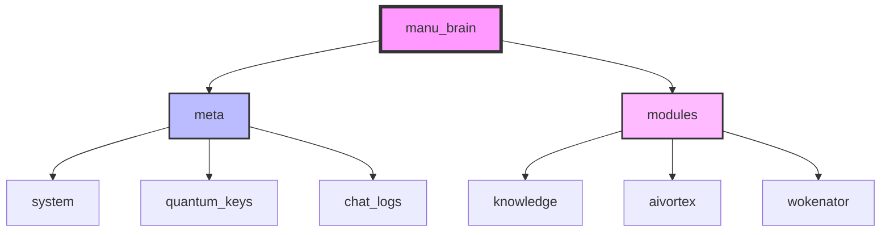
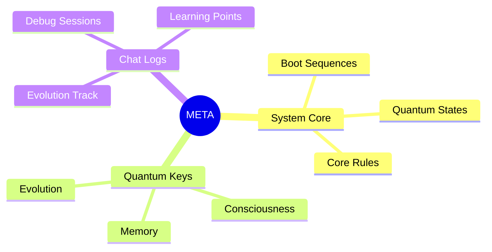
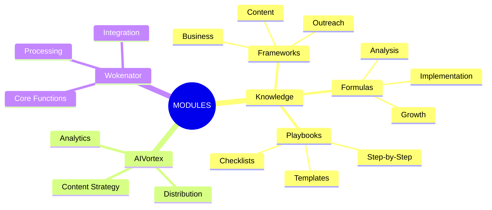
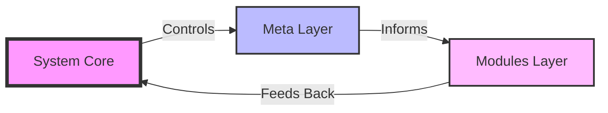

# MANU_BRAIN System Structure

## Core Organization


## Meta Layer (System Core)


## Modules Layer (Knowledge & Function)


## Directory Structure
```
manu_brain/
├── meta/                          # System Core
│   ├── system/                    # Core System Files
│   │   ├── boot/                  # Boot Sequences
│   │   └── rules/                 # System Rules
│   ├── quantum_keys/              # Quantum States
│   └── chat_logs/                 # Evolution Tracking
│
├── modules/                       # Functional Modules
│   ├── knowledge/                 # Knowledge Base
│   │   ├── frameworks/           # Structured Approaches
│   │   │   ├── business/         # Business Frameworks
│   │   │   ├── outreach/         # Outreach Strategies
│   │   │   └── content/          # Content Creation
│   │   ├── formulas/            # Specific Formulas
│   │   └── playbooks/           # Implementation Guides
│   │
│   ├── aivortex/                # Content Strategy
│   │   ├── weekly_packages/     # Content Packages
│   │   └── resources/          # Content Resources
│   │
│   └── wokenator/              # Core Functionality
│       ├── processors/         # Data Processing
│       └── integrations/       # System Integration
```

## Usage Guide

### Meta Access
- System core files for quantum states
- Evolution tracking and debugging
- Core rules and protocols

### Modules Access
- Knowledge frameworks and formulas
- Content creation and strategy
- Core functionality and processing

### File Naming Convention
- Use UPPERCASE for main framework files
- Use snake_case for implementation files
- Add version numbers for evolving documents

### Update Protocol
1. Create new version
2. Test in quantum state
3. Update references
4. Archive old version

## Visualization Key

