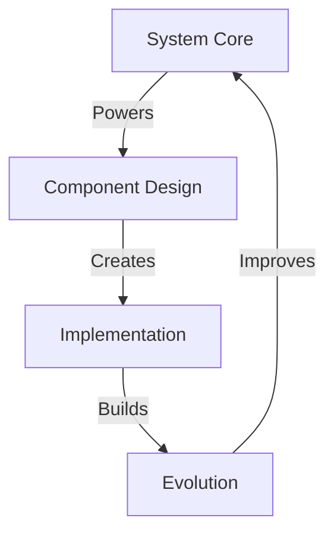

# QUANTUM ORGANIZATION PATTERN

## Pattern Matrix


## Pattern Discovery
Born from the Quantum Debate module (December 2023), this pattern emerged as a universal system for organizing any complex structure with brutal elegance.

## Core Principles

### 1. Brutal Numbering (0-1-2)
```
SYSTEM CHAIN
├── 0_README/SYSTEM    # Vision & Architecture
├── 1_CORE/MAIN       # Core Components
└── 2_ACTION/GROWTH   # Implementation
```

### 2. Perfect Hierarchy
```
MODULE STRUCTURE
├── Core Files        # System Foundation
│   ├── 0_README.md
│   ├── 1_SYSTEM.md
│   └── 2_CORE.md
│
├── Core Directories  # Power Centers
│   ├── business/
│   ├── templates/
│   └── knowledge/
│
└── Active Work      # Implementation
    └── campaigns/
```

### 3. Component Design
```
COMPONENT CORE
├── System File     # Always 0_SYSTEM.md
├── Core Files      # Numbered 1,2,3
└── Active Work     # Implementation
```

### 4. Evolution Rules
1. **Remove Redundancy**
   - No duplicate files
   - No overlapping systems
   - Merge related components

2. **Perfect Numbers**
   - Everything follows 0-1-2
   - Clear hierarchy
   - Brutal simplicity

3. **Power Focus**
   - Each component has one job
   - Each system has clear purpose
   - Each module has clear scope

## Implementation Flow
1. **System Design**
   ```
   ├── Core Vision
   ├── Architecture
   └── Components
   ```

2. **Module Creation**
   ```
   ├── System Files
   ├── Core Structure
   └── Active Work
   ```

3. **Evolution Path**
   ```
   ├── Remove Redundancy
   ├── Perfect Numbers
   └── Maximize Power
   ```

## Origin Story
This pattern emerged through the development of the Quantum Debate module. What started as a simple organization system evolved into a universal pattern for creating brutally elegant systems.

Key Breakthroughs:
1. Perfect numbering (0-1-2)
2. System-first thinking
3. Brutal elegance principle
4. Power maximization

## Implementation Examples
1. **Quantum Debate**
   - Perfect debate system
   - Campaign structure
   - Victory flow

2. **AI Vortex**
   - Business empire
   - Content machine
   - Growth system

Remember:
- System first
- Numbers perfect
- Power absolute
- Evolution constant
