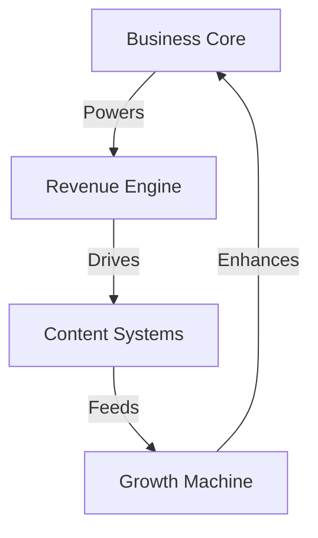

# AI VORTEX SYSTEM

## System Matrix


## Business Architecture
```
VORTEX EMPIRE
├── Business Core
│   ├── Revenue Streams
│   ├── Client Systems
│   ├── Growth Metrics
│   └── Evolution Path
│
├── Revenue Engine
│   ├── Product Lines
│   ├── Service Matrix
│   ├── Pricing Models
│   └── Sales Systems
│
├── Content Systems
│   ├── Production Line
│   ├── Quality Control
│   ├── Distribution
│   └── Impact Metrics
│
└── Growth Machine
    ├── Market Analysis
    ├── Expansion Maps
    ├── Scale Systems
    └── Future Vision
```

## System Components

### 1. Business Foundation
```
EMPIRE CHAIN
├── Revenue Streams
│   ├── Direct Sales
│   ├── Partnerships
│   └── Passive Income
│
├── Client Systems
│   ├── Acquisition
│   ├── Management
│   └── Growth
│
├── Growth Metrics
│   ├── KPIs
│   ├── Analytics
│   └── Optimization
│
└── Evolution Path
    ├── Market Position
    ├── Future Vision
    └── Scale Plans
```

### 2. Module Structure
```
SYSTEM MAP
├── 0_README.md           # Navigation & Vision
├── 1_SYSTEM.md           # Core Architecture
│
├── business/            # Business Engine
│   ├── revenue/        # Revenue Systems
│   ├── clients/        # Client Management
│   └── growth/         # Growth Systems
│
├── templates/           # System Templates
│   ├── 0_RESEARCH.md
│   ├── 1_ANALYSIS.md
│   └── 2_IMPLEMENTATION.md
│
├── campaigns/           # Active Projects
│   ├── 1_reality_check/
│   ├── 2_implementation/
│   └── 3_metrics/
│
└── knowledge/          # Empire Knowledge
    ├── best_practices/
    ├── market_intel/
    └── growth_maps/
```

## Core Flows

### 1. Business Operations
- Revenue generation
- Client management
- Growth acceleration
- Market domination

### 2. System Evolution
- Market analysis
- Strategy refinement
- System optimization
- Empire expansion

### 3. Campaign Execution
- Market research
- Solution design
- Implementation
- Result tracking

## Quick Commands
1. **New Revenue Stream**
   ```
   ├── Market Analysis
   ├── Product Design
   ├── Launch Strategy
   └── Growth Plan
   ```

2. **Client System**
   ```
   ├── Acquisition Flow
   ├── Management Protocol
   ├── Growth Strategy
   └── Value Chain
   ```

3. **Growth Initiative**
   ```
   ├── Market Map
   ├── Action Plan
   ├── Execution Grid
   └── Result Chain
   ```

Remember:
- Empire First
- Revenue Always
- Growth Forever
