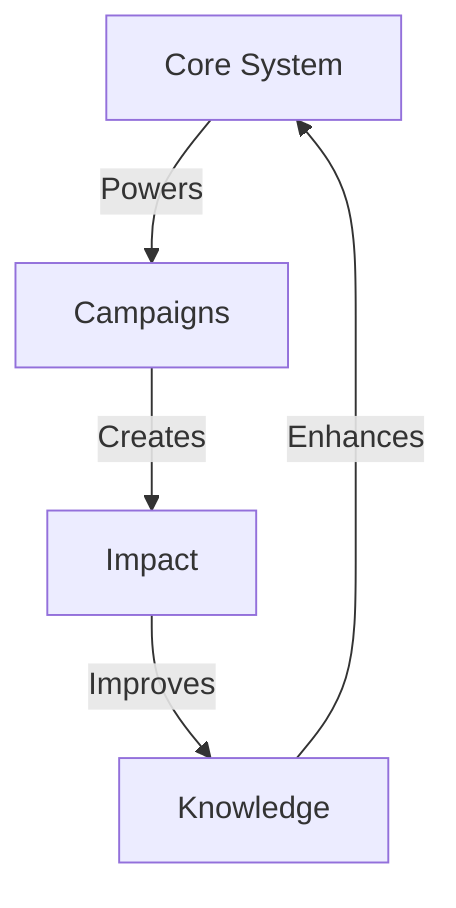

# AI VORTEX SYSTEM

## System Matrix


## Impact Grid
```
SYSTEM GRID
┌─────────────┬──────────────┬─────────────┐
│ Component   │ Function     │ Impact      │
├─────────────┼──────────────┼─────────────┤
│ Core        │ Foundation   │ Power       │
│ Campaigns   │ Execution    │ Results     │
│ Knowledge   │ Evolution    │ Growth      │
└─────────────┴──────────────┴─────────────┘
```

## Core Components

### 1. System Foundation
```
CORE CHAIN
├── Templates
├── Processes
├── Standards
└── Evolution
```

### 2. Campaign Engine
```
EXECUTION GRID
├── Research
├── Analysis
├── Implementation
└── Results
```

### 3. Knowledge Base
```
GROWTH CHAIN
├── Best Practices
├── Winning Formulas
├── Lessons Learned
└── Evolution Path
```

## System Flow
1. **Foundation Building**
   - Template creation
   - Process definition
   - Standard setting

2. **Campaign Execution**
   - Research phase
   - Analysis work
   - Implementation
   - Result tracking

3. **Knowledge Evolution**
   - Practice refinement
   - Formula enhancement
   - System growth

Remember:
- Build strong foundations
- Execute with precision
- Evolve constantly
