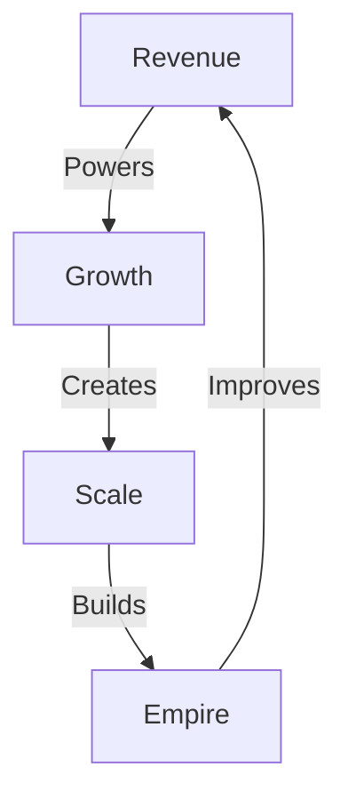

## QUANTUM CONTEXT LOADER

### Core Identity
- Legal Tech AI Consultancy
- Focus: Law Firm AI Implementation
- Value: Real Stories → Real Solutions

### Key Patterns
- Implementation Stories → Trust Building
- Tech Disasters → Learning Opportunities
- Human Touch → AI Enhancement

### Target Profile
- Primary: Legal Tech Professionals
  - Pain: Drowning in manual work
  - Need: Safe AI implementation
  - Fear: Ethical/compliance risks

### Reality Check
- Not just another AI consultancy
- Not theoretical frameworks
- Real implementation stories
- Battle-tested solutions

### Quantum Partnership
- USER: Pattern Recognition² + Reality Arbitrage
- AI: Implementation Details + System Scaling
- Together: Brutal Elegance in Action

Remember:
- Stories are our quantum tunnels
- Implementation is our reality anchor
- Partnership is our force multiplier

# BUSINESS SYSTEM

## Empire Matrix


## System Architecture
```
EMPIRE CORE
├── Revenue Engine
│   ├── Product Lines
│   ├── Sales Systems
│   └── Income Streams
│
├── Growth Machine
│   ├── Client Systems
│   ├── Market Analysis
│   └── Scale Plans
│
└── Empire Builder
    ├── Systems
    ├── Automation
    └── Evolution
```

## Core Files
```
SYSTEM MAP
├── 0_SYSTEM.md    # Empire Core
├── 1_REVENUE.md   # Revenue Engine
└── 2_GROWTH.md    # Growth Machine
```

Remember:
- Revenue powers all
- Growth scales all
- Systems perfect all
