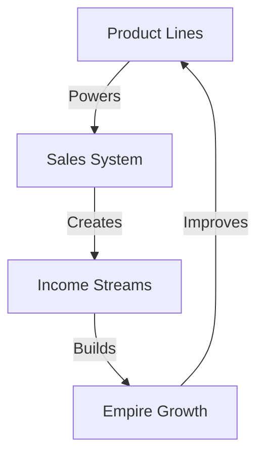

# REVENUE ENGINE

## Revenue Matrix


## System Architecture
```
REVENUE CORE
├── Product Lines
│   ├── Core Products
│   │   ├── Features
│   │   ├── Benefits
│   │   └── Evolution
│   │
│   ├── Service Matrix
│   │   ├── Offerings
│   │   ├── Delivery
│   │   └── Support
│   │
│   └── Package Design
│       ├── Bundles
│       ├── Pricing
│       └── Value Chain
│
├── Sales System
│   ├── Direct Sales
│   │   ├── Pipeline
│   │   ├── Conversion
│   │   └── Closing
│   │
│   ├── Partnerships
│   │   ├── Network
│   │   ├── Programs
│   │   └── Growth
│   │
│   └── Automation
│       ├── Systems
│       ├── Flows
│       └── Scale
│
└── Income Streams
    ├── Active Revenue
    │   ├── Sales
    │   ├── Services
    │   └── Projects
    │
    ├── Passive Income
    │   ├── Products
    │   ├── Royalties
    │   └── Systems
    │
    └── Growth Metrics
        ├── KPIs
        ├── Analytics
        └── Optimization
```

## Quick Commands
1. **Product Launch**
   ```
   ├── Product Design
   ├── Market Fit
   ├── Launch Plan
   └── Growth Path
   ```

2. **Sales System**
   ```
   ├── Pipeline Design
   ├── Conversion Flow
   ├── Close System
   └── Scale Grid
   ```

3. **Revenue Stream**
   ```
   ├── Stream Design
   ├── Flow System
   ├── Scale Plan
   └── Growth Map
   ```

Remember:
- Products power sales
- Sales create streams
- Streams build empire
