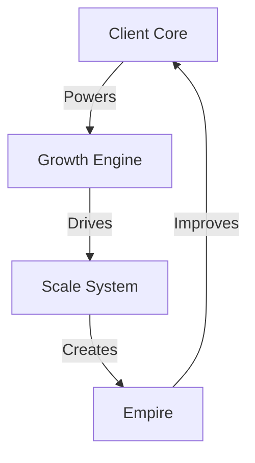

# GROWTH SYSTEM

## Growth Matrix


## System Architecture
```
GROWTH CORE
├── Client Engine
│   ├── Acquisition
│   │   ├── Lead Systems
│   │   ├── Conversion
│   │   └── Onboarding
│   │
│   ├── Management
│   │   ├── Service Delivery
│   │   ├── Support Systems
│   │   └── Growth Plans
│   │
│   └── Value Chain
│       ├── Upsells
│       ├── Cross-sells
│       └── Referrals
│
├── Growth Machine
│   ├── Market Analysis
│   │   ├── Intelligence
│   │   ├── Opportunities
│   │   └── Threats
│   │
│   ├── Strategy Design
│   │   ├── Growth Plans
│   │   ├── Scale Maps
│   │   └── Evolution
│   │
│   └── Execution Grid
│       ├── Systems
│       ├── Processes
│       └── Results
│
└── Scale Engine
    ├── Automation
    ├── Optimization
    └── Evolution
```

## Quick Commands
1. **Client System**
   ```
   ├── Acquisition Flow
   ├── Management Grid
   ├── Value Chain
   └── Growth Path
   ```

2. **Growth Initiative**
   ```
   ├── Market Map
   ├── Strategy Grid
   ├── Action Plan
   └── Scale Path
   ```

Remember:
- Clients power growth
- Growth drives scale
- Scale builds empire
