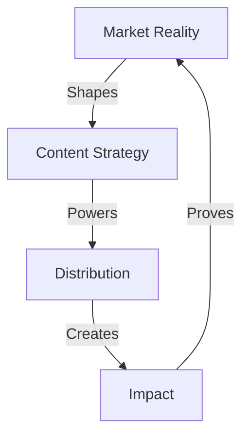

# REALITY CHECK CAMPAIGN

## Campaign Matrix


## Campaign Architecture
```
CAMPAIGN CORE
├── Market Analysis
│   ├── Reality Map
│   ├── Pain Points
│   └── Opportunities
│
├── Content Strategy
│   ├── Core Message
│   ├── Story Flow
│   └── Impact Chain
│
├── Distribution Grid
│   ├── Channels
│   ├── Timeline
│   └── Metrics
│
└── Impact System
    ├── Results
    ├── Evolution
    └── Scale
```

## Active Files
- 1_MASTER.md
- 2_CONTENT.md
- 3_DISTRIBUTION.md
- 4_IMPACT.md

## Campaign Flow
1. **Reality Mapping**
   ```
   ├── Market Analysis
   ├── Pain Points
   ├── Opportunity Grid
   └── Reality Chain
   ```

2. **Content Creation**
   ```
   ├── Story Design
   ├── Impact Flow
   ├── Value Chain
   └── Result Grid
   ```

3. **Distribution System**
   ```
   ├── Channel Map
   ├── Timeline Grid
   ├── Impact Flow
   └── Scale Path
   ```
