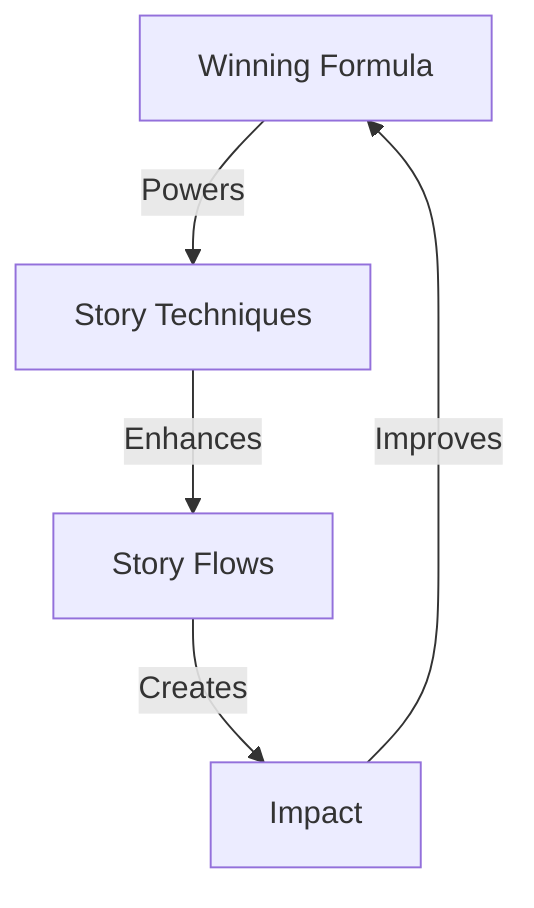

# KNOWLEDGE SYSTEM

## Power Matrix


## System Architecture
```
KNOWLEDGE CORE
├── Winning Formula
│   ├── Core Structure
│   │   ├── Title Design
│   │   ├── Hook System
│   │   └── Technical Flow
│   │
│   └── Implementation
│       ├── Character Build
│       ├── Voice Control
│       └── Impact Close
│
├── Story Techniques
│   ├── The Dance
│   ├── Rhythm
│   ├── Tone
│   ├── Direction
│   └── Lens
│
└── Story Flows
    ├── Hook
    ├── Build
    ├── Peak
    └── Close
```

## Integration Points

### 1. Formula → Techniques
```
POWER FLOW
├── Formula provides structure
├── Techniques add depth
└── Together create impact
```

### 2. Techniques → Flows
```
EXECUTION CHAIN
├── Techniques guide style
├── Flows control pacing
└── Together drive engagement
```

### 3. Application Domains
```
IMPACT GRID
├── Platforms
│   ├── Social Media
│   ├── Blogs
│   ├── Videos
│   └── Presentations
│
├── Topics
│   ├── Technical
│   ├── Business
│   ├── Educational
│   └── Marketing
│
└── Industries
    ├── Tech
    ├── Legal
    ├── Finance
    └── Healthcare
```

## Implementation Flow
1. **Start with Formula**
   - Use core structure
   - Follow proven patterns
   - Adapt examples

2. **Apply Techniques**
   - Choose right dance
   - Set perfect rhythm
   - Find unique lens

3. **Control Flow**
   - Hook with power
   - Build with purpose
   - Close with impact

Remember:
- Formula is foundation
- Techniques add power
- Flow creates magic
- Together they're unstoppable
