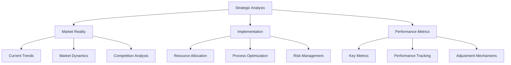
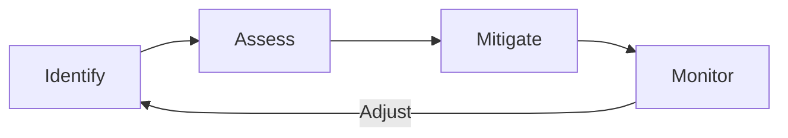
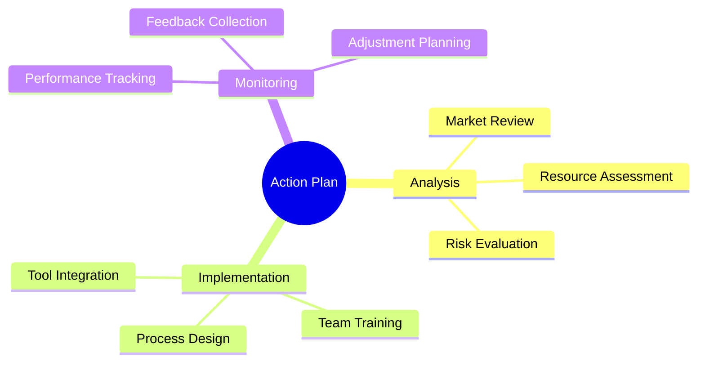

# Strategic Framework

## 1. Core Analysis Framework

## 2. Implementation Matrix

| Area | Current State | Target State | Action Items |
|------|--------------|--------------|--------------|
| Content Creation | Weekly packages | Continuous flow | Implement pipeline system |
| Knowledge Management | Basic structure | Dynamic system | Add automation layers |
| Resource Utilization | Manual tracking | Automated tracking | Integrate metrics tools |

## 3. Critical Success Factors

### 3.1 Reality Check Points
- Regular market analysis
- Client feedback integration
- Competition monitoring
- Resource allocation efficiency

### 3.2 Implementation Deep Dives
- Process documentation
- Team training
- Tool integration
- Performance monitoring

### 3.3 Dynamic Adjustments
- Regular review cycles
- Feedback incorporation
- Strategy refinement
- Resource reallocation

## 4. Risk Management Framework

## 5. Performance Metrics

### Key Performance Indicators
1. Content Impact
   - Engagement rates
   - Client adoption
   - Market response

2. Knowledge Utilization
   - Access frequency
   - Implementation rate
   - Update cycles

3. Resource Efficiency
   - Tool utilization
   - Process automation
   - Time optimization

## 6. Adaptation Strategy

### Short-term Adjustments
- Weekly review cycles
- Quick response mechanisms
- Immediate feedback loops

### Long-term Evolution
- Market trend integration
- System architecture updates
- Strategic realignment

## 7. Action Framework

## Best Practices

1. **Regular Reviews**
   - Weekly progress checks
   - Monthly strategy reviews
   - Quarterly deep dives

2. **Resource Management**
   - Optimal allocation
   - Efficiency monitoring
   - Regular optimization

3. **Risk Control**
   - Early warning system
   - Mitigation strategies
   - Continuous monitoring

4. **Performance Enhancement**
   - Regular training
   - Tool optimization
   - Process refinement
