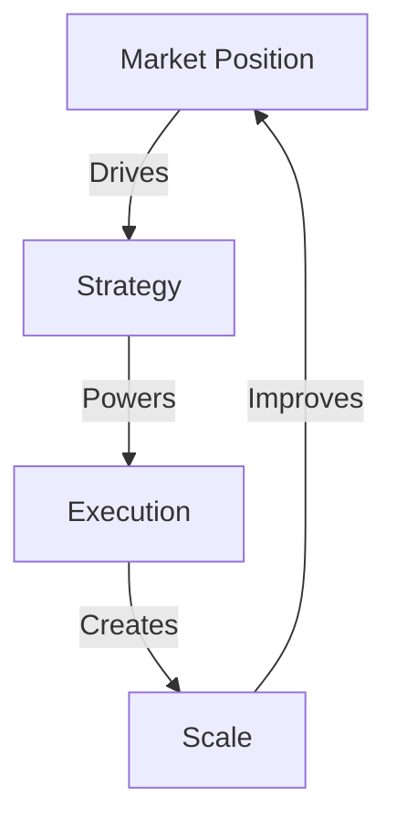

# GROWTH MAPS

## Growth Matrix


## Growth Architecture
```
GROWTH CORE
├── Market Position
│   ├── Current State
│   ├── Opportunities
│   └── Evolution Path
│
├── Strategy Design
│   ├── Growth Plans
│   ├── Scale Maps
│   └── Action Grid
│
├── Execution System
│   ├── Process Flow
│   ├── Result Chain
│   └── Optimization
│
└── Scale Engine
    ├── Automation
    ├── Evolution
    └── Empire Growth
```

## Quick Commands
1. **Position Analysis**
   ```
   ├── Market Map
   ├── State Analysis
   ├── Growth Path
   └── Action Plan
   ```

2. **Strategy Design**
   ```
   ├── Growth Grid
   ├── Scale Flow
   ├── Action Chain
   └── Result Map
   ```
