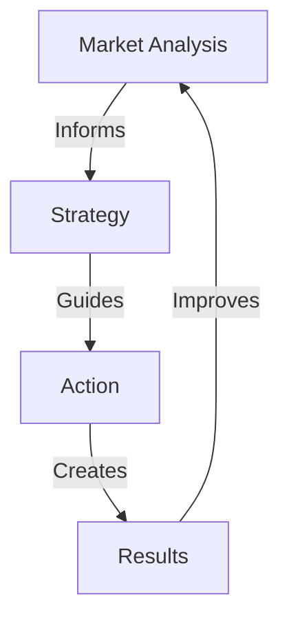

# MARKET INTELLIGENCE

## Intelligence Matrix


## Intelligence Architecture
```
INTEL CORE
├── Market Analysis
│   ├── Trends
│   ├── Opportunities
│   └── Threats
│
├── Strategy Grid
│   ├── Position
│   ├── Advantage
│   └── Evolution
│
├── Action System
│   ├── Plans
│   ├── Execution
│   └── Results
│
└── Growth Engine
    ├── Scale
    ├── Optimization
    └── Evolution
```

## Quick Commands
1. **Market Analysis**
   ```
   ├── Trend Map
   ├── Opportunity Grid
   ├── Threat Chain
   └── Action Plan
   ```

2. **Strategy Design**
   ```
   ├── Position Map
   ├── Advantage Grid
   ├── Action Flow
   └── Result Chain
   ```
