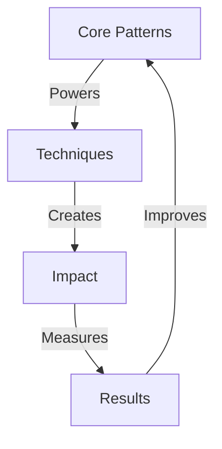

# STORYTELLING SYSTEM

## Story Matrix


## Story Architecture
```
STORY CORE
├── Pattern Library
│   ├── Core Patterns
│   ├── Story Flows
│   └── Impact Chains
│
├── Technique Grid
│   ├── Opening Hooks
│   ├── Story Arcs
│   └── Closers
│
├── Impact System
│   ├── Emotional
│   ├── Logical
│   └── Strategic
│
└── Result Engine
    ├── Metrics
    ├── Evolution
    └── Optimization
```

## Quick Commands
1. **Pattern Design**
   ```
   ├── Core Pattern
   ├── Flow Design
   ├── Impact Chain
   └── Result Grid
   ```

2. **Story Flow**
   ```
   ├── Hook Design
   ├── Arc Flow
   ├── Close Impact
   └── Result Map
   ```
