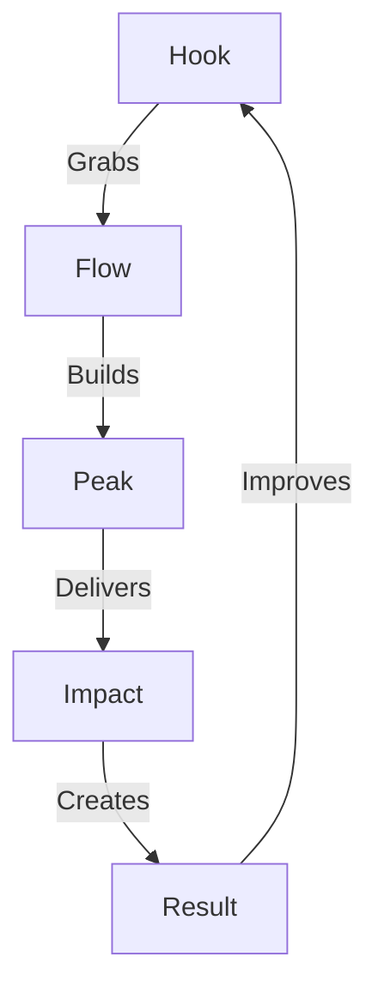

# STORY PATTERNS

## Pattern Matrix


## Pattern Library

### 1. Opening Patterns
```
HOOK GRID
├── Reality Break
│   └── "Everything you know is wrong..."
│
├── Future Vision
│   └── "Imagine a world where..."
│
├── Pattern Interrupt
│   └── "But what if..."
│
└── Stakes Reveal
    └── "The cost of inaction..."
```

### 2. Flow Patterns
```
FLOW CHAIN
├── Reality Map
│   ├── Current State
│   ├── Pain Points
│   └── Cost of Inaction
│
├── Vision Path
│   ├── Future State
│   ├── Transformation
│   └── Value Chain
│
└── Action Grid
    ├── Clear Steps
    ├── Quick Wins
    └── Long Term
```

### 3. Peak Patterns
```
PEAK SYSTEM
├── Revelation
│   ├── "The key insight..."
│   └── "The hidden truth..."
│
├── Transformation
│   ├── "The moment everything changed..."
│   └── "The critical shift..."
│
└── Victory
    ├── "The ultimate win..."
    └── "The final breakthrough..."
```

### 4. Impact Patterns
```
IMPACT CHAIN
├── Emotional
│   ├── Fear of Loss
│   ├── Joy of Gain
│   └── Pride of Victory
│
├── Logical
│   ├── Clear Evidence
│   ├── Solid Proof
│   └── Real Results
│
└── Strategic
    ├── Market Impact
    ├── Growth Path
    └── Scale Plan
```

## Pattern Flow
1. **Hook Design**
   ```
   ├── Pattern Selection
   ├── Impact Design
   ├── Flow Map
   └── Result Grid
   ```

2. **Story Build**
   ```
   ├── Pattern Chain
   ├── Flow Design
   ├── Peak Creation
   └── Impact Map
   ```

Remember:
- Patterns must flow
- Impact must hit
- Results must show
