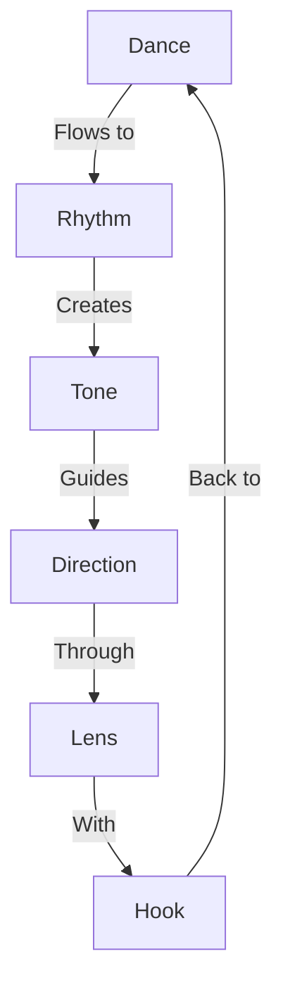

# STORYTELLING GUIDE

## Technique Matrix


## Core Techniques

### 1. The Dance: Context and Conflict
```
DANCE PATTERN
├── Structure
│   ├── Context Setup
│   ├── Conflict Intro
│   ├── Context Resolution
│   └── New Conflict Hook
│
└── Example Flow
    ├── Context: Stanley Cups struggling
    ├── Conflict: Mom bloggers see mistake
    ├── Resolution: Special bulk deal
    └── New Conflict: 5-day sellout
```

### 2. Rhythm: Sentence Variety
```
RHYTHM CHAIN
├── Structure
│   ├── Short Punches
│   ├── Medium Flows
│   └── Long Elaborations
│
└── Example
    "This sentence has five words.
     Here are five more words.
     Five-word sentences are fine.
     But several together become monotonous.
     Listen to what is happening.
     The writing is getting boring.
     The sound of it drones.
     It's like a stuck record.
     The ear demands some variety."
```

### 3. Tone: Conversational Impact
```
TONE SYSTEM
├── Core Elements
│   ├── Natural Speech
│   ├── Direct Connection
│   └── Personal Touch
│
└── Execution
    ├── Friend Chat Style
    ├── Direct Answers
    └── Personality Shine
```

### 4. Direction: End-First Approach
```
DIRECTION GRID
├── Structure
│   ├── End Goal
│   ├── Backward Plan
│   └── Story Flow
│
└── Example Flow
    ├── Define Impact
    ├── Plot Points
    └── Build Path
```

### 5. Story Lens: Unique Perspective
```
LENS CHAIN
├── Development
│   ├── Common Angles
│   ├── Unique Takes
│   └── Personal Spin
│
└── Example
    ├── Common: Swift's outfit
    ├── Unique: NFL business impact
    └── Personal: Your angle
```

### 6. The Hook: Instant Grab
```
HOOK SYSTEM
├── Structure
│   ├── Punchy First Line
│   ├── Visual Impact
│   └── Clear Promise
│
└── Execution
    ├── Specific Hook
    ├── Visual Support
    └── Immediate Value
```

## Implementation Flow
1. **Story Design**
   ```
   ├── End Goal
   ├── Hook Design
   ├── Dance Flow
   └── Rhythm Map
   ```

2. **Story Build**
   ```
   ├── Tone Set
   ├── Lens Apply
   ├── Flow Create
   └── Impact Lock
   ```

Remember:
- Dance with context and conflict
- Vary your rhythm
- Keep it conversational
- Start with the end
- Use your unique lens
- Hook immediately
