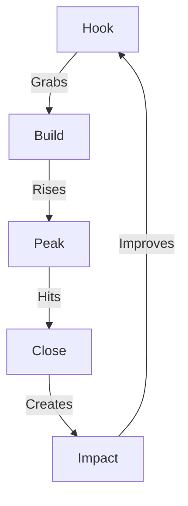

# STORY FLOWS

## Flow Matrix


## Flow Architecture

### 1. Hook Techniques
```
HOOK SYSTEM
├── Pattern Break
│   ├── Reality Shock
│   ├── Future Vision
│   └── Stakes Reveal
│
├── Emotional Grab
│   ├── Fear of Loss
│   ├── Promise of Gain
│   └── Pride Appeal
│
└── Logic Lock
    ├── Clear Problem
    ├── Hidden Cost
    └── Market Reality
```

### 2. Build Techniques
```
BUILD CHAIN
├── Reality Map
│   ├── Current Pain
│   ├── Hidden Cost
│   └── Market Impact
│
├── Solution Path
│   ├── Clear Vision
│   ├── Transform Map
│   └── Value Chain
│
└── Proof Grid
    ├── Evidence
    ├── Results
    └── Impact
```

### 3. Peak Techniques
```
PEAK SYSTEM
├── Revelation
│   ├── Key Insight
│   ├── Hidden Truth
│   └── Market Reality
│
├── Transform
│   ├── Shift Point
│   ├── Change Map
│   └── Result Chain
│
└── Victory
    ├── Clear Win
    ├── Real Impact
    └── Future Path
```

### 4. Close Techniques
```
CLOSE CHAIN
├── Impact Lock
│   ├── Clear Value
│   ├── Real Results
│   └── Future Vision
│
├── Action Drive
│   ├── Next Steps
│   ├── Quick Wins
│   └── Long Path
│
└── Result Grid
    ├── Metrics
    ├── Growth
    └── Scale
```

## Flow Commands
1. **Story Design**
   ```
   ├── Flow Select
   ├── Tech Chain
   ├── Impact Map
   └── Result Grid
   ```

2. **Story Build**
   ```
   ├── Hook Flow
   ├── Build Chain
   ├── Peak Hit
   └── Close Impact
   ```

Remember:
- Flow must grab
- Build must rise
- Peak must hit
- Close must lock
