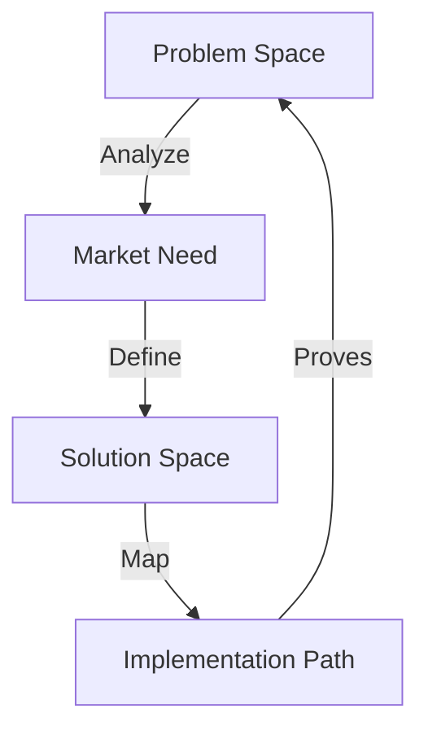

# AI VORTEX RESEARCH TEMPLATE

## Research Matrix


## Impact Grid
```
RESEARCH GRID
┌─────────────┬──────────────┬─────────────┐
│ Component   │ Analysis     │ Impact      │
├─────────────┼──────────────┼─────────────┤
│ Problem     │ Pain Points  │ Value       │
│ Market      │ Needs        │ Opportunity │
│ Solution    │ Approach     │ Results     │
└─────────────┴──────────────┴─────────────┘
```

## Core Components

### 1. Problem Analysis
```
PAIN CHAIN
├── Current State
├── Pain Points
├── Blockers
└── Impact
```

### 2. Market Research
```
NEED MAP
├── User Segments
├── Use Cases
├── Requirements
└── Value Props
```

### 3. Solution Space
```
APPROACH GRID
├── Technical Options
├── Implementation Paths
├── Resource Needs
└── Success Metrics
```

## Research Flow
1. **Problem Definition**
   - Current state analysis
   - Pain point mapping
   - Impact assessment

2. **Market Analysis**
   - User research
   - Need mapping
   - Value alignment

3. **Solution Framework**
   - Technical assessment
   - Resource planning
   - Implementation path

Remember:
- Start with real problems
- Focus on market needs
- Map clear solutions
