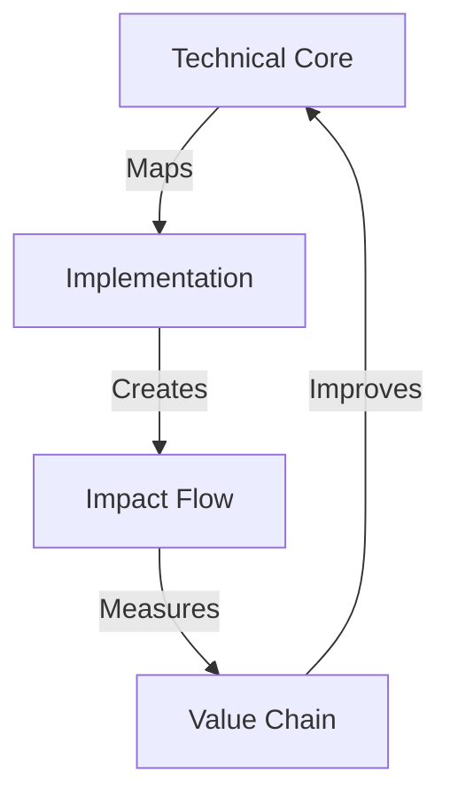

# AI VORTEX ANALYSIS TEMPLATE

## Analysis Matrix


## Impact Grid
```
ANALYSIS GRID
┌─────────────┬──────────────┬─────────────┐
│ Component   │ Analysis     │ Impact      │
├─────────────┼──────────────┼─────────────┤
│ Technical   │ Core System  │ Foundation  │
│ Process     │ Flow Map     │ Efficiency  │
│ Impact      │ Value Chain  │ Results     │
└─────────────┴──────────────┴─────────────┘
```

## Core Components

### 1. Technical Analysis
```
SYSTEM CHAIN
├── Core Components
├── Dependencies
├── Integration Points
└── Technical Debt
```

### 2. Process Mapping
```
FLOW GRID
├── User Journey
├── System Flow
├── Decision Points
└── Optimization
```

### 3. Impact Assessment
```
VALUE CHAIN
├── Metrics
├── KPIs
├── Results
└── Optimization
```

## Analysis Flow
1. **Technical Deep Dive**
   - System architecture
   - Component analysis
   - Integration mapping

2. **Process Analysis**
   - Flow mapping
   - Efficiency analysis
   - Optimization points

3. **Impact Evaluation**
   - Result measurement
   - Value assessment
   - Improvement path

Remember:
- Map everything
- Measure impact
- Find optimization
