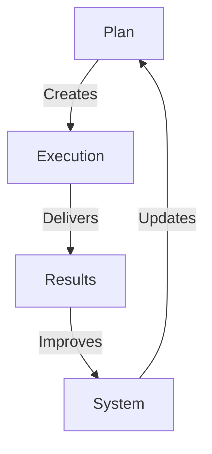

# AI VORTEX IMPLEMENTATION TEMPLATE

## Implementation Matrix


## Impact Grid
```
IMPLEMENTATION GRID
┌─────────────┬──────────────┬─────────────┐
│ Phase       │ Action       │ Impact      │
├─────────────┼──────────────┼─────────────┤
│ Planning    │ Strategy     │ Direction   │
│ Execution   │ Development  │ Delivery    │
│ Results     │ Measurement  │ Value       │
└─────────────┴──────────────┴─────────────┘
```

## Core Components

### 1. Planning Phase
```
STRATEGY CHAIN
├── Objectives
├── Resources
├── Timeline
└── Milestones
```

### 2. Execution Flow
```
DEVELOPMENT GRID
├── Sprint Planning
├── Development
├── Testing
└── Deployment
```

### 3. Results Tracking
```
VALUE CHAIN
├── Metrics
├── KPIs
├── Impact
└── Optimization
```

## Implementation Flow
1. **Strategic Planning**
   - Goal setting
   - Resource allocation
   - Timeline creation

2. **Execution Process**
   - Development sprints
   - Testing cycles
   - Deployment steps

3. **Results Analysis**
   - Metric tracking
   - Impact assessment
   - Optimization path

Remember:
- Plan thoroughly
- Execute precisely
- Measure everything
