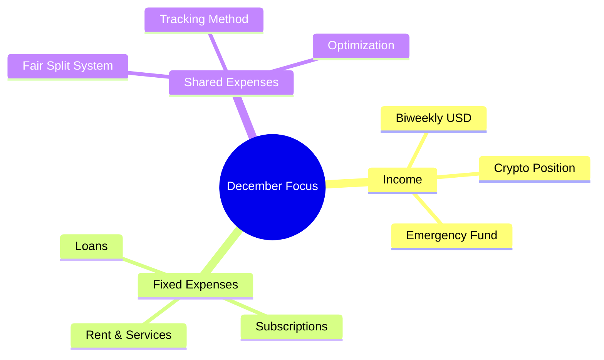
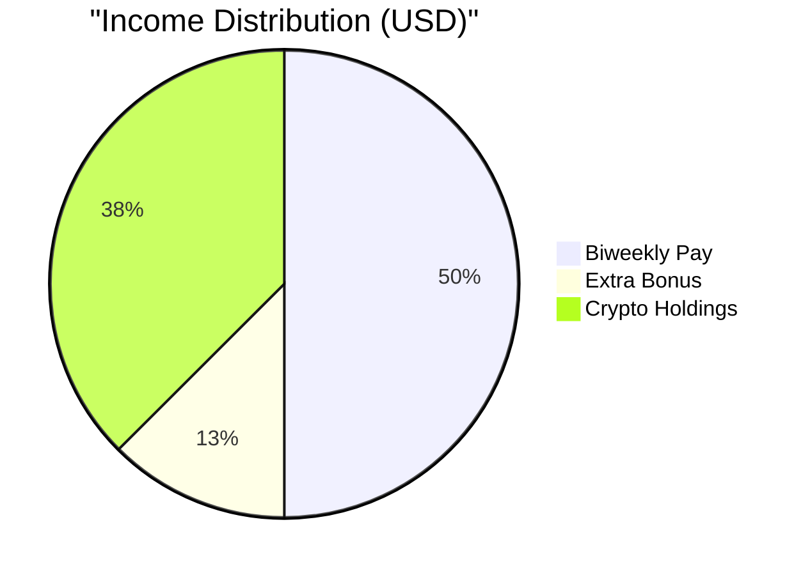
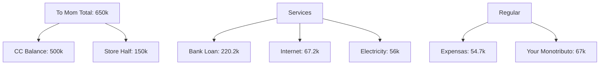
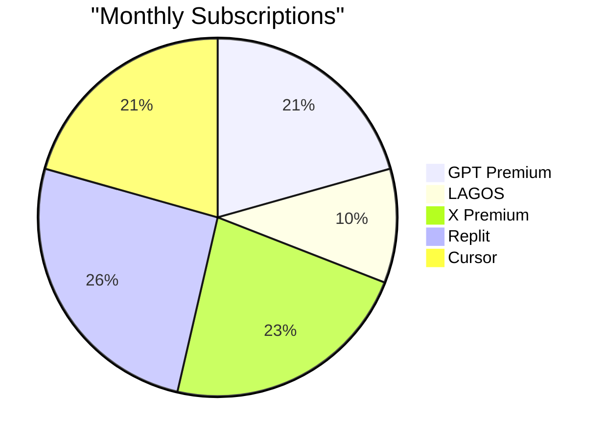
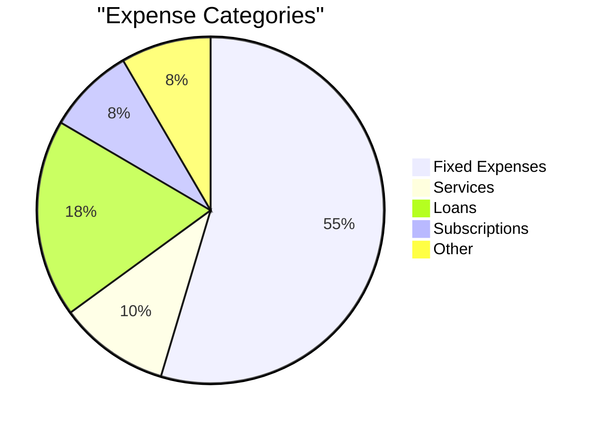

# December 2024 Financial Quantum State 💰

## Daily Focus Map 🎯

## Current Status (December 10) 📊

### Income Streams

### Urgent Expenses (Due Now)

### Digital Subscriptions ($97 USD)

## Shared Expenses Split (70/30)
### Your Share (70%)
- Rent: 170k
- Expensas: 38k
- Electricity: ~35k

### Juli's Share (30%)
- Rent: 70k
- Expensas: 16.7k
- Electricity: ~15k

## Payment Schedule 📅
1. Credit Card & Store (To Mom): 650k
2. Bank Loan: 220.2k
3. Services (Internet, Electric): 123.2k
4. Monotributo: 67k
5. Expensas: 54.7k

## Investment Position 📈
### Crypto
- Current: 1956 USDT on flex earn
- Current: 0.8 BNB (~$546.40) on flex earn that yields other coins when launched
- Sold: 2.436 BNB at $753.65 for the USDT balance plus the small coins that were generated by those 3.2 BNB across the year
- Exit: Partial at market rate
- Holding: For strategic timing

## Monthly Analysis 📊

## Action Items 🎯
1. Complete urgent payments
2. Set up shared expense tracking
3. Plan January's fair split
4. Monitor crypto position
5. Build emergency fund strategy

## Notes & Insights 💭
- Fair split system implemented
- Digital subscriptions consolidated
- Crypto position maintained
- Emergency fund priority identified

## Next Month Prep 🔄
1. Lower bank loan (210k)
2. Reduced CC balance (~250k)
3. Adjust shared expenses split
4. Monitor variable costs
