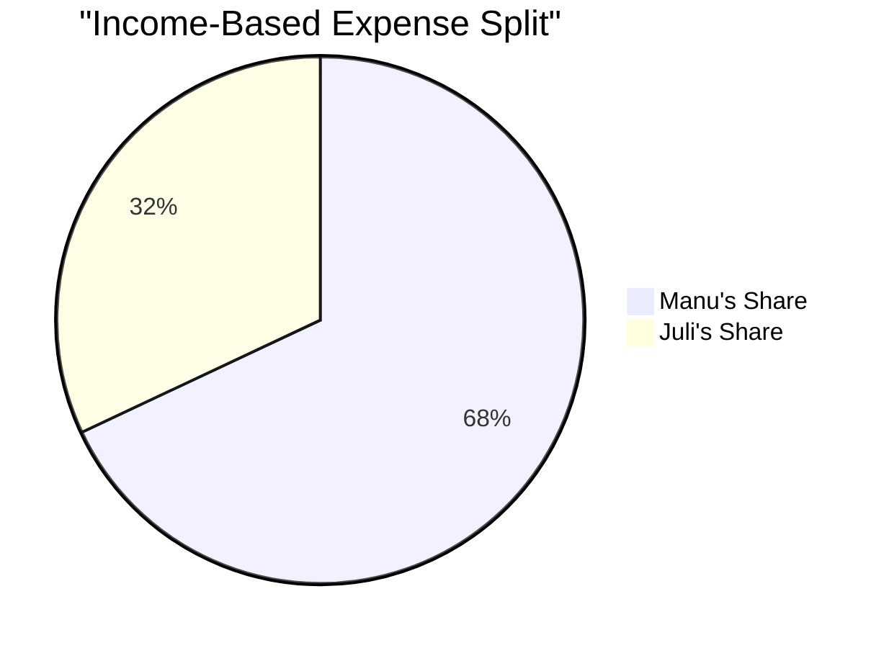

# January 2024 Financial Overview 💰

## Monthly Income 💵
| Person | Amount | Notes |
|--------|---------|-------|
| Manu   | ~1.6M ARS | (~$1600 USD) |
| Juli   | ~748k ARS | Single income source |
| Total  | ~2.348M ARS | Combined household income |

## Fair Split System (68/32) 📊

## Shared Expenses Breakdown
| Expense | Total (ARS) | Manu (68%) | Juli (32%) |
|---------|-------------|------------|------------|
| Rent | 240k | 163k | 77k |
| Expensas | 54.7k | 37k | 17.7k |
| Electricity | ~50k | 34k | 16k |
| **Total Shared** | ~344.7k | ~234k | ~110.7k |

## Personal Expenses
### Manu
- Bank Loan: 210k
- Credit Card: ~250k (estimated)
- Monotributo: 67k
- Internet + Phone: ~60k
- Digital Subscriptions: $97 USD
  - GPT Premium: $20
  - LAGOS: $10
  - X Premium: $22
  - Replit: $25
  - Cursor: $20

### Juli
- Monotributo: 26.6k
- Obra Social: 152k
- Credit Card Portion: ~25k (estimated)

## Investment Position 📈
- 1956 USDT on flex earn
- 0.8 BNB (~$546.40) on flex earn

## Monthly Summary
### Manu's Total Responsibility
- Shared Expenses: ~234k
- Personal Expenses: ~587k
- Total: ~821k
- Buffer: ~779k

### Juli's Total Responsibility
- Shared Expenses: ~110.7k
- Personal Expenses: ~203.6k
- Total: ~314.3k
- Buffer: ~433.7k

## Notes 📝
- Split based on current income ratio (68/32)
- Store rent removed for January
- Utilities estimates might vary
- Credit card estimates based on reduced spending
