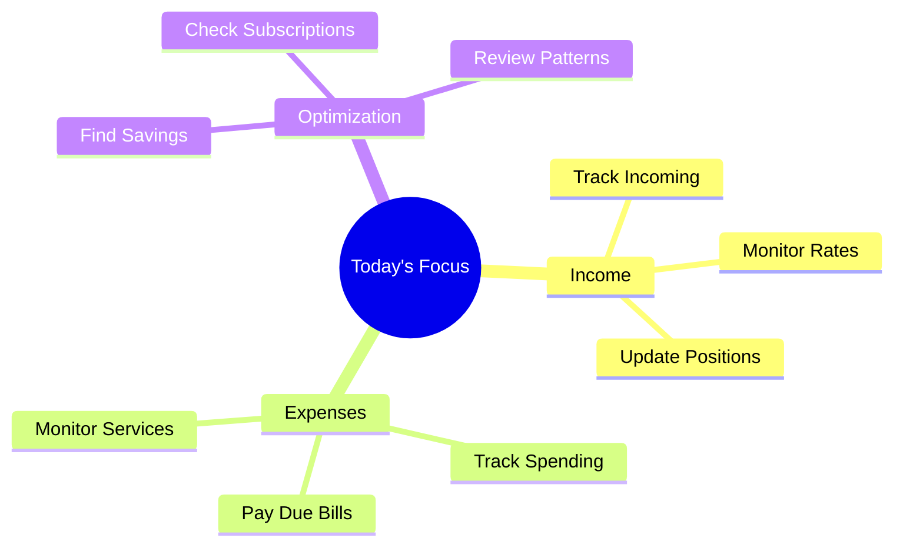
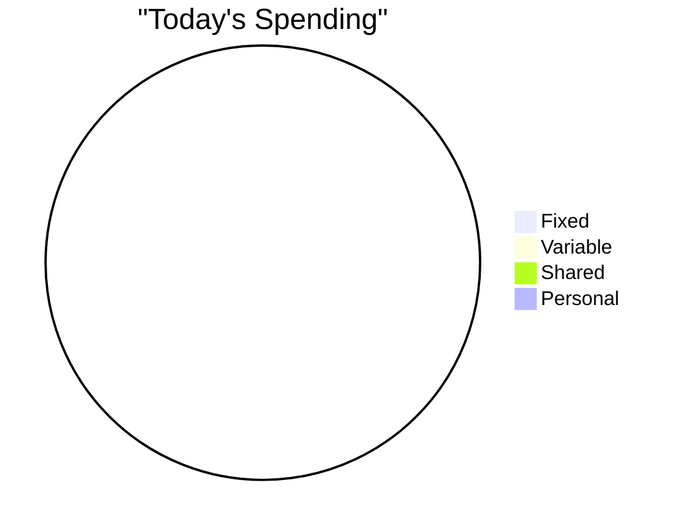

# Daily Financial Quantum State 💰

## Morning Check 📊
- USD Rate: [Rate]
- Crypto Positions: [Status]
- Pending Payments: [List]
- Due Today: [Amount]

## Daily Focus Map 🎯

## Expense Log 📝
### Fixed Expenses
- [ ] Item:
  - Amount:
  - Category:
  - Shared: [Yes/No]
  - Split: [Ratio]

### Variable Expenses
- [ ] Item:
  - Amount:
  - Category:
  - Necessary: [Yes/No]
  - Notes:

## Daily Metrics 📈

## Investment Updates 📊
### Crypto
- Position:
- Value Change:
- Action Needed:

### Savings
- Current:
- Target:
- Progress:

## Notes & Insights 💭
- Patterns Noticed:
- Optimization Opportunities:
- Action Items:

## Tomorrow's Prep 🎯
- [ ] Review due payments
- [ ] Check rates
- [ ] Update tracking
- [ ] Plan expenses
