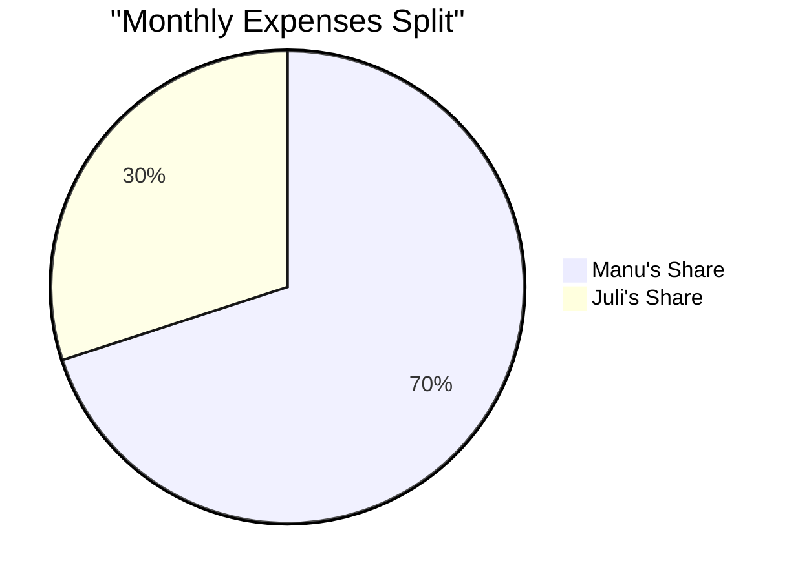

# Monthly Overview - [Month Year] 💰

## Monthly Income 💵
| Person | Amount | Notes |
|--------|---------|-------|
| Manu   |         |       |
| Juli   |         |       |
| Total  |         |       |

## Shared Expenses 🏠
| Expense | Amount | Due Date | Status | Split (M/J) |
|---------|---------|-----------|---------|-------------|
| Rent    |         |           |         |             |
| Utilities|         |           |         |             |
| Internet |         |           |         |             |
| Groceries|         |           |         |             |

## Summary

### Manu's Share
- Total to Pay: [Amount]
- Status: [Paid/Pending]

### Juli's Share
- Total to Pay: [Amount]
- Status: [Paid/Pending]

## Notes 📝
- Important payment dates:
- Changes for next month:
- Savings update:
