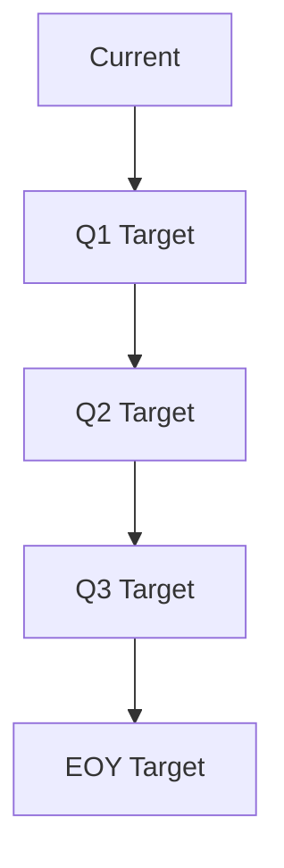

# 2025 Performance Targets 🎯

## Physical Development Goals

### Body Composition
- **Primary Goal**: Natural, defined physique
- **Target Metrics**:
  - Body fat: Athletic range (10-15%)
  - Muscle mass: Progressive increase
  - Weight: Quality gains focus

### Strength Targets
Based on current performance and progressive overload principles:

#### Upper Body

**Benchmarks**:
1. Dumbbell Press
   - Current: 15kg x 8
   - EOY Target: 25kg x 8
2. Triceps Extension
   - Current: 20kg x 8
   - EOY Target: 30kg x 8
3. Back Exercises
   - Current: See exercise profile
   - EOY Target: +40% on all lifts

### Performance Goals
1. **Soccer**
   - Maintain weekly game performance
   - Improve stamina through cardio integration
   - Balance with strength training

2. **Functional Fitness**
   - 10k steps daily consistency
   - Improved recovery between sessions
   - Better left-right arm balance

## Health Markers

### Nutrition
1. **Protein Intake**
   - Daily minimum: 150g
   - Consistency: 90% adherence

2. **Hydration**
   - Daily target: 3L
   - Tracking method: Daily log

3. **Meal Timing**
   - Implement intermittent fasting
   - Early dinner (7-8 PM)
   - Strategic pre/post workout nutrition

### Recovery
1. **Sleep**
   - 8 hours minimum
   - Consistent schedule
   - Track quality metrics

2. **Stress Management**
   - Maintain work-life balance
   - Active recovery practices
   - Regular progress reviews

## Lifestyle Integration

### Habit Formation
1. **Q1**: Establish baseline routines
2. **Q2**: Optimize meal timing
3. **Q3**: Perfect recovery protocols
4. **Q4**: Fine-tune all systems

### Social Balance
- Weekly restaurant outings without compromising goals
- Flexible approach to social events
- Sustainable long-term practices

## Progress Tracking
- Monthly body composition checks
- Quarterly strength assessments
- Weekly habit compliance review
- Daily nutrition logging

## Success Metrics
- [ ] Strength targets met in all major lifts
- [ ] Consistent protein intake (90%+ days)
- [ ] Sleep schedule maintained (80%+ days)
- [ ] Body composition goals achieved
- [ ] Lifestyle sustainability achieved

## Review Schedule
- Daily: Quick metrics check
- Weekly: Progress review
- Monthly: Detailed assessment
- Quarterly: Goal adjustment
