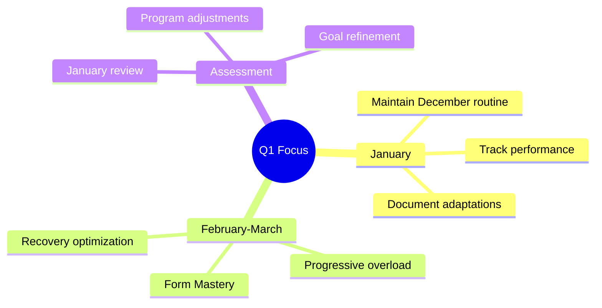
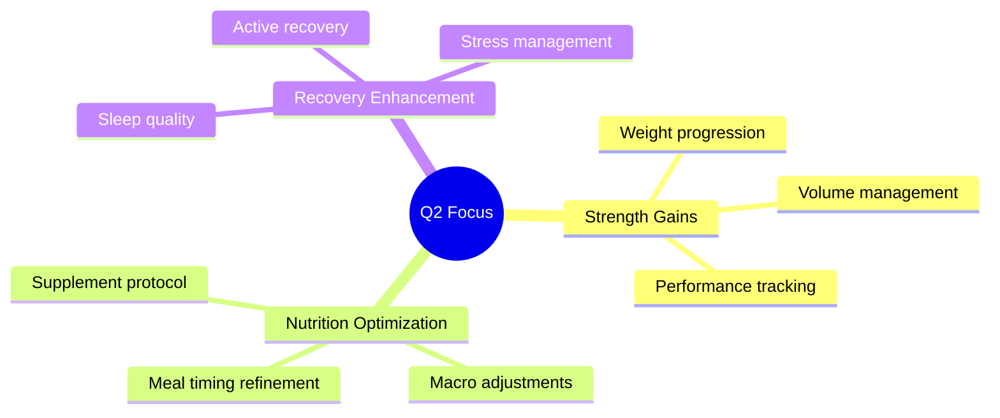
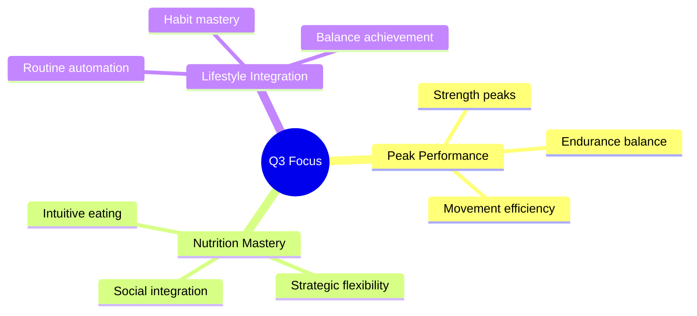
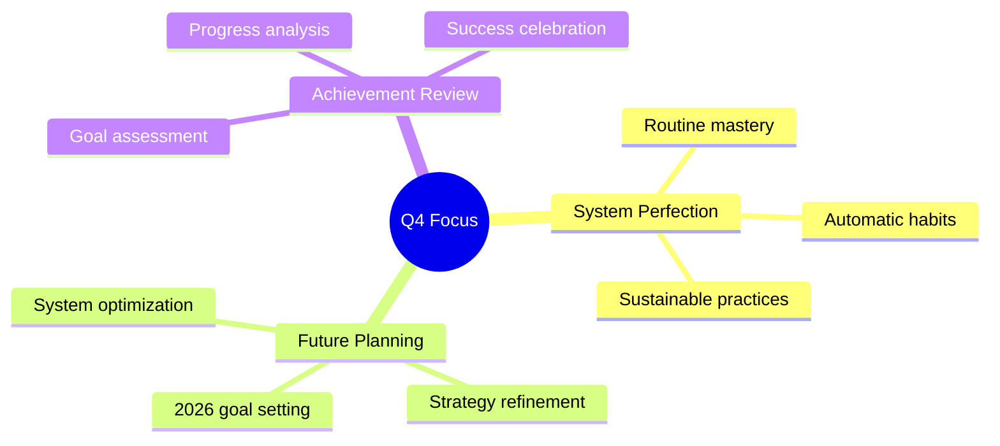

# 2025 Quarterly Targets 📊

## Q1 2025 (January - March)

### Focus: Routine Optimization

#### Key Targets
1. **January**
   - Continue December split (Shoulders/Arms, Back/Chest, Legs/Core)
   - Document performance metrics
   - Track recovery patterns
   - End-of-month comprehensive review

2. **February-March**
   - Implement review findings
   - Perfect form on all exercises
   - Establish left-right balance baseline
   - Document exercise responses

3. **Recovery & Nutrition**
   - Lock in 8-hour sleep schedule
   - Consistent 150g protein daily
   - Document recovery patterns
   - Establish meal timing routine
   - Test different pre/post workout meals

## Q2 2025 (April - June)

### Focus: Progressive Overload

#### Key Targets
1. **Training**
   - Implement progressive overload
   - Balance soccer and strength training
   - Fine-tune exercise selection

2. **Nutrition**
   - Perfect meal timing
   - Optimize pre-workout nutrition
   - Refine supplement strategy

3. **Recovery**
   - Enhance sleep quality
   - Implement active recovery
   - Monitor stress levels

## Q3 2025 (July - September)

### Focus: Performance Optimization

#### Key Targets
1. **Training**
   - Peak strength phase
   - Endurance optimization
   - Movement efficiency

2. **Nutrition**
   - Perfect macro balance
   - Social eating strategy
   - Restaurant game plan

3. **Recovery**
   - Recovery optimization
   - Stress minimization
   - Life balance mastery

## Q4 2025 (October - December)

### Focus: Maintenance & Refinement

#### Key Targets
1. **Training**
   - Maintain strength gains
   - Perfect movement patterns
   - Plan 2026 progression

2. **Nutrition**
   - Habitual healthy eating
   - Holiday strategy
   - 2026 nutrition planning

3. **Recovery**
   - Sustainable routines
   - Perfect work-life balance
   - Long-term habits
