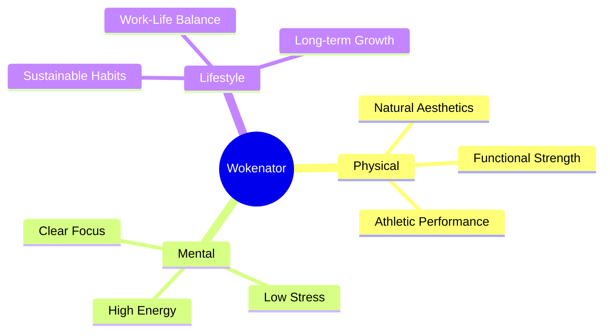
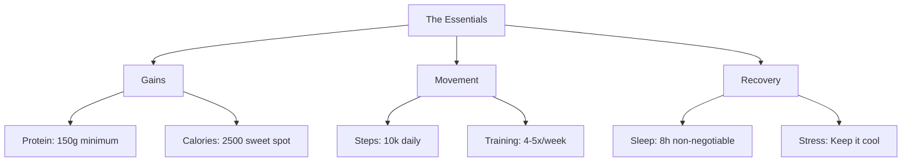
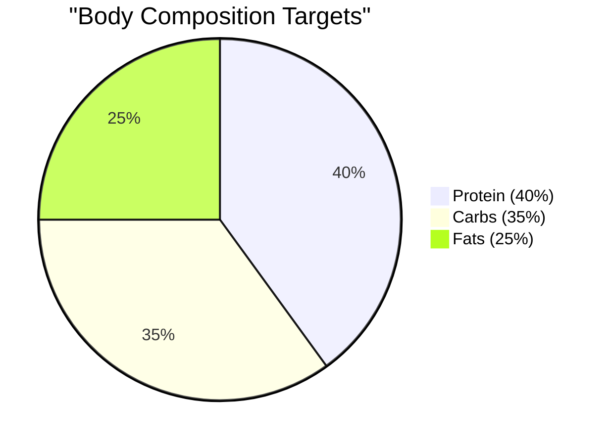
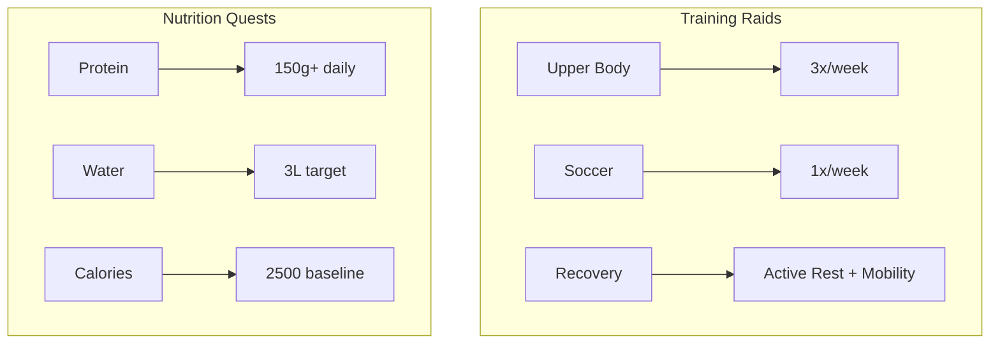
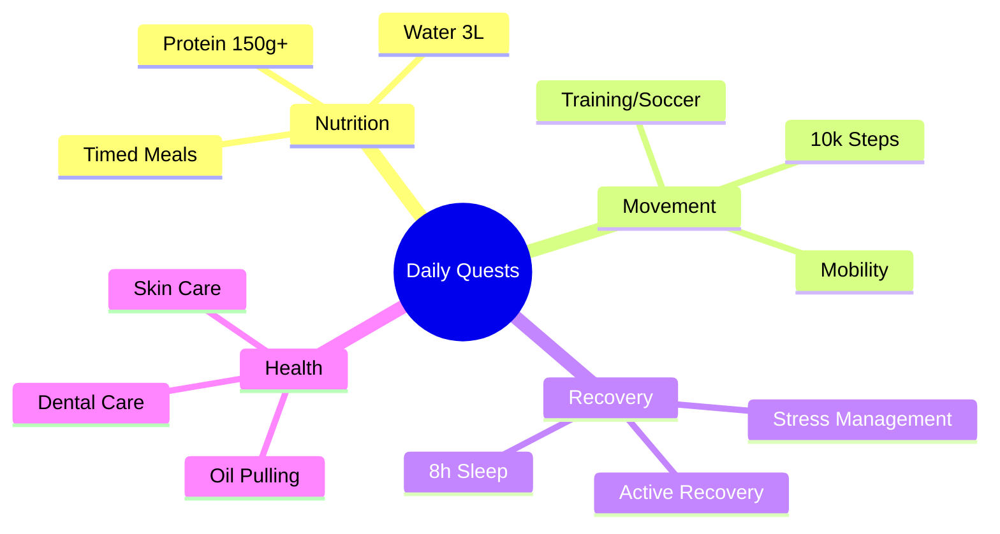

# The Wokenator Plan 2025 💪

## The Vision 🎯

## Character Stats 💪

## Core Missions 🎯
### Physical Transformation Quest

1. **The Balanced Physique**
   - Target Form: Natural, defined physique
   - Power Level: Sustainable gains
   - Time Limit: Ongoing

2. **Performance Raids**
   - Weekly Raid Count: 4-5
   - Recovery Requirements: 8h+ sleep
   - Resource Management: 3L water daily

## Weekly Game Plan

### Training Days
- Upper Body Focus (3x)
  - Progressive overload
  - Form perfection
  - Strength focus

- Soccer Day (1x)
  - Cardio endurance
  - Lower body work
  - Team skills

### Nutrition Strategy
1. **Macro Targets**
   - Protein: 40% (150g+)
   - Carbs: 35% 
   - Fats: 25%

2. **Meal Tactics**
   - Simple, nutritious recipes
   - Minimal frying, prefer oven
   - Strategic weekend flexibility

## Daily Non-Negotiables ⚔️

## Achievement System 🏆
### Daily Achievements
- Protein Master (150g+)
- Hydration Hero (3L)
- Step Champion (10k)
- Sleep Warrior (8h+)

### Weekly Achievements
- 5x Training Streak
- Perfect Recovery Week
- Macro Master
- Low Stress Sage

### Monthly Boss Fights
- Progress check
- Strategy updates
- New achievement unlocks

## Progress Tracking System 📊
### Daily Quests
- Log all power sources (meals)
- Track vital stats
- Complete daily missions

### Weekly Raid Reviews
- What worked? Quick hits
- What didn't? No fluff
- Next week's strategy

## Power-Up Knowledge Base 📚
- Huberman protocols (science-backed)
- Nutrition fundamentals (no fad diets)
- Recovery methods (work smart)
- Training principles (progressive overload)

## Achievement Unlocks 🌟
- [ ] Protein Perfect (30 days straight)
- [ ] Sleep Master (8h+ for 7 days)
- [ ] Hydration Hero (3L for 14 days)
- [ ] Movement King (10k steps 5x/week)
- [ ] Stress Buster (Below 4/10 for a month)

Remember:
- Consistency > Perfection
- Track what matters
- Sleep = gains
- Water = life
- Protein = non-negotiable

Let's make it happen! 💪
