# Workout Plan 2024-2025 🏋️‍♂️

## Training Philosophy

## Split Overview
- **Tuesday**: Push (Chest, Front/Side Shoulders, Triceps)
- **Thursday**: Pull (Back, Rear Delts, Biceps)
- **Saturday**: Arms & Shoulders Focus
- **Recovery**: Mon/Wed/Fri/Sun

*Note: Focus on upper body until February 2025. Legs training will be incorporated later.

## Weekly Volume Distribution

## Recovery Windows

## Equipment Efficiency Guide 🎯
### Dumbbell Progression Path

*Current working weight highlighted

## Exercise Science Overview

### Energy System Usage

### Time Efficiency Analysis

## Stretching & Mobility Guidelines

### Between-Set Stretches

```mermaid
mindmap
  root((Active Recovery))
    Shoulders
      Front delts ↔ Rear delts
      Side delts ↔ Traps
    Arms
      Biceps ↔ Triceps
      Forearms ↔ Upper arms
```

1. **Shoulder Work**
   - When doing front delt work: Stretch rear delts
   - When doing side raises: Light trap stretches
   - Duration: 15-20s during rest

2. **Arm Work**
   - During bicep sets: Tricep overhead stretch
   - During tricep sets: Bicep wall stretch
   - Duration: 15-20s during rest

3. **Compound Movements**
   - Between press sets: Shoulder dislocations
   - Between pull sets: Shoulder blade squeezes
   - Duration: 3-5 reps during rest

### Intra-Workout Mobility
- Between stations: 2-3 shoulder circles
- During longer rests: Band pull-aparts
- When waiting for equipment: Light mobility work

### Cool Down Sequence (2-3 mins)
1. Shoulder dislocations: 10 reps
2. Wall slides: 10 reps
3. Cross-body shoulder stretch: 20s each
4. Tricep overhead stretch: 20s each
5. Bicep wall stretch: 20s each

## Detailed Workouts

### Tuesday - Push Day 💪
#### Warmup (5-7 mins)
- Arm circles: 20 forward, 20 backward
- Band pull-aparts: 2 × 15
- Scapular pulls: 2 × 10

#### Station 1 - Chest Focus
1. **Chest Press**
   - Sets: 3 × 8-10
   - Focus: Upper/middle chest, front delts, triceps
   - Form: 
     - Back flat on bench
     - Elbows at 45° angle
     - Full range of motion
   - Stretch: Upper back stretch (hug yourself, round upper back)
   - Abs During Rest: Plank hold 30-45s
   - Rest: 60s

2. **Incline Press**
   - Sets: 3 × 10
   - Focus: Upper chest, front deltoids
   - Form: 
     - Bench at 30° angle
     - Elbows tucked slightly
     - Control the negative
   - Stretch: Chest stretch (doorway stretch)
   - Abs During Rest: Dead bugs 12 each side
   - Rest: 60s between supersets

#### Station 2 - Shoulder Push
1. **Overhead Press**
   - Sets: 3 × 8-10
   - Focus: Front/middle delts, upper chest, triceps
   - Form:
     - Core tight
     - Natural arc movement
     - Full lockout
   - Stretch: Lat stretch (hold rack, lean away)
   - Abs During Rest: Hollow body hold 20s
   - Rest: 45s

2. **Front Raises**
   - Sets: 3 × 12
   - Focus: Front deltoids, upper chest
   - Form:
     - Slight bend in elbows
     - Thumbs up position
     - Control descent
   - Stretch: Rear delt stretch (arm across body)
   - Abs During Rest: Mountain climbers 20 total
   - Rest: 45s between supersets

#### Station 3 - Triceps
1. **Skull Crushers**
   - Sets: 3 × 10
   - Focus: Long head of triceps
   - Form:
     - Elbows stable
     - Lower to forehead
     - Full extension
   - Stretch: Biceps wall stretch
   - Abs During Rest: V-sits hold 20s
   - Rest: 45s

2. **Tricep Pushdowns**
   - Sets: 3 × 12
   - Focus: Lateral head of triceps
   - Form:
     - Elbows at sides
     - Wrists straight
     - Full extension
   - Stretch: Triceps overhead stretch
   - Abs During Rest: Cross-body mountain climbers 20 total
   - Rest: 45s

#### Finishers (Choose 2)
1. **Push-Up Burnout**
   - 3 sets to near failure
   - Form: Keep core tight
   - Rest: 30s between sets
   - Stretch: Cat-cow stretch

2. **Delt Raise Complex**
   - Front raises × 10
   - Lateral raises × 10
   - Rear delt raises × 10
   - No rest between movements
   - Stretch: Cross-body shoulder stretch

#### Cool Down (2-3 mins)
1. Chest stretch against wall: 20s each side
2. Shoulder dislocations: 10 reps
3. Triceps overhead stretch: 20s each
4. Upper back stretch: 20s
5. Wrist and forearm stretches: 10s each position

### Thursday - Pull Day 🏋️‍♂️
#### Warmup (5-7 mins)
- Cat-cow stretches: 10 reps
- Band pull-aparts: 2 × 15
- Shoulder dislocations: 10 reps

#### Station 1 - Back Width
1. **Lat Pulldowns**
   - Sets: 3 × 10
   - Focus: Latissimus dorsi, rear delts, biceps
   - Form:
     - Chest up
     - Pull to upper chest
     - Squeeze lats at bottom
   - Stretch: Lat stretch (hang from bar)
   - Abs During Rest: Reverse crunches 15 reps
   - Rest: 60s

2. **Straight-Arm Pulldowns**
   - Sets: 2 × 12
   - Focus: Lats, serratus anterior
   - Form:
     - Slight bend in elbows
     - Keep arms fixed
     - Feel stretch at top
   - Stretch: Child's pose with arms extended
   - Abs During Rest: Side plank 20s each
   - Rest: 60s

#### Station 2 - Back Thickness
1. **One-Arm Rows**
   - Sets: 3 × 10/side
   - Focus: Middle back, lats, rear delts
   - Form:
     - Flat back
     - Pull to hip
     - Control negative
   - Stretch: Chest stretch against wall
   - Abs During Rest: Bird dogs 10 each side
   - Rest: 45s

2. **Meadows Rows**
   - Sets: 2 × 12/side
   - Focus: Upper back, lats
   - Form:
     - Hip hinge position
     - Pull with elbow high
     - Squeeze at top
   - Stretch: Thoracic extension over bench
   - Abs During Rest: Dead bugs 10 each side
   - Rest: 45s

#### Station 3 - Biceps & Rear Delts
1. **EZ Bar Curls**
   - Sets: 3 × 10
   - Focus: Biceps brachii
   - Form:
     - Elbows at sides
     - Full range of motion
     - Control negative
   - Stretch: Triceps overhead stretch
   - Abs During Rest: Plank shoulder taps 20 total
   - Rest: 45s

2. **Rear Delt Flyes**
   - Sets: 3 × 15
   - Focus: Posterior deltoids, upper back
   - Form:
     - Bend forward 45°
     - Elbows slightly bent
     - Lead with elbows
   - Stretch: Front delt stretch
   - Abs During Rest: Superman holds 20s
   - Rest: 45s

#### Finishers (Choose 2)
1. **Back Blaster**
   - Wide grip pull-ups or assisted pull-ups
   - 3 sets to near failure
   - Stretch: Hanging lat stretch

2. **Bicep Burnout**
   - 21s style curls
   - Drop set on last round
   - Stretch: Biceps wall stretch

#### Cool Down (2-3 mins)
1. Cat-cow stretch: 10 reps
2. Thread the needle: 20s each side
3. Child's pose: 30s
4. Biceps stretch: 20s each
5. Thoracic extension: 10 reps

### Saturday - Arms & Shoulders 💪

#### Pre-Workout Notes
- Equipment needed: Dumbbells, cables (optional), bench
- Rest between stations: 2-3 minutes
- Hydration: Sip water between exercises
- Stretching options during rest: Shoulder rotations, tricep overhead stretch, bicep wall stretch

#### Warmup (5-7 mins)
- Arm circles: 20 each direction
- Band pull-aparts: 2 × 15
- Light lateral raises: 2 × 15

#### Station 1 - Shoulder Focus (15-20 mins)
1. **Lateral Raises**
   - Sets: 4 × 15 (last set drop set)
   - Focus: Middle deltoids, upper traps
   - Form: Slight bend in elbows, lead with elbows
   - Stretch: Trap stretch (tilt head to opposite side, gentle pull)
   - Abs During Rest: Side plank 20s each side
   - Rest: 45-60s

2. **Face Pulls / Rear Delt Raises**
   - Sets: 4 × 15
   - Focus: Rear deltoids, upper back
   - Form: Pull towards forehead, elbows high
   - Stretch: Front delt stretch (clasp hands behind back, chest up)
   - Abs During Rest: Russian twists 20 reps
   - Rest: 45-60s

3. **Military Press / Seated DB Press**
   - Sets: 3 × 10
   - Focus: Front deltoids, triceps
   - Form: Core tight, natural arc movement
   - Stretch: Triceps stretch (arm overhead, pull elbow behind head)
   - Abs During Rest: Plank hold 30s
   - Rest: 60s

#### Station 2 - Arms Supersets (20-25 mins)
1. **First Superset** (4 rounds)
   **Hammer Curls**
   - Reps: 12
   - Focus: Biceps, brachialis
   - Form: Neutral grip, minimal body swing
   - Stretch: Triceps overhead stretch
   
   **Tricep Extensions**
   - Reps: 12
   - Focus: Long head of triceps
   - Form: Keep elbows tucked, full extension
   - Stretch: Biceps wall stretch (palm against wall, turn body)
   - Rest after both: 45s
   - Abs During Rest: Leg raises 15 reps

2. **Second Superset** (4 rounds)
   **Incline Curls**
   - Reps: 12
   - Focus: Peak biceps contraction
   - Form: Back flat on bench, full range
   - Stretch: Triceps behind head stretch
   
   **Overhead Extensions**
   - Reps: 12
   - Focus: All three tricep heads
   - Form: Keep elbows pointing forward
   - Stretch: Biceps cross-body stretch
   - Rest after both: 45s
   - Abs During Rest: Bicycle crunches 20 reps

#### Finishers (Choose 2-3)
1. **21s Bicep Curls**
   - 7 bottom half
   - 7 top half
   - 7 full range
   - Stretch: Triceps rope stretch

2. **Tricep Burnout**
   - 20 reps
   - Form: Focus on full extension
   - Stretch: Biceps lean-away stretch

3. **Shoulder Burnout**
   - Lateral raise burnout
   - Front raise to press
   - Stretch: Cross-body shoulder stretch

#### Cool Down
- Shoulder dislocations with band: 10 reps
- Wall slides: 10 reps
- Full stretching sequence (hold each 20s):
  1. Cross-body shoulder stretch
  2. Triceps overhead
  3. Biceps wall stretch
  4. Trap stretch both sides

## Progressive Complexity Roadmap

### Current Phase Priority
1. **Form Mastery**
   - Perfect each movement pattern
   - Build mind-muscle connection
   - Establish consistent tempo

2. **Consistency**
   - 3x per week attendance
   - Fixed workout times
   - Regular recovery days

3. **Basic Progression**
   - Simple weight increases
   - Rep quality over quantity
   - Focus on feeling the muscle

## Progressive Overload Strategy 📈
1. **Weight Progression**
   - Increase when you can complete all sets with good form
   - Small jumps (2.5kg) for upper body
   - Larger jumps (5kg) for lower body

2. **Volume Progression**
   - Week 1-2: Base volume
   - Week 3: Add 1 set to main lifts
   - Week 4: Deload (reduce weight by 20%)

## Recovery Protocol 🔄
### Active Recovery Days
- Light walking: 20-30 mins
- Mobility work: 10-15 mins
- Stretching: Focus on worked muscles

### Rest Days
- Sleep: 7-8 hours
- Hydration: 3L water minimum
- Protein: 1.6-2.0g/kg bodyweight

## Monthly Planning Calendar 📅

## Notes 📝
- Adjust weights based on energy levels
- Focus on mind-muscle connection
- Log any joint discomfort
- Track personal records (PRs)

Remember: Form > Weight > Volume
