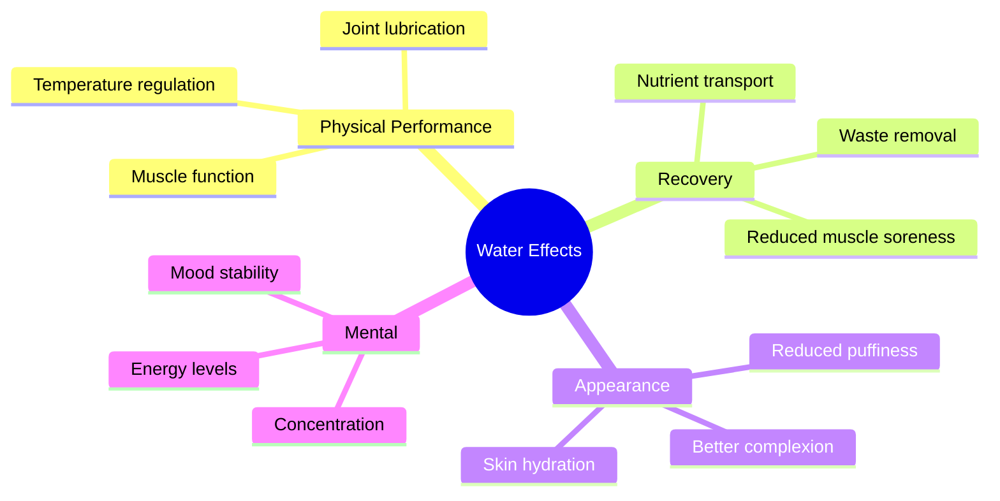
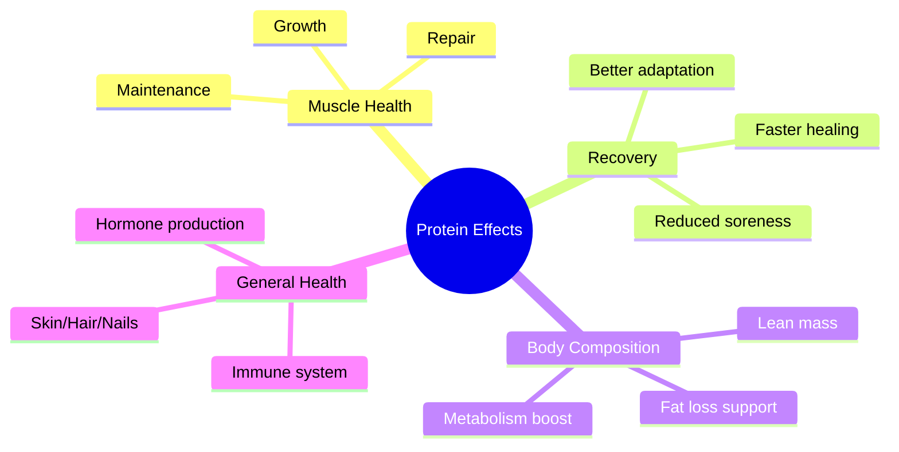
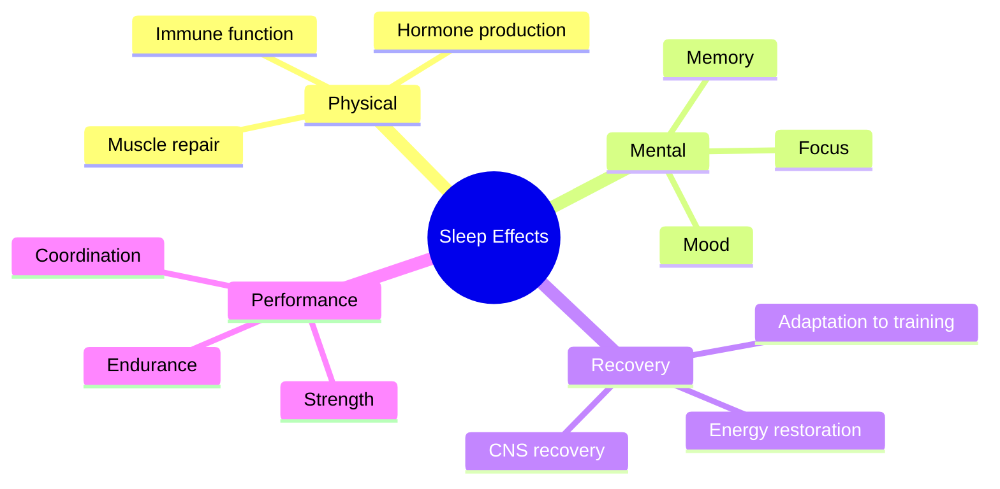
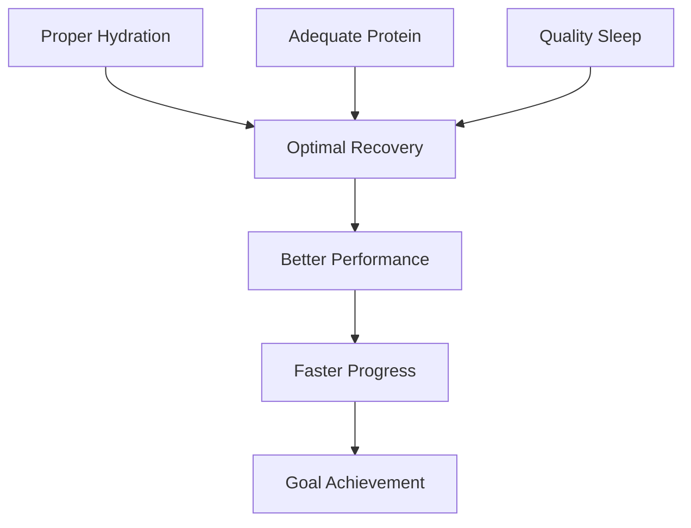

# Health Impacts Guide 🎯

## Daily Targets & Their Effects

### Water Intake (3L Target) 💧

#### Consequences of Under-hydration
1. **Short Term (Same Day)**
   - Decreased strength (-10-15%)
   - Reduced endurance
   - Poorer pump during workout
   - Headaches
   - Dry mouth/lips

2. **Medium Term (Days-Weeks)**
   - Slower recovery
   - Joint stiffness
   - Skin issues
   - Digestive problems

3. **Long Term**
   - Kidney stress
   - Joint problems
   - Chronic dehydration
   - Metabolic slowdown

### Protein Intake (150g Target) 🥩

#### Consequences of Low Protein
1. **Short Term (Same Day)**
   - Reduced recovery
   - Increased hunger
   - Lower energy
   - Poor workout performance

2. **Medium Term (Days-Weeks)**
   - Muscle loss
   - Slower gains
   - Longer recovery times
   - Increased injury risk

3. **Long Term**
   - Reduced muscle mass
   - Slower metabolism
   - Compromised immune system
   - Poor skin/hair health

### Sleep Quality (8h Target) 😴

#### Consequences of Poor Sleep
1. **Short Term (Next Day)**
   - Reduced strength (-20-30%)
   - Poor focus
   - Increased injury risk
   - Hormone disruption

2. **Medium Term (Days-Weeks)**
   - Compromised recovery
   - Mood issues
   - Increased fat storage
   - Reduced muscle gains

3. **Long Term**
   - Chronic inflammation
   - Metabolic issues
   - Increased cortisol
   - Reduced testosterone

## Synergistic Effects

### Positive Combinations 📈
1. **Good Sleep + High Protein**
   - Optimal muscle growth
   - Better recovery
   - Improved body composition

2. **Proper Hydration + Sleep**
   - Better muscle repair
   - Reduced inflammation
   - Optimal hormone production

3. **Hydration + Protein Timing**
   - Better nutrient absorption
   - Improved muscle protein synthesis
   - Reduced muscle breakdown

### Negative Combinations 📉
1. **Poor Sleep + Low Protein**
   - Accelerated muscle loss
   - Increased fat storage
   - Compromised recovery

2. **Dehydration + Poor Sleep**
   - Increased inflammation
   - Poor recovery
   - Reduced performance

## Recovery Optimization

## Action Steps
1. **Track Daily**
   - Water intake throughout day
   - Protein at each meal
   - Sleep quality and duration

2. **Monitor Impact**
   - Performance metrics
   - Recovery quality
   - Energy levels

3. **Adjust Based On**
   - Workout intensity
   - Climate/temperature
   - Activity level
   - Stress factors
