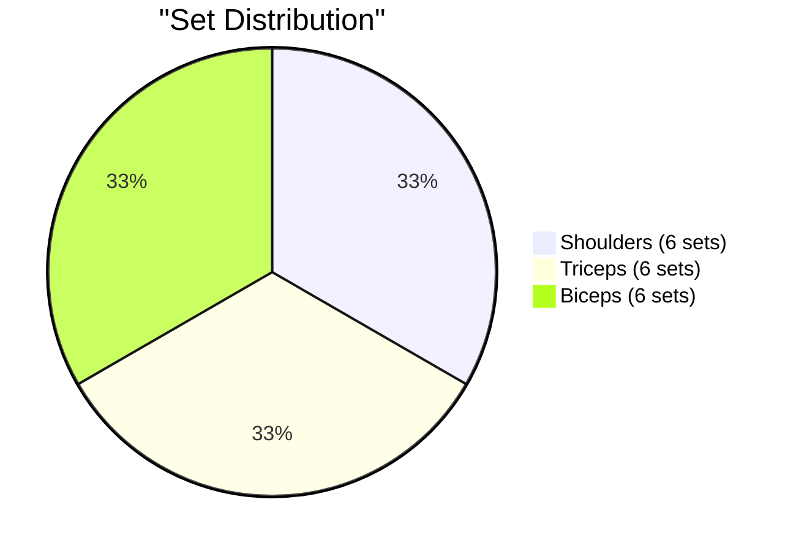
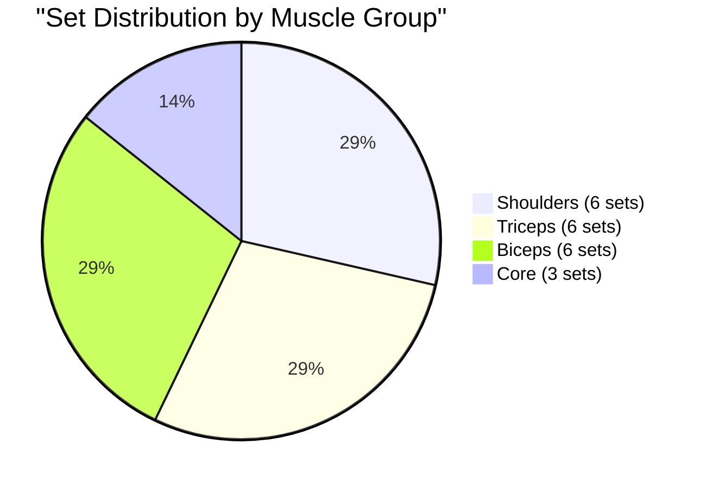
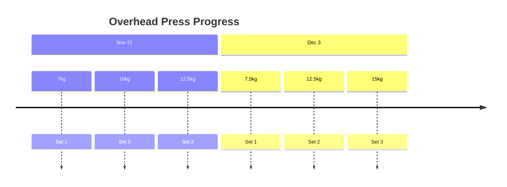
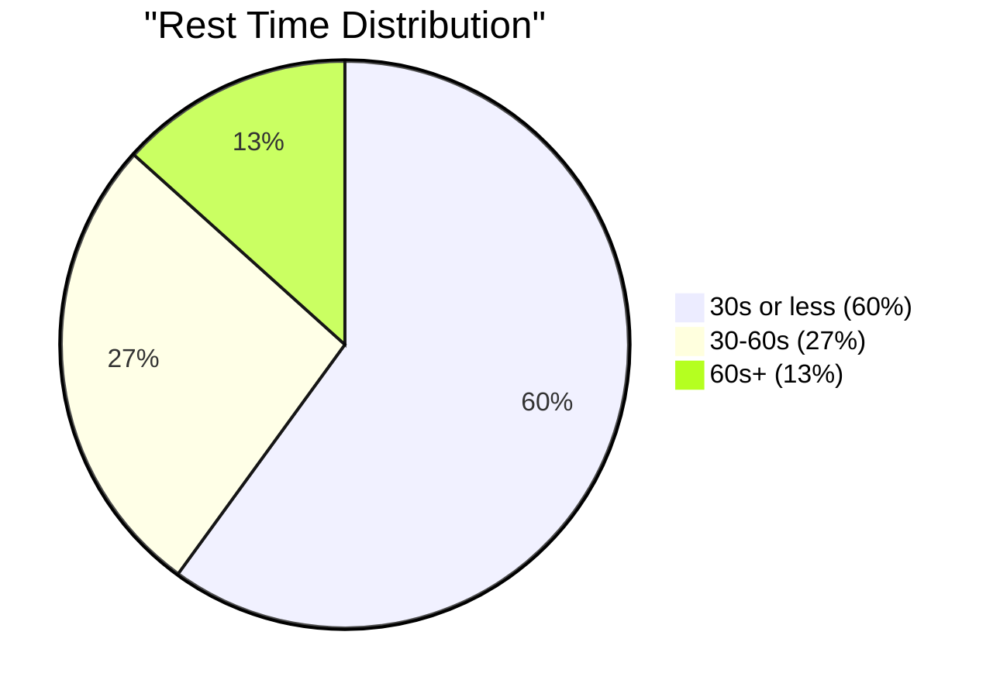

# Tuesday, Dec 3 - Shoulders & Arms 💪

## Training Log 🏋️‍♂️
### Shoulders & Arms Session
- Time: [Not specified]
- Style: Fast-paced, minimal rest
- Focus: Shoulders, Biceps, Triceps

#### 1. Overhead Dumbbell Press
- Set 1: 7.5kg × 8-10 reps
- Set 2: 12.5kg × 8-10 reps
- Set 3: 15kg × 8-10 reps
- Notes: Good progression in weight

#### 2. Standing Skull Crushers
- Set 1: 12.5kg × 10 reps
- Set 2: 17.5kg × 10 reps
- Set 3: 20kg × 10 reps
- Notes: Standing variation used

#### 3. Dumbbell Front Raises
- Set 1: 7.5kg × 10-12 reps
- Set 2: 10kg × 10-12 reps
- Set 3: 12.5kg × 10-12 reps
- Notes: Challenging exercise, progress slower here

#### 4. EZ Bar Bicep Curls
- Set 1: 2.5kg × 10 reps
- Set 2: 5kg × 10 reps
- Set 3: 7.5kg × 10 reps
- Set 4: 10kg × 8 reps
- Notes: Added extra set with higher weight

#### 5A. Hammer Curls (Superset)
- Set 1: 7.5kg × 10 reps
- Set 2: 10kg × 10 reps
- Notes: Reduced to 2 sets due to fatigue

#### 5B. Triceps Rope Pushdowns (Superset)
- Set 1: ~40kg × 10 reps
- Set 2: ~55kg × 10 reps
- Set 3: ~70kg × 10 reps
- Notes: Progressive increase in weight

## Analysis & Notes 📝
### Volume Analysis

### Workout Graphs
### Volume Distribution

### Weight Progression

### Rest Time Analysis

### Positives
- Strong triceps performance (up to 20kg on skull crushers)
- Good shoulder press progression
- Maintained intensity despite minimal rest

### Areas for Attention
- Front raises challenging - might need longer progression timeline
- Reduced hammer curl volume due to fatigue
- Consider exercise order optimization

### Next Session Focus
1. Maintain shoulder press progression
2. Keep form strict on front raises
3. Consider starting biceps earlier when fresher

Remember: Track, analyze, adjust based on data! 💪
