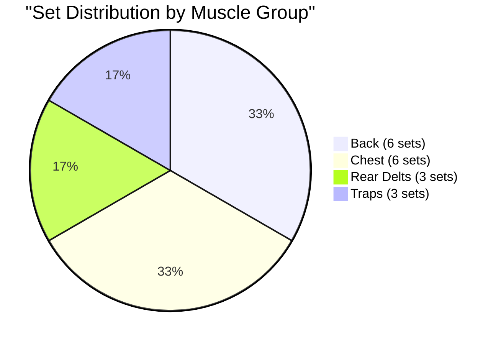
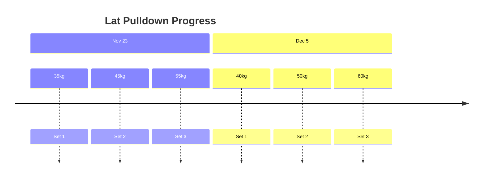
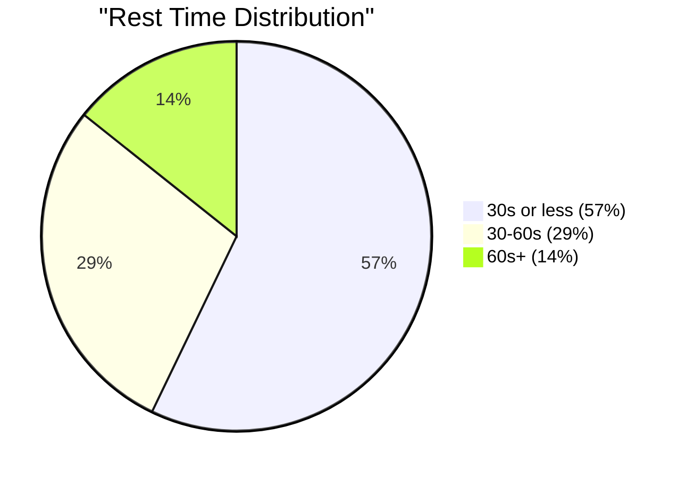

# Thursday, Dec 5 - Back & Chest 💪

## Training Log 🏋️‍♂️
### Back & Chest Session
- Time: [Not specified]
- Style: Fast-paced, minimal rest
- Focus: Back, Chest, Rear Delts

#### 1. Lat Pulldown
- Set 1: ~40kg × 10 reps
- Set 2: ~50kg × 10 reps
- Set 3: ~60kg × 10 reps
- Notes: Progressive weight increase
- Abs: 3 sets × 12 hanging knee raises during rest

#### 2. Chest Press Machine
- Set 1: ~40kg × 10 reps
- Set 2: ~50kg × 10 reps
- Set 3: ~60kg × 10 reps
- Notes: Machine feedback not optimal, more triceps engagement

#### 3. Dumbbell One-Arm Row
- Set 1: 7.5kg × 10 reps/arm
- Set 2: 12.5kg × 10 reps/arm
- Set 3: 15kg × 10 reps/arm
- Notes: Good form, high intensity

#### 4. Incline Dumbbell Press
- Set 1: 10kg × 10 reps
- Set 2: 12.5kg × 10 reps
- Set 3: 15kg × 10 reps
- Notes: Solid progression

#### 5A. Dumbbell Rear Delt Row (Superset)
- Set 1: 10kg × 12 reps
- Set 2: 12.5kg × 12 reps
- Set 3: 15kg × 12 reps
- Notes: Good mind-muscle connection

#### 5B. Dumbbell Shrugs (Superset)
- Set 1: 7.5kg × 10 reps
- Set 2: 12.5kg × 10 reps
- Set 3: 17.5kg × 10 reps
- Notes: Progressive weight increase

## Analysis & Notes 📝
### Volume Distribution

### Weight Progression

### Rest Time Analysis

### Positives
- Good back engagement across exercises
- Progressive overload on most movements
- Added abs work during rest periods

### Areas for Attention
- Chest press machine feedback suboptimal
- Consider alternative chest exercises
- Monitor trap development vs rear delt balance

### Next Session Focus
1. Explore alternative chest press options
2. Maintain back exercise progression
3. Focus on mind-muscle connection for chest

Remember: Track, analyze, adjust based on data! 💪
