# Friday, Dec 6 - Rest Day 💪

## Morning Check 📊
- Scale: [?] kg (Target: 75kg)
- Sleep: 7h (Target: 8+) - Woke up at 6:30 AM
- Energy: 7/10 
- Stress: 4/10 (Target: <4)
- Recovery: [?]/10

## Recovery Metrics 
### Sleep Analysis
- Hours: 7h (11:30 PM - 6:30 AM)
- Quality: 7/10
- Notes: Early wake-up, slightly below target

### Muscle Recovery Status

## Daily Focus Map 🎯

## Daily Targets & Impacts 📊

### Supplement & Recovery Stack
- Creatine: Not taken (Rest day)
- Streak: Maintained on training days
- Note: Natural recovery focus

> 🎯 **Rest Day Effects**:
> - Maintenance Phase: Baseline levels
> - Recovery Support: Natural processes
> - Next Day Prep: Ready for Saturday

### Hydration Status
- Target: 3L
- Current: 2L
- Progress: [▓▓▓▓░░] 67%

> 🎯 **Holistic Impact Alert**:
> ⚡ IMPROVEMENT ZONE:
> - Performance: Basic functions maintained
> - Skin: Minimal support
> - Oral: Basic saliva production
> - Recovery: Room for optimization
> Action: Increase intake for optimal benefits

### Protein Tracking
- Target: 150g
- Current: 175g
- Progress: [▓▓▓▓▓▓] 117%

> 🎯 **Holistic Impact Alert**:
> ✨ GROWTH ZONE:
> - Recovery: Excellent protein support
> - Metabolism: Enhanced on rest day
> - Skin & Hair: Optimal repair support
> - Satiety: Well managed throughout day

### Carbs & Energy
- Target: 250g
- Current: 220g
- Impact: Recovery Support

> 🎯 **Holistic Impact Alert**:
> ✨ OPTIMAL ZONE:
> - Energy: Stable throughout day
> - Insulin: Well managed
> - Oral: Moderate impact
> - Recovery: Good glycogen maintenance

## Daily Timeline ⏰

## Daily Targets Status 📈

```mermaid
%%{init: {'theme': 'base', 'themeVariables': { 'fontSize': '16px'}}}%%
graph TD
    subgraph Key Metrics vs Targets
    Protein["🥩 Protein: 175g/150g (+25g)"]
    Water["💧 Water: 2L/3L (-1L)"]
    Calories["🔥 Calories: 2850/2500 (+350)"]
    Steps["👣 Steps: 1.5k/10k (-8.5k)"]
    end
```

## Protein Sources 💪

## Calorie Breakdown 🔥

## Today's Wins & Misses 💯
- [x] Protein: 175g vs 150g target (+25g) 
- [ ] Water: 2L vs 3L target (-1L)
- [ ] Calories: 2850 vs 2500 target (+350)
- [ ] Steps: 1.5k vs 10k target (-8.5k)

## Analysis & Notes 📝
Positives:
- Great protein day (175g) - supports muscle maintenance/growth
- High-quality protein from costilla (80g) - complete protein source
- Consistent meal spacing throughout day
- Good energy levels (7/10) despite less sleep

Areas for Attention:
- Sleep was 1h below target (7h vs 8h) - aim to get to bed earlier
- Steps significantly below target (1.5k vs 10k) - could add a morning walk
- Late dinner (10 PM) - consider earlier timing for better sleep quality
- Stress at threshold (4/10) - manageable but monitor

## Patterns & Trends 📊
- Dog walk adding some movement but need more daily activity
- Good protein distribution across meals
- Late dinner pattern might affect sleep quality

## Action Items for Tomorrow 🎯
1. Add morning walk to increase step count
2. Aim for dinner before 9 PM
3. Target bedtime to achieve 8h sleep
4. Maintain protein success while optimizing meal timing

## Notes & Insights 💭
- Energy Levels: Good (7/10)
- Recovery Quality: Solid
- Areas for Improvement: 
  - Hydration needs attention
  - Sleep duration slightly low
  - Step count below target

## Tomorrow's Prep 🎯
- [x] Set workout clothes
- [x] Plan meals
- [x] Check schedule
- [x] Set primary focus
- [ ] Increase water intake strategy

## Rest Day Metrics 📊
### Muscle Recovery Status

### Macros

### Readiness Metrics

## Meal Log 🍳
### Breakfast (Time: 9:00 AM)
- Items:
  - [x] 2 avocado toasts
  - [x] 1 egg
  - [x] Coffee with milk
- Macros:
  - Protein: 6g
  - Fats: ~20g (healthy fats from avocado)
  - Calories: ~500
- Water: [Not tracked]

### Morning Snack
- Items:
  - [x] Protein shake with coffee
  - [x] Milk
- Macros:
  - Protein: 29g (25g shake + 4g milk)
  - Calories: ~150
- Water: [Not tracked]

### Lunch
- Items:
  - [x] Stuffed chicken milanesa (400g)
    - Chicken breast
    - Ham and cheese filling
    - Fried (reheated)
- Macros:
  - Protein: ~60g
  - Fats: High (from frying)
  - Calories: ~800
- Water: [Not tracked]

### Afternoon Snack
- Items:
  - [x] Reese's M&Ms
  - [x] 1 large Reese's cup
- Macros:
  - Protein: Minimal
  - Carbs: High (sugars)
  - Calories: ~400
- Water: [Not tracked]

### Dinner (Fancy Restaurant)
- Items:
  - [x] Costilla a la parrilla (400g)
  - [x] Half portion creamy mashed potatoes
  - [x] Pickled beans (100g)
  - [x] 2 campesino breads
  - [x] Chimichurri & criolla sauce
  - [x] 2 glasses of wine
- Macros:
  - Protein: ~80g (from beef ribs)
  - Carbs: Moderate-High (potatoes, bread)
  - Fats: Moderate-High
  - Calories: ~1000
- Water: [Not tracked]

## Daily Totals
- Total Protein: ~175g (above target, great!)
- Total Calories: ~2850 (above target)
- Total Water: ~2L
- Alcohol: 2 glasses wine

## Notes & Patterns
- Higher calorie day due to restaurant dinner
- Good protein intake at lunch
- Added sugars from afternoon snacks
- Alcohol consumption at dinner
- Water intake could be improved
