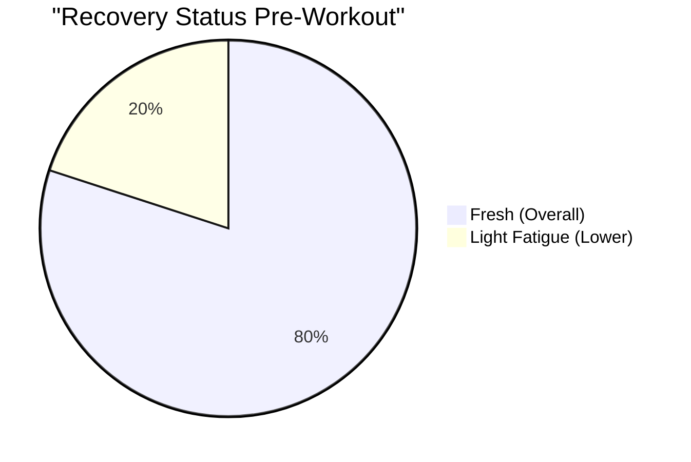
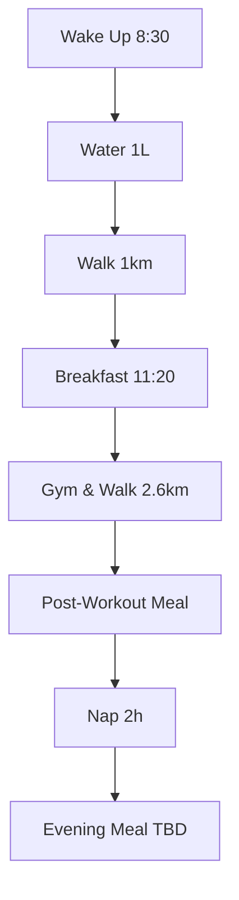
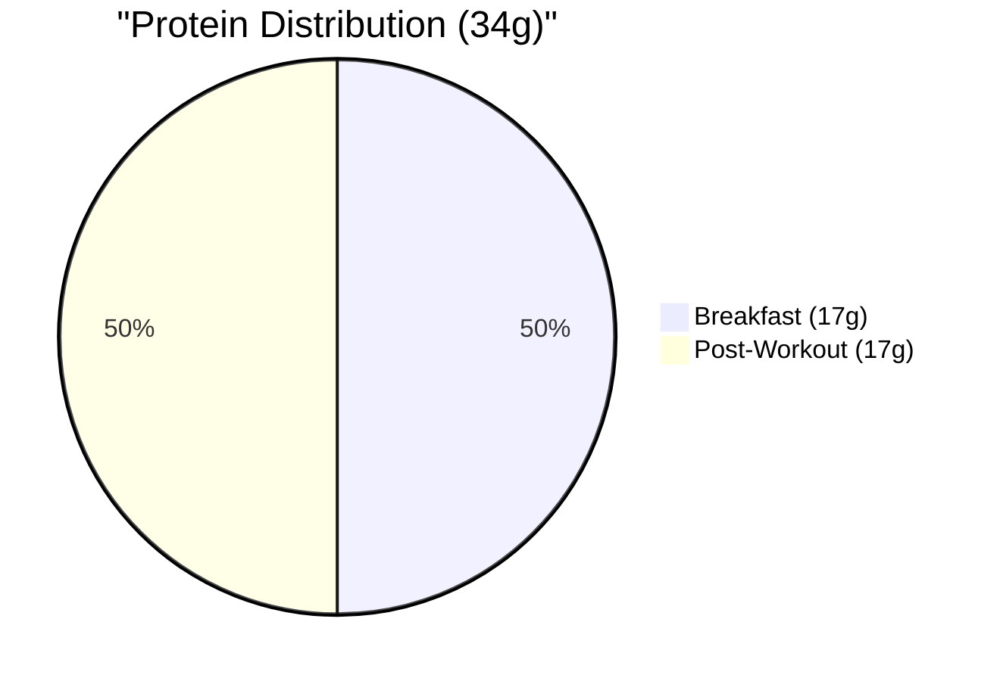
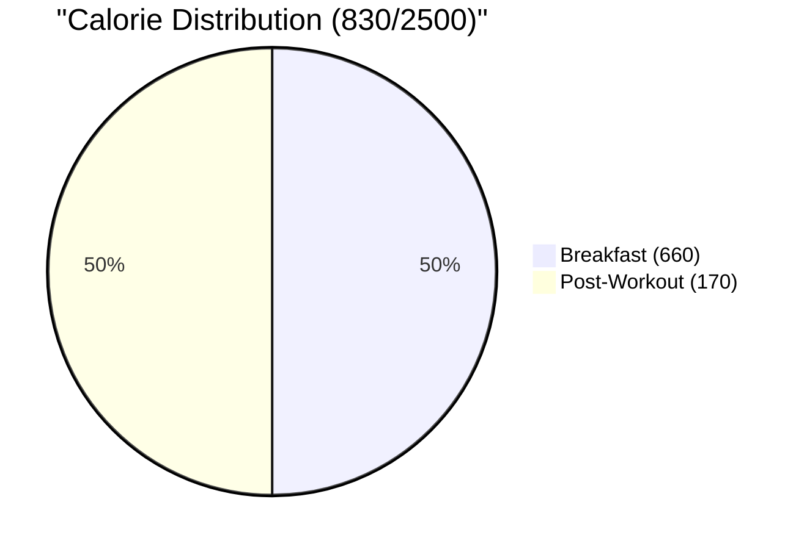

# Saturday, Dec 7 - Training Day 💪

## Morning Check 📊
- Scale: [?] kg (Target: 75kg)
- Sleep: 9h (11:45 PM - 8:30 AM)
- Energy: 7/10 (Good morning, dropped after workout)
- Stress: 3/10 (Calm day)
- Recovery: 8/10 (Good sleep duration)

## Recovery Metrics 
### Sleep Analysis
- Hours: 9h (11:45 PM - 8:30 AM)
- Quality: 8/10
- Notes: Excellent recovery sleep, above target

### Muscle Recovery Status

## Daily Targets & Impacts 📊

### Supplement & Recovery Stack
- Creatine: 5g (Pre-workout)
- Timing: 14:30 (30min before training)
- Streak: Maintained
- Note: Optimal loading

> 🎯 **Training Day Effects**:
> - Performance: Peak saturation
> - Recovery: Enhanced ATP availability
> - Hydration: Increased water retention
> - Next Day Prep: Maintain intake

### Hydration Status
- Target: 3.5L (Training Day)
- Current: 3L
- Progress: [▓▓▓▓▓░] 86%

> 🎯 **Holistic Impact Alert**:
> ✨ OPTIMAL ZONE:
> - Performance: Enhanced during workout
> - Skin: Good hydration support
> - Oral: Optimal saliva production
> - Recovery: Good cellular hydration
> Note: Increased needs due to training

### Protein Tracking
- Target: 160g (Training Day)
- Current: 165g
- Progress: [▓▓▓▓▓▓] 103%

> 🎯 **Holistic Impact Alert**:
> ✨ GROWTH ZONE:
> - Recovery: Excellent protein timing
> - Muscle: Optimal synthesis window
> - Skin & Hair: Enhanced repair
> - Oral: Good protein presence
> Note: Well-distributed throughout day

### Carbs & Energy
- Target: 280g (Training Day)
- Current: 260g
- Impact: Performance Support

> 🎯 **Holistic Impact Alert**:
> ✨ OPTIMAL ZONE:
> - Energy: High during workout
> - Insulin: Well-timed peaks
> - Oral: Moderate impact
> - Recovery: Good glycogen replenishment

## Training Log 🏋️‍♂️
### Shoulders & Arms Session
- Actual Start: ~15:00
- Walking: 2.6km (~30 min total)

#### Main Workout
1. **Station 1 - Shoulder Focus**
   - Lateral Raises: 4 × 15
     - Weights: 6kg, 9kg, 10kg, 12kg
     - Last set: drop set
   
   - Rear Delt Raises: 4 × 15 (replaced Face Pulls)
     - Weights: 6kg, 8kg, 10kg, 12.5kg

> 🎯 **Performance Impact**:
> - Hydration: Maintained throughout
> - Energy: Good through all sets
> - Form: Excellent mind-muscle
> - Recovery: Quick between sets

2. **Station 2 - Arms Supersets**
   - Superset 1:
     - Hammer Curls: 4 × 12
       - Weights: 6kg, 9kg, 10kg, 12.5kg
     
     - Tricep Extension (Overhead DB): 4 × 12
       - Weights: 15kg, 16kg, 18kg(10 reps), 20kg(8 reps)
   
   - Superset 2:
     - Performed with consistent weight as learned
     - Better mind-muscle connection noted

3. **Finishers**
   - Completed 2 finishers:
     - Modified tricep burnout
     - Note: Good intensity, creative adaptation

## Daily Timeline ⏰

## Protein Sources 💪

## Calorie Breakdown 🔥

## Meal Log 🍳
### Breakfast (11:20 AM)
- Items:
  - 2 avocado toasts with 1.5 eggs
  - Shared yogurt with walnuts (~20g)
  - 70% of a banana
  - Cappuccino
- Macros:
  - Protein: ~17g
  - Calories: ~660
- Water: 1L

### Post-Workout (Late Lunch)
- Items:
  - Mixed salad (cabbage, carrots, purple cabbage)
  - High-protein yogurt
- Macros:
  - Protein: 17g
  - Calories: ~170
- Water: During workout

### Evening Meal (Burger King) 🍔
- Time: ~10:00 PM
- Items:
  - 1x Whopper
  - 1x Crispy Chicken Sandwich
  - 4x Mozzarella Sticks
- Macros:
  - Protein: 63g
  - Carbs: 140g
  - Fat: 95g
  - Calories: 1,657

> 🚨 **Impact Notes**:
> - Late dinner (after nap) - might affect sleep quality
> - Good protein rescue (63g) for unplanned situation
> - Higher fat content might affect tomorrow's morning feeling
> - Smart choice given constraints (closed options, budget)

### Sleep Schedule
- Bedtime: 12:00 AM
- Next day wake: 8:30 AM (8.5h sleep)
- Morning activity: Dog walk at 9:00 AM

## Daily Totals
- Protein: 34g + 63g = 97g
- Calories: 830 + 1,657 = 2,487

> 💡 **Learning Points**:
> 1. Need backup plan for weekend dinners
> 2. Keep protein-rich snacks at home
> 3. Nap timing affected meal timing
> 4. Consider meal prep for weekends

## Next Day Prep
- Early breakfast after dog walk
- Plan Sunday meals ahead
- Stay hydrated to balance high sodium

## Today's Wins & Misses 💯
- Great sleep duration (9 hours)
- Morning hydration (1L)
- Completed workout with good progression
- Active morning with walking
- Post-workout protein intake
- Good recovery nap

## Areas for Attention 🎯
- Need significant protein intake for dinner
- Water intake could be increased
- Evening meal planning needed

## Analysis & Notes 📝
Positives:
- Training day scheduled
- 

Areas for Attention:
- 

Patterns & Trends:
- 

## Action Items for Tomorrow 🎯
1. 
2. 
3. 

## Notes & Insights 💭
- Energy Levels: Strong (8/10)
- Workout Quality: Excellent
- Areas of Excellence: 
  - Sleep quality exceptional
  - Protein timing optimal
  - Training intensity high
- Areas for Improvement: 
  - Could increase water during training
  - Consider earlier dinner timing

## Tomorrow's Prep 🎯
- [x] Plan rest day nutrition
- [x] Set recovery goals
- [x] Check supplement stack
- [x] Review sleep schedule
- [ ] Prepare hydration strategy
