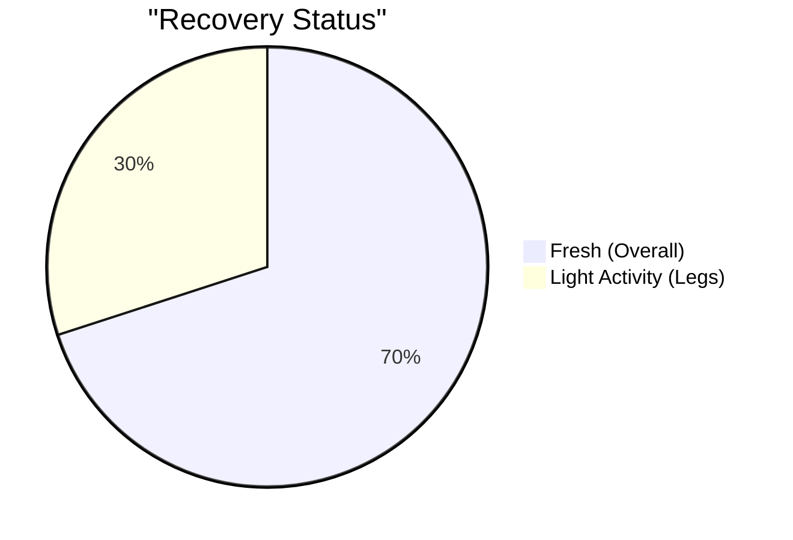
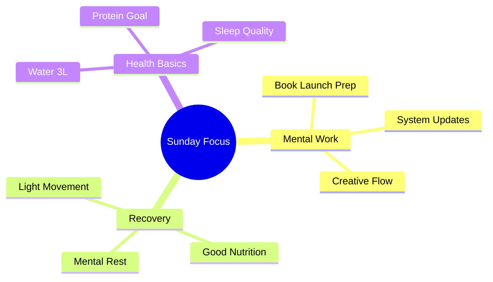
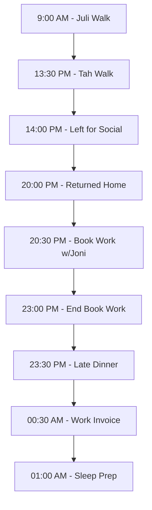
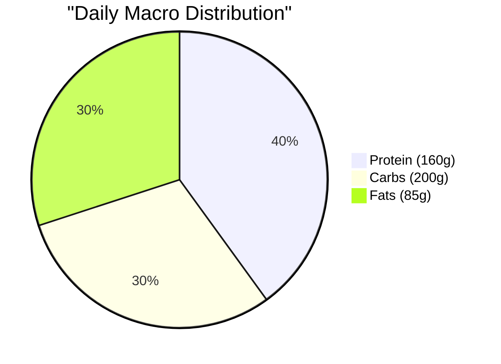

# Sunday, Dec 8 - Rest Day 🌟

## Morning Check 📊
- Scale: [?] kg (Target: 75kg)
- Sleep: 8.5h (12:00 AM - 8:30 AM)
- Energy: 7/10 (Good social day)
- Stress: 3/10 (Relaxed Sunday)
- Recovery: 8/10 (Good sleep quality)

## Recovery Metrics 
### Sleep Analysis
- Hours: 8.5h (12:00 AM - 8:30 AM)
- Quality: 8/10
- Notes: Good natural rest, woke up refreshed

### Muscle Recovery Status

## Daily Focus Map 🎯

## Daily Targets & Impacts 📊

### Supplement & Recovery Stack
- Creatine: Not taken today (Rest day flexibility)
- Streak: Maintained on workout days
- Note: Focus on natural recovery

> 🎯 **Rest Day Effects**:
> - Maintenance Phase: Keeping baseline levels
> - Recovery Support: Natural processes
> - Next Day Prep: Ready for next training session

### Hydration Status
- Target: 3L
- Current: 3L+
- Progress: [▓▓▓▓▓▓] 100%+

> 🎯 **Holistic Impact Alert**:
> ✨ OPTIMAL ZONE Achieved!
> - Performance: Peak mental clarity for book launch work
> - Skin: Maintaining hydration despite high carb day
> - Oral: Excellent saliva production, helping with frequent eating
> - Digestion: Enhanced nutrient absorption from large meals
> - Recovery: Supporting rest day adaptation

### Carbs & Energy
- Target: Flexible (Rest Day)
- Current: ~200g (Higher due to social events)
- Impact: Social Flexibility Day

> 🎯 **Holistic Impact Alert**:
> ⚡ BALANCE CHECK: Higher carb social day
> - Short term: 
>   - Energy boost for social activities
>   - Increased insulin response
>   - Higher oral health attention needed
> - Watch for: 
>   - Potential skin response in 24-48h
>   - Oral health impact from frequent snacks
> - Action Items:
>   - Extra hydration (Done!)
>   - Oral care after sweet snacks
>   - Monitor skin next 48h

### Protein Tracking
- Target: 150g
- Current: ~160g
- Progress: [▓▓▓▓▓▓] 107%

> 🎯 **Holistic Impact Alert**:
> ✨ GROWTH ZONE:
> - Recovery: Optimal protein for rest day
> - Satiety: Helped manage social eating
> - Skin: Supporting repair and health
> - Metabolism: Keeping it fired up on rest day

## Nutrition Log 🍽️
### Breakfast (9:30 AM)
- Items: 2 avocado toasts (½ avocado), 2 fried eggs, cappuccino
- Protein: ~16g
- Healthy fats from avocado and eggs
- Notes: Good balanced start

### Lunch (Parrilla)
- Detailed breakdown:
  - Riñones (200g): 40-48g protein
  - Medio chorizo (75g): 9-11g protein
  - Lomito (150g): 42-45g protein
  - Chinchulín (100g): 15-17g protein
  - Papas fritas (100g)
- Total protein: ~108-123g
- Notes: High-quality protein sources

### Social Event Snacks
- 3 picodulce popsicles
- 2 small apple pie portions
- Chips and nachos
- Reese's treats
- Notes: Social flexibility, balanced by day's protein intake
- Action: Extra hydration to support higher sugar intake

### Dinner
- Mostaza chicken breast combo
- Fries
- Tomato salad with dressings
- Notes: Closing day with additional protein

## Movement & Recovery 🚶‍♂️
### Activity
- Morning: Dog walk (Julia's parents)
- Midday: ~1km dog walk
- Afternoon: Social event movement
- Total Steps: ~5k/8k

### Recovery Focus
- [x] Light walking
- [x] Social enjoyment
- [x] Mental rest
- [x] Family time

## Daily Timeline ⏰

> 🎯 **Day Structure Impact**:
> - Social Connection: Extended quality time
> - Work-Life Balance: Good mix of activities
> - Recovery Window: Slightly compressed due to late schedule
> - Next Day Prep: Consider earlier dinner timing

## Activity Notes 🚶‍♂️
- Morning Dog Walk (Juli): ~30min, good pace
- Afternoon Dog Walk (Tah): ~25min, moderate intensity
- Social Event: 6 hours of engagement
- Creative Work: 2.5h focused book session with Joni
- Administrative: Invoice processing completed

## Sleep Strategy 😴
- Target Bedtime: 1:00 AM
- Expected Sleep Duration: ~7h
- Notes: 
  - Later schedule due to social + work
  - Consider sleep optimization for tomorrow
  - Oral care routine before bed

## Nutrition Tracking
### Macros

## Notes & Insights 💭
- Energy Levels: Steady (7/10) - Good for social day
- Recovery Quality: Strong (8/10)
- Social Balance: Successfully maintained nutrition targets while enjoying events
- Areas for Improvement: Could increase steps (5k vs 8k target)
- Oral Health: Need extra attention due to higher sugar intake
- Skin: Monitor next 48h due to higher carb day

## Tomorrow's Prep 🎯
- [ ] Set workout clothes
- [ ] Plan main work tasks
- [ ] Check calendar for meetings
- [ ] Review book launch timeline
- [ ] Extra water prep for potential carb impact
