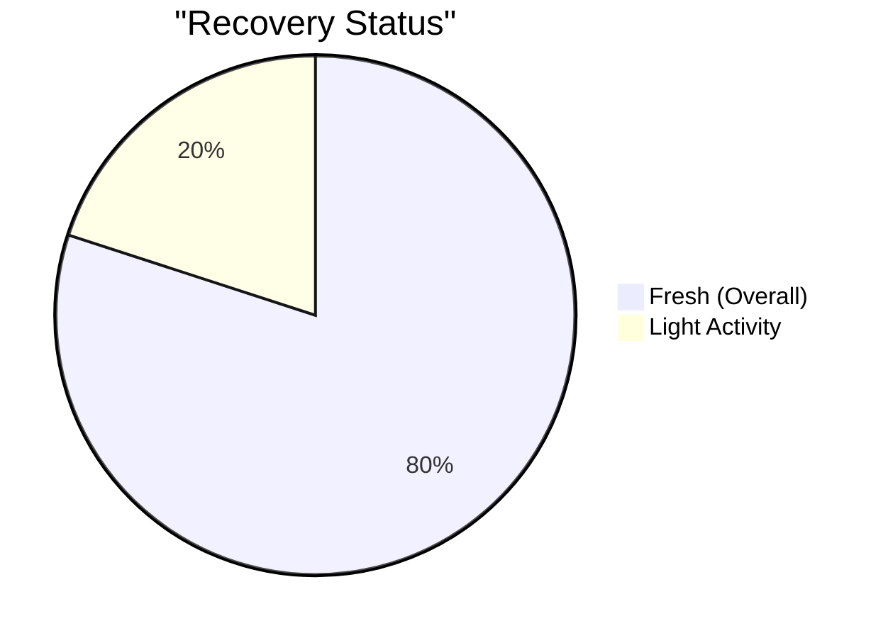
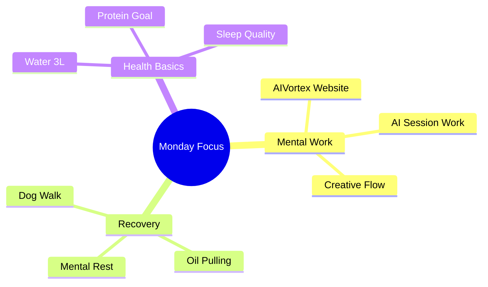
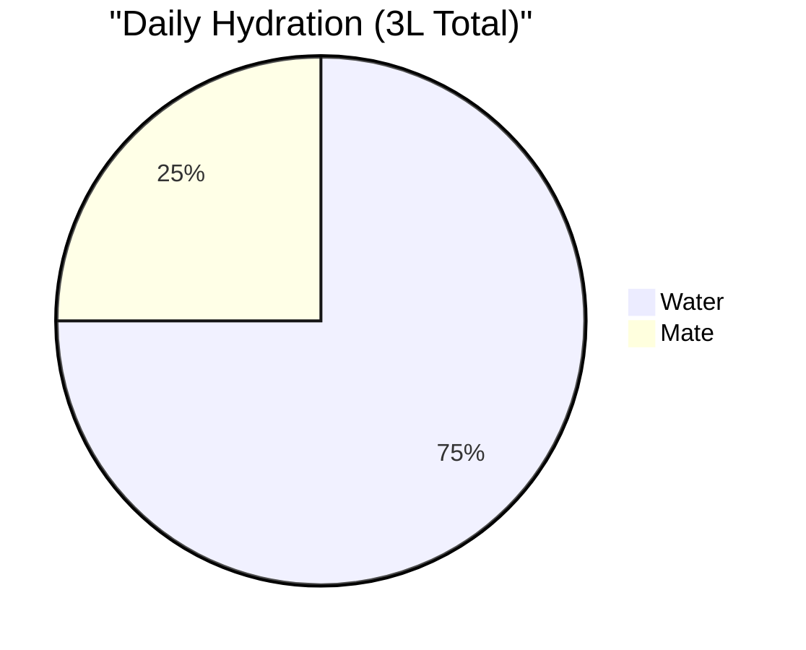
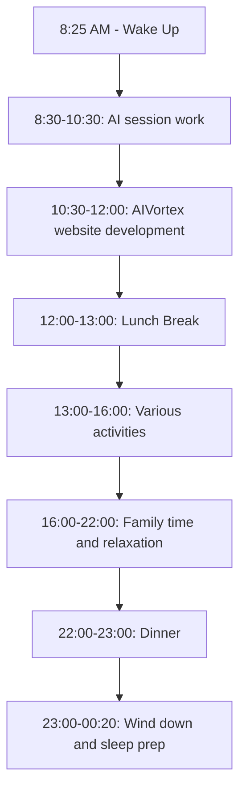

# Monday, Dec 9 - Rest Day 🌟

## Morning Check 📊
- Scale: [?] kg (Target: 75kg)
- Sleep: 7.5h (1:00 AM - 8:30 AM)
- Energy: 7/10 (Productive day)
- Stress: 4/10 (Balanced workday)
- Recovery: 8/10 (Good rest day)

## Recovery Metrics 
### Sleep Analysis
- Hours: 7.5h (1:00 AM - 8:30 AM)
- Quality: 7/10
- Notes: Good sleep despite later bedtime

### Muscle Recovery Status

## Daily Focus Map 🎯

## Daily Targets & Impacts 
### Supplement & Recovery Stack
- Creatine: Not taken (Rest day)
- Protein shake: Pre-bed
- Note: Focus on natural recovery

> **Rest Day Effects**:
> - Recovery: Natural processes prioritized
> - Hydration: Meeting 3L target
> - Next Day Prep: Ready for Tuesday's push day
> - Focus: Light activity & mental work

### Hydration Status
- Target: 3L
- Current: 4L (3L water + 1L mate)
- Progress: [▓▓▓▓▓▓] 133%

> 🎯 **Holistic Impact Alert**:
> ✨ OPTIMAL ZONE Exceeded!
> - Performance: Excellent hydration throughout day
> - Skin: Well maintained with extra water
> - Oral: Oil pulling (coconut oil) + optimal hydration
> - Recovery: Supporting rest day processes
> - Digestion: Enhanced with consistent water intake

### Protein Tracking
- Target: 150g
- Current: ~140g
- Progress: [▓▓▓▓▓░] 93%

> **Holistic Impact Alert**:
>  MAINTENANCE ZONE:
> - Recovery: Good protein for rest day
> - Muscle: Supporting maintenance
> - Evening shake helps reach targets
> - Action: Early protein tomorrow for training

### Carbs & Energy
- Target: Moderate (Rest Day)
- Current: ~220g (Higher from pasta dinner)
- Impact: Recovery Support

> **Holistic Impact Alert**:
>  BALANCE CHECK:
> - Energy: Good for mental work
> - Higher evening carbs from ravioles
> - Watch morning energy for training
> - Action: Earlier, lighter dinner tomorrow

## Nutrition & Hydration 
### Meals Timeline
1. **Breakfast** (9:30)
   - Coffee with milk
   - Tostado JyQ

2. **Lunch** (13:00)
   - Rice-egg omelet (1 egg portion)
   - Chicken breast (400g)
   - Spices

3. **Snacks**
   - Reese's M&Ms
   - Mantecol
   - Mate (1L @ 16:00)

4. **Dinner** (22:00)
   - 2 plates ravioles w/meat sauce

5. **Pre-bed**
   - Protein shake

### Hydration Status

## Nutrition Log 
### Breakfast (9:30 AM)
- Coffee with milk
- Tostado JyQ
- Protein: ~12g
- Notes: Light start, could be earlier

### Lunch (13:00)
- Rice-egg omelet (1 egg portion)
- Chicken breast (400g)
- Spices
- Protein: ~95g
- Notes: Solid protein-rich meal

### Snacks & Hydration
- Reese's M&Ms
- Mantecol
- Mate (1L @ 16:00)
- Notes: Higher sugar, balanced by protein intake

### Dinner (22:00)
- 2 plates ravioles w/meat sauce
- Protein: ~15g
- Carbs: Higher pasta portion
- Notes: Could time earlier for better digestion

### Pre-bed
- Protein shake
- Protein: ~25g
- Notes: Helps hit daily protein target

## Activity & Movement 
- Evening walk with dog (~1km+)
- Oil pulling (10 min morning routine)
- General daily movement

## Productivity & Focus 
### Work Blocks
- 8:30-10:30: AI session work
- 10:30-12:00: AIVortex website development
- Rest of day: Various activities including family time

### Mental State
- Good focus during morning work sessions
- Balanced social and work activities
- Productive creative flow with website work

## Recovery Notes 
### What Went Well
- Met hydration goals
- Good protein intake
- Maintained light activity
- Productive work sessions

### Areas for Tomorrow
- Earlier bedtime for Tuesday's workout
- Pack gym gear
- Plan pre-workout meal

## Evening Reflection 
- Recovery Quality: Strong (8/10)
- Social Balance: Good mix of work and family time
- Areas for Improvement: Could structure meal timing better
- Oral Health: Oil pulling completed
- Sleep Prep: Aiming for earlier bedtime (target: 00:20)

## Daily Timeline 

## Notes & Insights 
- Following late Sunday schedule
- Active recovery focus
- Prepare for Tuesday's training
- Emphasis on sleep optimization tonight

## Tomorrow's Prep 🎯
- [ ] Pack gym gear for 14:45 session
- [ ] Plan pre-workout meal (2-3h before)
- [ ] Early protein intake
- [ ] Check supplement stack
- [ ] Time meals around quiet gym period (14:45-15:30)
