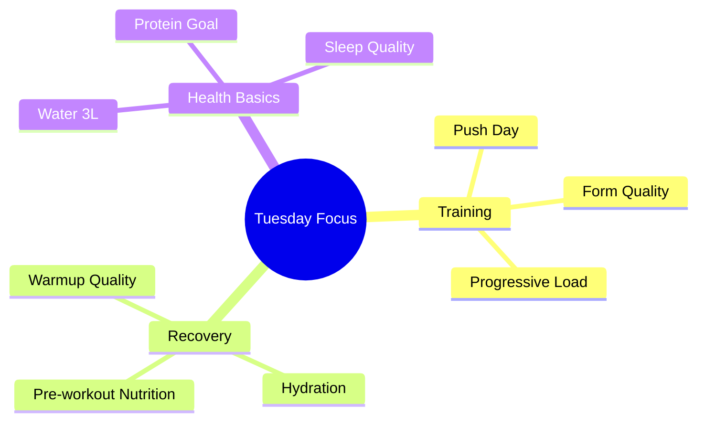

# Tuesday, Dec 10 - Push Day 💪

## Morning Check 📊
- Scale: [?] kg (Target: 75kg)
- Sleep: 7.5h (00:45 AM - 8:12 AM)
- Energy: TBD/10
- Stress: TBD/10
- Recovery: TBD/10

## Training Day Prep 🏋️‍♂️
### Pre-Workout Timeline
- Current: 8:16 AM
- Gym Time: 14:45-15:30 (Quiet period)
- Key times:
  - Protein meal: 2-3h before (11:45-12:45)
  - Pre-workout hydration: Start now
  - Light meal: 1h before if needed

### Workout Focus
**Push Day Targets**
- [ ] Bench Press progression
- [ ] Triceps volume
- [ ] Shoulder stability
- [ ] Form check on inclines

## Daily Focus Map 🎯

## Morning Notes 📝
- Sleep: 7.5h (decent for training)
- Next actions:
  1. Morning hydration
  2. Light breakfast
  3. Plan pre-workout meal
  4. Pack gym bag

Will update throughout the day with nutrition, hydration, and workout details! 💪
