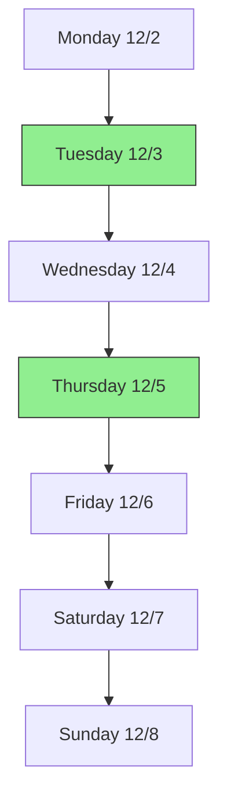
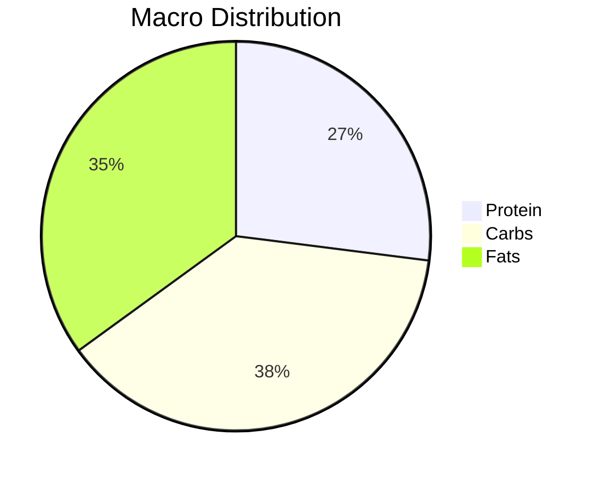
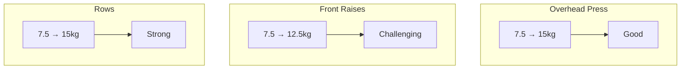

# Progress Tracker

## Weekly Overview (Dec 2-8, 2024)


## Daily Stats
### Weight Tracking
- Starting: [Your starting weight]
- Current: [Your current weight]
- Trend: [+/- from last week]

### Session Logs

#### Tuesday (Dec 3) - Shoulders & Arms
- Time: 14:45-16:15
- Energy Level: 8/10
- Exercises Completed:
  1. Overhead Press (3×10): 7.5kg → 15kg
  2. Standing Skull Crushers (3×10): 12.5kg → 20kg
  3. Front Raises: 12.5kgx10
  4. One-arm Rows: 15kgx8
  5. 
  6. 
- Notes: Strong progression on overhead press

#### Thursday (Dec 5) - Back & Chest
- Time:
- Energy Level (1-10):
- Exercises Completed:
- Notes:

#### Friday (Dec 6) Summary
- Rest Day Activities: None reported
- Water Intake: ~2L 
- Caffeine: Coffee with milk (morning)

#### Nutrition Breakdown
1. **Breakfast** (~500 kcal)
   - 2 avocado toasts
   - 1 egg
   - Coffee with milk
   - Protein: ~6g
   - Healthy Fats: ~20g

2. **Morning Snack** (~150 kcal)
   - Protein shake with coffee
   - Protein: ~29g (25g shake + 4g milk)

3. **Lunch** (~800 kcal)
   - Stuffed chicken milanesa (400g)
     - Chicken breast
     - Ham and cheese filling
     - Fried (reheated)
   - Protein: ~60g
   - Fats: High (fried)

4. **Snack** (~400 kcal)
   - Reese's M&Ms
   - 1 large Reese's cup
   - High sugar content 

5. **Dinner** (Fancy Restaurant) (~1000 kcal)
   - Costilla a la parrilla (400g)
   - Half portion creamy mashed potatoes
   - Pickled beans (100g)
   - 2 campesino breads
   - Chimichurri & criolla sauce
   - 2 glasses of wine 
   
#### Daily Totals
- Calories: ~2850 kcal  (Above target)
- Protein: ~120g  (Below target)
- Water: 2L 
- Notes:
  - High quality protein sources
  - Weekend dining flexibility
  - Higher fat intake from fried food
  - Added sugars from snacks

#### Recommendations for Saturday
1. Focus on lean protein early
2. Reduce fried foods
3. Plan protein-rich snacks
4. Consider post-workout shake

#### Saturday (Dec 7) - TODAY
#### Morning Check-in ⏰ 9:00 AM
- Priority Focus: Protein intake and training quality
- Yesterday's Learning Points:
  - Total protein: 120g (20g below target)
  - Calories: Above target due to dinner choices
  - Good water intake base

#### Today's Targets
1. **Nutrition Priorities**
   - Early protein focus
   - Target: 150g protein minimum
   - Controlled fats (after yesterday's fried foods)
   - Maintain 2L+ water

2. **Training Day Macros**
   - Protein: 150g (non-negotiable)
   - Calories: 2300-2500
   - Carbs: Timed around workout
   - Fats: Moderate, focusing on healthy sources

3. **Meal Timing**
   - Pre-workout: Protein + complex carbs
   - During: Hydration
   - Post: Fast-absorbing protein + carbs

#### Upper Body Training Plan
- Target Start Time: [Set preferred time]
- Warmup: 10 min mobility
- Main Exercises:
  1. [ ] Bench Press/Push-ups: 4×8-12
  2. [ ] Overhead Press: 4×8-12
  3. [ ] Rows: 4×10-12
  4. [ ] Lateral Raises: 3×12-15
  5. [ ] Tricep Extension: 3×12-15
  6. [ ] Superset: Bicep/Shoulder Finisher

#### Recovery Focus
- Extra hydration (after wine yesterday)
- Quality protein timing
- Proper warm-up
- Form priority

#### Weekend Strategy
- Plan meals ahead
- Protein sources ready
- Backup shake available
- Strategic flexibility

## Nutrition Tracking

### Daily Targets (Dec 6)
- Protein: 140-150g  (Hit: 159g, over target but acceptable)
- Calories: 2300-2500 kcal  (Hit: 2393 kcal)
- Water: 2.5L target  (Hit: 2L + coffee)
- Macros Distribution:
  - Protein: 159g (27%) 
  - Carbs: 230g (38%)
  - Fats: 93g (35%)

### Health Markers
- Caffeine Timing:  Following Huberman (90min after wake)
- Oil Pulling: 
- Dental Care: 
- Skin Care: 

### Latest Meal Analysis


### Daily Breakdown
- Pre-workout meals: ~1893 kcal
  - Protein: 139g
  - Carbs: 170g
  - Fats: 73g
- Post-workout meals (2 sandwiches):
  - Protein: +20g
  - Carbs: +60g
  - Fats: +20g
  - Total: ~500 kcal

### Nutrition Insights 
- Overall calorie target on point for training day
- Good absolute protein intake despite lower %
- Carb timing good for workout energy
- Hydration needs slight increase

### Today's Recommendations 
1. Add 500ml water to hit target
2. Consider protein shake to boost ratio
3. Reduce fat intake slightly tomorrow
4. Keep meal timing around workouts

### Monthly Goals Progress
- Protein Target: 11/30 days tracked 
- Hydration Target: 9/30 days tracked 
- Calorie Target: 10/30 days tracked 

## Progress Analysis
### Strengths 
- High intensity maintained throughout
- Good weight progression on most exercises
- Completed all major exercises
- Adapted well to equipment availability

### Areas to Improve 
- Abs work during rest periods
- Consistent rest timing
- Machine selection for chest (find better alternative)
- Form check on one-arm rows

### Action Items 
- Research alternative chest press options
- Set timer for rest periods
- Plan abs work before session
- Document machine settings for next time

## Weight Progression Chart


## Quick Input Format
```
Session: [Day] - [Workout Type]
Time: [HH:MM]
Energy: [1-10]
Exercises:
- [Exercise]: [Weight]x[Reps] [Notes]
Nutrition:
- Protein: [g]
- Calories: [kcal]
- Water: [L]
```

#### Monday (Dec 9) Summary
- **Sleep**: 1:00 AM - 8:30 AM (7.5h)
- **Nutrition**:
  - Breakfast (9:30): Coffee + tostado JyQ
  - Lunch (13:00): Rice-egg omelet (~1 egg) + chicken breast (400g)
  - Snacks: Reese's M&Ms, mantecol
  - Dinner (22:00): 2 plates ravioles w/meat sauce
  - Protein shake before bed
- **Hydration**: 
  - Water: ~3L total
  - Mate: 1L (16:00)
- **Activity**: 
  - Light walk with dog (~1km+)
  - Oil pulling (10 min)
- **Work/Productivity**:
  - 8:30-10:30: AI session
  - 10:30-12:00: AIVortex website (2 sections)
- **Notes**: Rest day completed as planned. Good hydration and protein intake. Light activity with evening walk.
