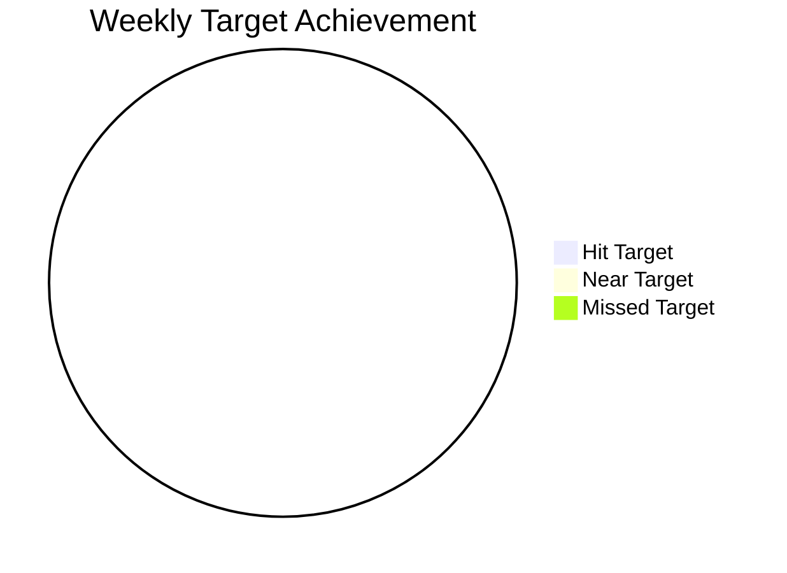
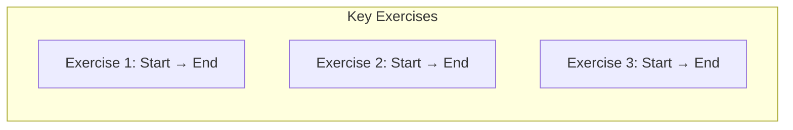
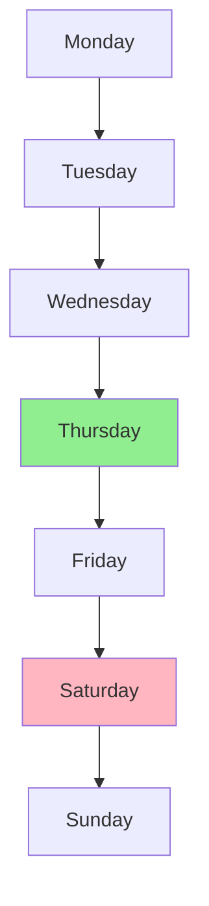

# Weekly Health Review

## Week Overview
**Week**: [Date Range]
**Review Date**: [Current Date]

## Quick Health Score

## Training Analysis
### Workout Completion
- [ ] Tuesday: [Status]
- [ ] Thursday: [Status]
- [ ] Saturday: [Status]
- [ ] Soccer: [Status]

### Progress Highlights
#### Weight Progression

#### Energy Levels

## Nutrition Summary
### Daily Averages
- Protein: [avg]g/day (Target: 140-150g)
- Calories: [avg]kcal/day
- Water: [avg]L/day

### Adherence Rates
- Protein Target: [x/7] days
- Calorie Target: [x/7] days
- Water Target: [x/7] days

### Weekend Management
- Cheat Meals: [count]
- Recovery Strategy: [notes]

## Health Protocols
### Huberman Protocol Adherence
- Morning Sunlight: [x/7] days
- Caffeine Timing: [x/7] days
- Training Timing: [x/7] days

### Oral Health
- Oil Pulling: [x/7] days
- Proper Brushing: [x/7] days
- Flossing: [x/7] days

### Skin Health
- Water Goals Met: [x/7] days
- Low Glycemic Days: [x/7] days
- Care Routine: [x/7] days

## Pattern Recognition
### Strengths This Week
1. [Strength 1]
2. [Strength 2]
3. [Strength 3]

### Areas for Improvement
1. [Area 1]
2. [Area 2]
3. [Area 3]

### Notable Correlations
- Energy vs. Sleep: [Pattern]
- Nutrition vs. Performance: [Pattern]
- Recovery vs. Progress: [Pattern]

## Action Items
### Immediate Adjustments
1. [ ] [Adjustment 1]
2. [ ] [Adjustment 2]
3. [ ] [Adjustment 3]

### Next Week Focus
1. [ ] [Focus 1]
2. [ ] [Focus 2]
3. [ ] [Focus 3]

## Progress Photos
- [ ] Front View
- [ ] Side View
- [ ] Back View
- [ ] Compare to Previous Week

## Monthly Trend
- Week 1: [Brief Summary]
- Week 2: [Brief Summary]
- Week 3: [Brief Summary]
- Week 4: [Brief Summary]
- This Week: [Current Summary]

## Notes for Next Week
### Schedule Adjustments
- [Any changes needed]

### Equipment Needs
- [Any requirements]

### Supplement Check
- [Inventory status]

## Review Checklist
- [ ] Reviewed all daily logs
- [ ] Updated progress tracker
- [ ] Checked against health goals
- [ ] Updated quick reference guide
- [ ] Set next week's targets
- [ ] Scheduled next review

_Remember: The goal is steady progress, not perfection. Focus on patterns and sustainable improvements._
