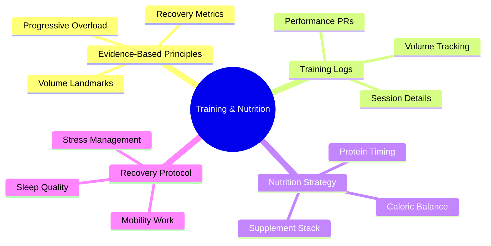
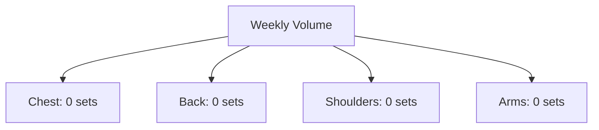

# Evidence-Based Training & Nutrition Hub 🔬

## Quick Reference

## Current Program Design
Based on scientific literature for optimal frequency and volume:

### Training Split (Evidence-Based)
- Upper Body: 3x/week (10-20 sets/muscle group/week)
- Soccer: 1x/week (cardio + skill work)
- Recovery: Active rest + mobility work
- Volume Landmarks: MAV (Maximum Adaptive Volume) focus

### Key Performance Indicators
1. Training Volume (sets × reps × weight)
2. Progressive Overload Tracking
3. Recovery Metrics (sleep, stress)
4. Nutrition Compliance (protein, calories)

## Session Notes
[Links to detailed session logs in /sessions/2024_12_SESSION_LOG.md]

### Weekly Volume Tracking

### Evidence-Based Targets
- Weekly Volume: 10-20 sets per muscle group
- Rep Ranges: 6-12 for hypertrophy
- RPE: 7-9 for most working sets
- Rest: 2-3 min between sets

## Literature-Based Recommendations
- Protein: 1.6-2.2g/kg/day
- Sleep: 7-9 hours for optimal recovery
- Hydration: 3L minimum
- Caloric Surplus: 10-20% above maintenance

## Progress Tracking
[Links to progress tracker for longitudinal data]

Remember: Track, analyze, adjust based on data. Just like Jeff would want! 💪
