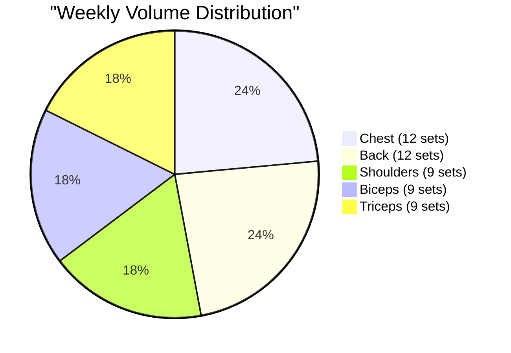
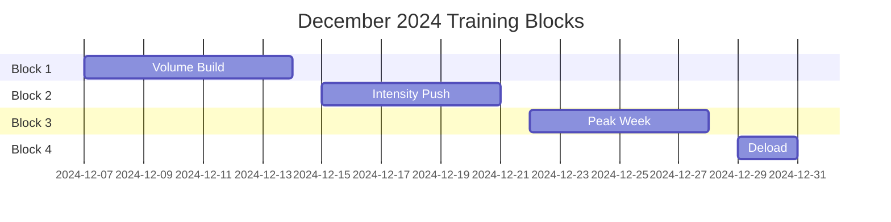

# December 2024 Upper Body Focus 💪

## Split Overview (No Legs Until February)
- **Tuesday**: Push (Chest & Triceps)
- **Thursday**: Pull (Back & Biceps)
- **Saturday**: Shoulders & Arms
- **Recovery**: Mon/Wed/Fri/Sun

## Volume Analysis for Aesthetics

## Detailed Workouts

### Tuesday - Push Day 💪
#### Warmup (5-7 mins)
- Arm circles: 20 forward, 20 backward
- Band pull-aparts: 2 × 15
- Push-ups: 2 × 10

#### Main Workout
1. **Station 1 - Heavy Press** (Bench + Dumbbells)
   - A1. Flat Bench Press: 4 × 8-10
   - A2. Incline Press: 3 × 10
   - Rest: 60s between supersets
   - _Alternative_: Machine Press / Floor Press

2. **Station 2 - Triceps Focus** (Cable Station)
   - B1. Tricep Pushdowns: 3 × 12
   - B2. Overhead Extensions: 3 × 12
   - Rest: 45s between supersets
   - _Alternative_: Skull Crushers / Close-Grip Press

3. **Finisher** (Same Light Dumbbells)
   - C1. Lateral Raises: 3 × 15
   - C2. Front Raises: 2 × 15
   - Rest: 30s between supersets

### Thursday - Pull Day 🏋️‍♂️
#### Warmup (5-7 mins)
- Cat-cow stretches: 10 reps
- Band pull-aparts: 2 × 15
- Scapular pulls: 2 × 10

#### Main Workout
1. **Station 1 - Vertical Pull** (Lat Machine)
   - A1. Wide-Grip Pulldowns: 4 × 10
   - A2. Close-Grip Pulldowns: 3 × 12
   - Rest: 60s between supersets
   - _Alternative_: Pull-ups / Band Pulldowns

2. **Station 2 - Row Focus** (Same Dumbbells)
   - B1. One-Arm Rows: 3 × 10/side
   - B2. Chest-Supported Rows: 3 × 12
   - Rest: 45s between sets
   - _Alternative_: Cable Rows / Machine Rows

3. **Station 3 - Biceps** (EZ Bar + Dumbbells)
   - C1. EZ Bar Curls: 3 × 10
   - C2. Hammer Curls: 3 × 12
   - Rest: 45s between supersets

### Saturday - Shoulders & Arms 🎯
#### Warmup (5-7 mins)
- Shoulder dislocations: 10 reps
- Face pulls: 2 × 15
- Band pull-aparts: 2 × 15

#### Main Workout
1. **Station 1 - Heavy Press** (Same Dumbbells)
   - A1. Overhead Press: 4 × 8-10
   - A2. Arnold Press: 3 × 10
   - Rest: 60s between supersets
   - _Alternative_: Machine Press / Push Press

2. **Station 2 - Side Delts** (Same Light Dumbbells)
   - B1. Lateral Raises: 4 × 12-15
   - B2. Bent-Over Raises: 3 × 15
   - Rest: 45s between supersets
   - _Alternative_: Cable Raises / Machine Raises

3. **Station 3 - Arms Finisher** (Cable Station)
   - C1. Tricep Pushdowns: 3 × 12
   - C2. Cable Curls: 3 × 12
   - Rest: 30s between supersets

## Pre/Post Workout Activity 🚶‍♂️
- **Built-in Cardio**: 2.8km total (15 min each way)
- **Pre-Workout**: 15 min walk serves as initial warm-up
- **Post-Workout**: 15 min walk aids recovery
- **Weekly Total**: ~8.4km from gym commute alone

This walking is perfect because:
1. Elevates heart rate gradually before training
2. Improves blood flow for better warm-up
3. Helps cool down after session
4. Contributes to daily step goal

Note: No need for additional warm-up cardio, can start with movement-specific warm-ups listed in workout plan.

## Ab Work (Optional During Rest Periods)
- Hanging Leg Raises: 3 × 12
- Cable Crunches: 3 × 15
- Planks: 3 × 45s

## Progressive Overload Strategy 📈
1. **December Focus**
   - Weeks 1-2: Build work capacity (10-12 reps)
   - Weeks 3-4: Increase intensity (8-10 reps)
   - Week 5: Deload (reduce weight by 20%)

2. **Volume Guidelines**
   - Large muscles: 10-12 sets/week
   - Small muscles: 8-10 sets/week
   - Increase by 1-2 sets/week if recovering well

## Recovery Protocol 🔄
### Active Recovery Days
- Light walking: 20-30 mins
- Upper body mobility work: 10-15 mins
- Stretching: Focus on shoulders and back

### Rest Days
- Sleep: 8 hours (as per your goals)
- Hydration: 3L water minimum
- Protein: 150g minimum (as per your goals)

## December Calendar 📅

## Notes 📝
- Volume is optimized for aesthetics (9-12 sets per muscle group)
- Focus on mind-muscle connection
- Track any shoulder fatigue
- Progressive overload on compound movements first

Remember: Quality > Quantity
