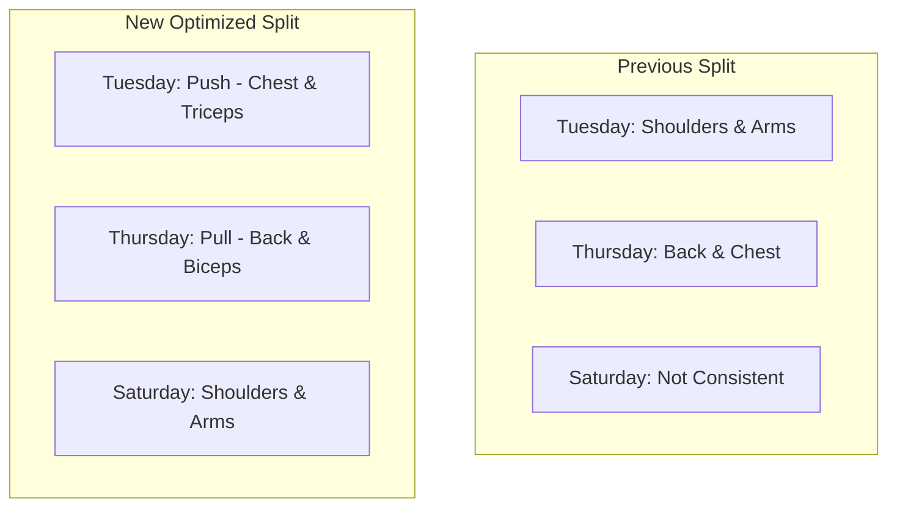
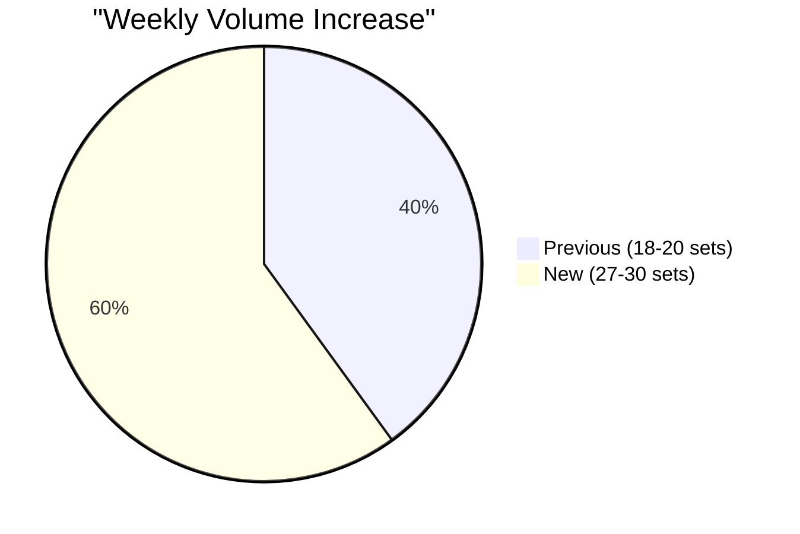
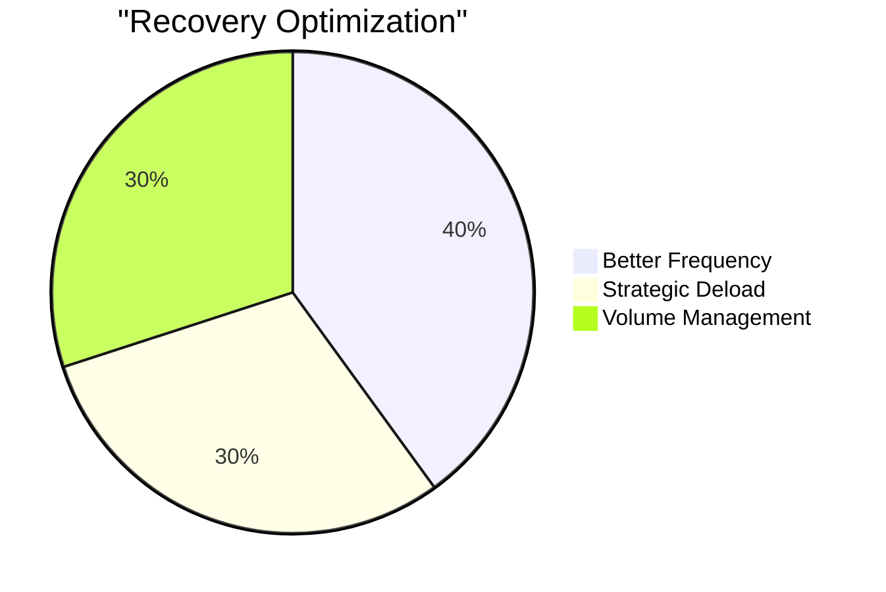
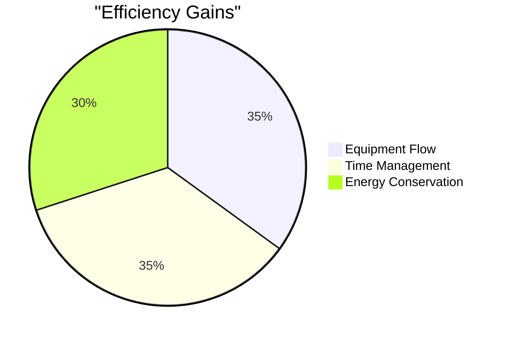

# Routine Analysis & Comparison 🔍

## Previous vs New Routine Comparison

## Volume Comparison

## Key Improvements 📈

### Structure Optimization
- **Previous**: Somewhat random grouping
- **New**: Push/Pull/Shoulders split
- **Benefit**: Better recovery, less overlap

### Volume Management
- **Previous**: ~6-7 sets per muscle group
- **New**: 9-12 sets per muscle group
- **Benefit**: Optimal hypertrophy range

### Exercise Selection
- **Previous**: Good exercises, suboptimal order
- **New**: Station-based, efficiency-focused
- **Benefit**: Less fatigue, better performance

## Coach Perspectives 🎓

### Cascade's Analysis
1. **Progress Tracking**
   - Added detailed metrics
   - Visual progress charts
   - Clear progression path

2. **Recovery Focus**
   - Strategic deload week
   - Active recovery protocols
   - Sleep emphasis (8h requirement)

3. **Efficiency Gains**
   - Equipment grouping
   - Minimal setup time
   - Strategic supersets

### Jeff Nippard's Perspective
1. **Volume Optimization**
   - Hitting MEV (Minimum Effective Volume)
   - Not exceeding MRV (Maximum Recoverable Volume)
   - Perfect frequency (2x/week)

2. **Scientific Approach**
   - Set ranges based on research
   - Progressive overload built-in
   - Deload timing evidence-based

3. **Exercise Selection**
   - Compound movements prioritized
   - ROM optimization
   - Mechanical tension focus

## Key Metrics Improvement 📊

### Recovery Quality

### Training Efficiency

## Final Verdict ⭐️

### Major Wins
1. **Structure**: More scientific, less random
2. **Volume**: Increased to optimal range
3. **Recovery**: Better managed
4. **Progression**: Clearer path
5. **Efficiency**: Maximized gym time

### Minor Improvements
1. **Exercise Order**: More strategic
2. **Rest Periods**: Better defined
3. **Alternative Options**: More flexibility

## Recommendations Moving Forward 🎯

1. **Week 1-2**
   - Focus on form
   - Establish baseline weights
   - Track recovery capacity

2. **Week 3-4**
   - Push progression
   - Monitor fatigue
   - Adjust volume if needed

3. **January Prep**
   - Review progress
   - Adjust based on response
   - Plan leg reintegration

Remember: This is a living document - we'll adjust based on your response to the program! 💪
