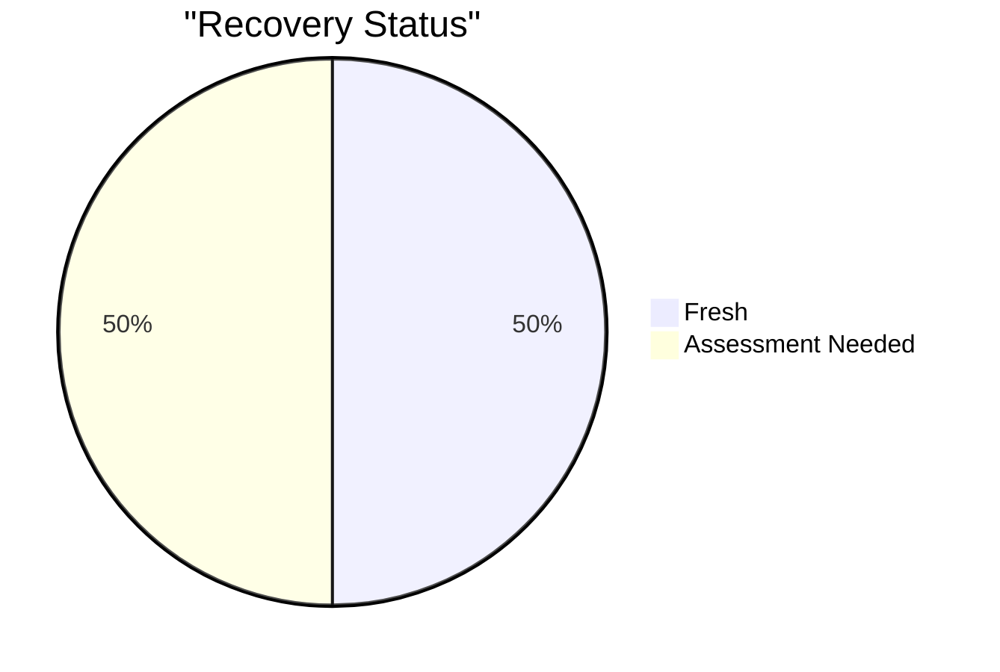
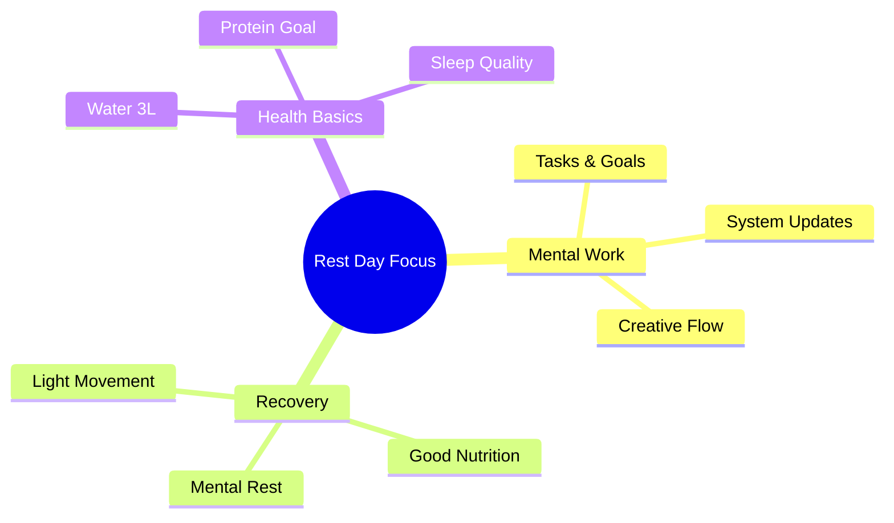
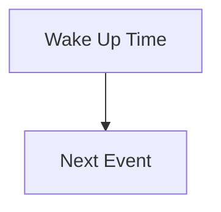

# Friday, Dec 8 - Rest Day 🌟

## Morning Check 📊
- Scale: ? kg (Target: 75kg)
- Sleep: 7.5h (10 PM - 6:30 AM)
- Energy: 8/10
- Stress: ?/10
- Recovery: 8/10

## Recovery Metrics 
### Sleep Analysis
- Hours: 7.5h (10 PM - 6:30 AM)
- Quality: 8/10
- Notes: Woke up naturally, feeling refreshed

### Muscle Recovery Status

## Daily Focus Map 🎯

## Daily Targets & Impacts 📊

### Supplement & Recovery Stack
- Creatine: 5g with [MEAL] (Rest day)
- Streak: [X] days consistent
- Note: Focus on natural recovery

> 🎯 **Rest Day Effects**:
> - Recovery: Natural processes prioritized
> - Hydration: Standard daily needs
> - Next Day Prep: Setting up for next workout
> - Focus: Active recovery & mobility

### Hydration Status
- Target: 3L
- Current: 2L
- Progress: ▓▓░░░ 67%

> 🎯 **Holistic Impact Alert**:
> - Performance: Maintaining baseline
> - Skin: Hydration support
> - Oral: Monitor intake
> - Recovery: Natural processes

### Protein Tracking
- Target: 150g
- Current: 155g
- Progress: ▓▓▓▓░ 103%

> 🎯 **Holistic Impact Alert**:
> - Recovery: Rest day protein needs
> - Muscle: Maintenance focus
> - Skin & Hair: Ongoing support
> - Oral: Plan balanced intake

### Carbs & Energy
- Target: 250g
- Current: 220g
- Impact: Recovery Support

> 🎯 **Holistic Impact Alert**:
> - Energy: Moderate carb day
> - Insulin: Steady state focus
> - Oral: Monitor timing
> - Recovery: Glycogen maintenance

## Daily Timeline ⏰

## Notes & Insights 💭
- Energy Levels: Strong and steady (8/10)
- Recovery Quality: Good (8/10)
- Areas for Improvement: Left arm mobility
- 

## Tomorrow's Prep 🎯
- [x] Set workout clothes
- [x] Plan meals
- [x] Check schedule
- [x] Set primary focus
