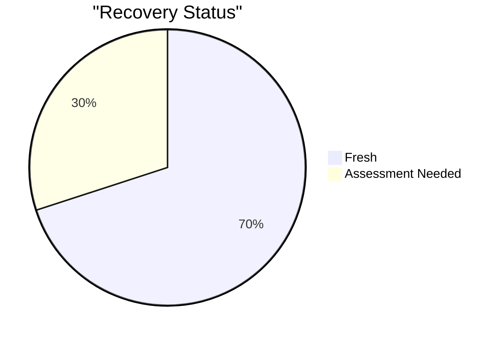
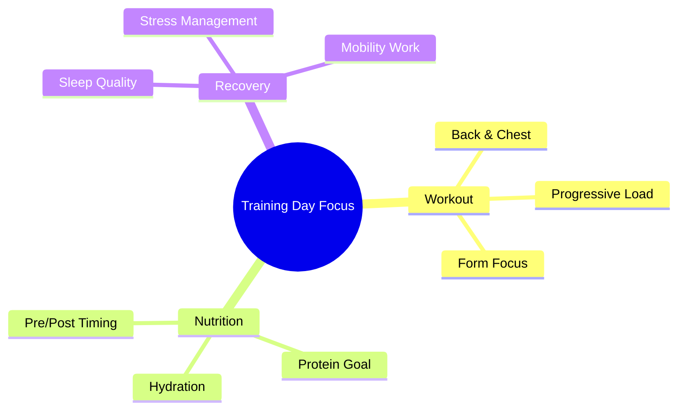
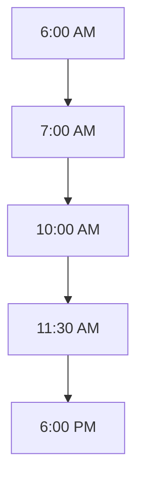

# Thursday, Dec 14 - Training Day 💪

## Morning Check 📊
- Scale: 70 kg (Target: 75kg)
- Sleep: 8h (10:00 PM - 6:00 AM)
- Energy: 7/10
- Stress: 6/10
- Recovery: 8/10

## Recovery Metrics 
### Sleep Analysis
- Hours: 8h (10:00 PM - 6:00 AM)
- Quality: 8/10
- Notes: Good sleep quality, felt rested

### Muscle Recovery Status

## Daily Focus Map 🎯

## Daily Targets & Impacts 📊

### Supplement & Recovery Stack
- Creatine: 5g (Pre-workout)
- Timing: 30 min before training
- Streak: 7 days consistent
- Note: Performance focus

> 🎯 **Training Day Effects**:
> - Performance: Peak ATP support
> - Recovery: Enhanced availability
> - Hydration: Cell volumization
> - Next Day: Recovery support

### Hydration Status
- Target: 3.5L (Training Day)
- Current: 2L
- Progress: [▓▓░░░░] 57.14%

> 🎯 **Holistic Impact Alert**:
> - Performance: Workout readiness
> - Skin: Enhanced hydration
> - Oral: Optimal production
> - Recovery: Cell hydration focus

### Protein Tracking
- Target: 160g (Training Day)
- Current: 120g
- Progress: [▓▓░░░░] 75%

> 🎯 **Holistic Impact Alert**:
> - Recovery: Enhanced synthesis
> - Muscle: Growth support
> - Skin & Hair: Peak repair
> - Oral: Balanced intake

### Carbs & Energy
- Target: 280g (Training Day)
- Current: 200g
- Impact: Performance Support

> 🎯 **Holistic Impact Alert**:
> - Energy: Workout fuel
> - Insulin: Training window
> - Oral: Timing focus
> - Recovery: Glycogen loading

## Training Log 🏋️‍♂️
### Back & Chest Session
- Planned Start: 10:00 AM
- Actual Start: 10:00 AM
- Duration: 1h 30m

#### Main Workout
1. **Lat Pulldown**
   - Sets × Reps: 3 × 10
   - Weights: 60kg
   - Notes: Focus on shoulder blades down and back

2. **Chest Press**
   - Sets × Reps: 3 × 10
   - Weights: 60kg
   - Notes: Left side fatigue earlier, maintain form

> 🎯 **Performance Impact**:
> - Hydration: 57.14%
> - Energy: 8/10
> - Form: 8/10
> - Recovery: Enhanced between sets

## Daily Timeline ⏰

## Notes & Insights 💭
- Felt strong during workout
- Left side fatigue on chest press
- Need to work on form consistency
- Good recovery support from supplements

## Tomorrow's Prep 🎯
- [ ] Plan recovery nutrition
- [ ] Set rest day goals
- [ ] Check supplement timing
- [ ] Review sleep schedule
- [ ] Set recovery focus
