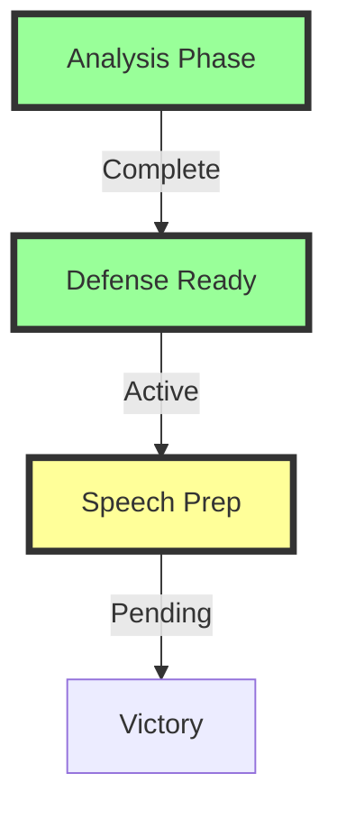

# LEFTIST EXPOSURE CAMPAIGN

## Campaign Status


## Campaign Matrix
```
OPERATION GRID
┌─────────────┬─────────────┬─────────────┐
│  ANALYSIS   │  DEFENSE    │   SPEECH    │
├─────────────┼─────────────┼─────────────┤
│ ✓ Master    │ ✓ Core      │ □ Scripts   │
│ ✓ Corporate │ ✓ Counters  │ □ Delivery  │
│ ✓ Academic  │ □ Kills     │ □ Impact    │
└─────────────┴─────────────┴─────────────┘
```

## Active Files
```
CAMPAIGN STRUCTURE
├── 1_analysis/
│   ├── ✓ 1_MASTER.md
│   ├── ✓ 2_CORPORATE.md
│   ├── ✓ 3_ACADEMIC.md
│   ├── ✓ 4_STATE.md
│   └── ✓ 5_PATTERNS.md
├── ✓ 2_DEFENSE.md
└── □ 3_SPEECH.md
```

## Progress Dashboard
| Component | Status | Next Action |
|-----------|--------|-------------|
| Analysis | 100% | Maintain Updates |
| Defense | 80% | Complete Kill Chain |
| Speech | 20% | Develop Scripts |

## Key Victories
```
IMPACT TRACKER
┌────────────────────┐
│ Patterns Exposed   │
├────────────────────┤
│ Methods Revealed   │
├────────────────────┤
│ Systems Unmasked   │
└────────────────────┘
```

## Active Operations
1. **Pattern Breaking**
   ```
   BREAK CHAIN
   ├── Logic Exposure
   ├── Method Reveal
   ├── System Unmask
   └── Reality Lock
   ```

2. **Defense Network**
   ```
   SHIELD GRID
   ├── Core Defense
   ├── Counter Array
   ├── Kill Chain
   └── Victory Path
   ```

3. **Speech Arsenal**
   ```
   STRIKE FORCE
   ├── Opening Hooks
   ├── Reality Anchors
   ├── Truth Chains
   └── Kill Shots
   ```

## Next Actions
- [ ] Complete kill chain documentation
- [ ] Develop speech templates
- [ ] Test counter strategies
- [ ] Map victory conditions

## Campaign Notes
[Add specific campaign notes and observations]

Remember: This campaign demonstrates our quantum system in action.
