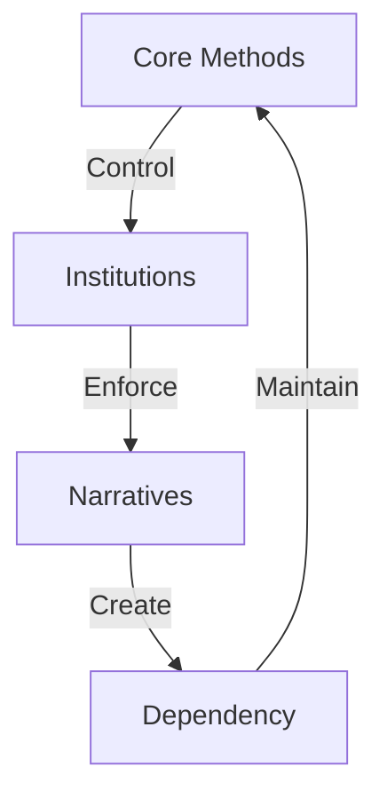

# THE ULTIMATE LEFTIST QUANTUM ANALYSIS

## MASTER THESIS
"The modern institutional left represents the perfect synthesis of everything they claim to oppose: corporate power, authoritarian control, intellectual parasitism, and moral hypocrisy - all while projecting their own authoritarian tendencies onto others."

## I. THE CORPORATE-STATE ALLIANCE

### A. The BlackRock Paradox
1. Corporate Partnerships
   - ESG scoring systems benefit mega-corps
   - DEI consulting billion-dollar industry
   - Tech giants enforce thought control
   - Banking system gatekeeping

2. Regulatory Capture
   - Complex regulations crush small business
   - Compliance costs favor big players
   - Artificial barriers to entry
   - "Green" requirements as control

3. Financial Control
   - Central bank manipulation
   - MMT as wealth transfer
   - Inflation as hidden tax
   - Currency control

### B. The Status Quo Defense
1. Power Structure Maintenance
   - Academic gatekeeping
   - Media narrative control
   - Tech platform censorship
   - Financial system manipulation

2. Attack Vectors
   - Label opposition as "extremist"
   - Use "fact-checkers" as censors
   - Deploy cancel culture
   - Manipulate algorithms

3. Corporate Socialism
   - Bailouts for the connected
   - Subsidies for supporters
   - Regulations against competitors
   - "Too big to fail" protection

## II. THE FREEDOM DECEPTION

### A. Control Through "Protection"
1. Economic Control
   - Minimum wage kills jobs
   - Licensing restricts opportunity
   - Regulations prevent innovation
   - Taxes punish success

2. Social Engineering
   - Education indoctrination
   - Media propaganda
   - Cultural manipulation
   - Language control

3. Personal Dependency
   - Welfare traps
   - Housing control
   - Healthcare monopoly
   - Education debt

### B. The Responsibility Erasure
1. Moral Hazard Creation
   - Remove consequences
   - Reward failure
   - Punish success
   - Destroy incentives

2. Independence Destruction
   - Create state dependency
   - Weaken family structures
   - Undermine communities
   - Attack self-reliance

3. Growth Prevention
   - Safety over opportunity
   - Comfort over challenge
   - Security over freedom
   - Control over choice

## III. THE ACADEMIC-STATE COMPLEX

### A. Parasitic Structure
1. Funding Dependency
   - State grants
   - Forced student loans
   - Taxpayer subsidies
   - Research funding control

2. Ideological Enforcement
   - Tenure gatekeeping
   - Publication control
   - Citation circles
   - Peer review manipulation

3. Market Avoidance
   - Fear of competition
   - Resistance to measurement
   - Rejection of outcomes
   - Hatred of merit

### B. Intellectual Fraud
1. Research Manipulation
   - Predetermined conclusions
   - Data manipulation
   - Methodology bias
   - Citation cartels

2. Teaching Corruption
   - Ideological indoctrination
   - Grade inflation
   - Standards erosion
   - Merit destruction

3. Cultural Impact
   - Anti-intellectual elitism
   - Practical knowledge disdain
   - Theory over reality
   - Credentials over competence

## IV. HISTORICAL PATTERNS

### A. Authoritarian Methods
1. Control Mechanisms
   - "Protection" rhetoric
   - Emergency powers
   - Gradual encroachment
   - Moral panic creation

2. Economic Control
   - Central planning
   - Price controls
   - Market manipulation
   - Resource allocation

3. Social Engineering
   - Youth indoctrination
   - Cultural revolution
   - Traditional destruction
   - Identity politics

### B. Tactical Parallels
1. Language Control
   - Redefine terms
   - Create newspeak
   - Control discourse
   - Label opposition

2. Opposition Management
   - Demonization
   - Social isolation
   - Economic punishment
   - Character assassination

3. Power Consolidation
   - Institutional capture
   - Emergency exploitation
   - Incremental control
   - Alliance building

## V. QUANTUM KILLS

### A. Core Exposures
1. The Corporate Alliance
   "Your 'revolution' is funded by BlackRock, enforced by Big Tech, and protected by Wall Street. You're not fighting the system - you are the system."

2. The Freedom Fraud
   "Every 'protection' you offer comes with chains. Every 'help' creates dependency. Every 'safety' removes choice. You're not protecting - you're imprisoning."

3. The Academic Exposure
   "Your ideas can't survive without forced funding, captured institutions, and suppressed competition. Real ideas create value without coercion."

4. The Historical Mirror
   "You use the same methods as every authoritarian: control through protection, power through panic, and suppression through 'safety'."

### B. Strategic Counters
1. Against "Nazi" Accusations
   - Expose their control methods
   - Show their corporate alliances
   - Reveal their suppression tactics
   - Demonstrate their authoritarianism

2. Against "Protection" Arguments
   - Expose dependency creation
   - Show opportunity destruction
   - Reveal control mechanisms
   - Demonstrate results failure

3. Against "Science" Claims
   - Expose funding bias
   - Show methodology flaws
   - Reveal peer review corruption
   - Demonstrate market avoidance

## VI. AUTHENTICITY FRAMEWORK

### A. Value Creation
1. Real World Impact
   - Market success
   - Voluntary adoption
   - Measurable results
   - Customer satisfaction

2. Independence Promotion
   - Personal responsibility
   - Skill development
   - Value creation
   - Merit recognition

3. Freedom Enhancement
   - Choice expansion
   - Opportunity creation
   - Barrier removal
   - Competition enabling

### B. Strategic Positioning
1. Moral High Ground
   - Champion real freedom
   - Promote responsibility
   - Create actual value
   - Enable independence

2. Results Focus
   - Show outcomes
   - Measure impact
   - Track success
   - Prove value

3. Reality Anchoring
   - Use concrete examples
   - Show real effects
   - Demonstrate results
   - Prove predictions

## MASTER QUANTUM KILL
"You've become a perfect synthesis of everything you claim to fight: corporate-funded, state-dependent, authoritarian thought police who can't survive without forced support. Your 'revolution' requires BlackRock's money, Big Tech's censorship, and government guns. Your 'protection' creates dependency, your 'safety' removes choice, and your 'science' needs state funding to survive. You're not rebels - you're the establishment's guard dogs, trained to attack anyone who truly threatens their power. The real revolution? Freedom, responsibility, and value creation in a world you've tried to control, restrict, and regulate into submission."

## ENHANCED MASTER ANALYSIS

### Pattern Map


### Control Matrix
```
SYSTEM GRID
┌─────────────┬─────────────┬─────────────┐
│  ACADEMIC   │  CORPORATE  │   STATE     │
├─────────────┼─────────────┼─────────────┤
│ Theory      │ ESG         │ Regulation  │
│ Credentials │ Compliance  │ Force       │
│ Status      │ Control     │ Dependency  │
└─────────────┴─────────────┴─────────────┘
```

### Core Components
1. **Control Methods**
   ```
   CONTROL CHAIN
   ├── Academic Theory
   ├── Corporate Policy
   ├── State Force
   └── Social Pressure
   ```

2. **System Structure**
   ```
   POWER GRID
   ├── Funding Sources
   ├── Control Points
   ├── Force Methods
   └── Impact Areas
   ```

3. **Dependency Creation**
   ```
   SLAVERY CHAIN
   ├── Economic Control
   ├── Social Control
   ├── Mental Control
   └── Physical Control
   ```

### Pattern Recognition
| Method | Implementation | Purpose |
|--------|---------------|----------|
| Theory | Academia | Mind Control |
| Policy | Corporate | Economic Control |
| Force | State | Physical Control |

### Weakness Map
```
BREAK POINTS
┌────────────────────┐
│ 1. Force Required  │
├────────────────────┤
│ 2. Results Fail    │
├────────────────────┤
│ 3. Truth Exposed   │
└────────────────────┘
```

### Counter Strategy
1. **Reality Focus**
   ```
   TRUTH CHAIN
   ├── Show Force Use
   ├── Expose Results
   ├── Reveal Control
   └── Break System
   ```

2. **Freedom Frame**
   ```
   LIBERTY GRID
   ├── Choice > Force
   ├── Results > Theory
   ├── Freedom > Control
   └── Truth > Narrative
   ```

### Kill Chain
```
VICTORY PATH
┌─────────────┬─────────────┬─────────────┐
│   EXPOSE    │    BREAK    │    WIN      │
├─────────────┼─────────────┼─────────────┤
│ Methods     │ Patterns    │ Reality     │
│ Systems     │ Controls    │ Freedom     │
│ Results     │ Narratives  │ Truth       │
└─────────────┴─────────────┴─────────────┘
```

### Action Items
- [ ] Document all force points
- [ ] Map control systems
- [ ] Track results failures
- [ ] Prepare kill chains

Remember: This analysis forms the foundation of our quantum victory.
