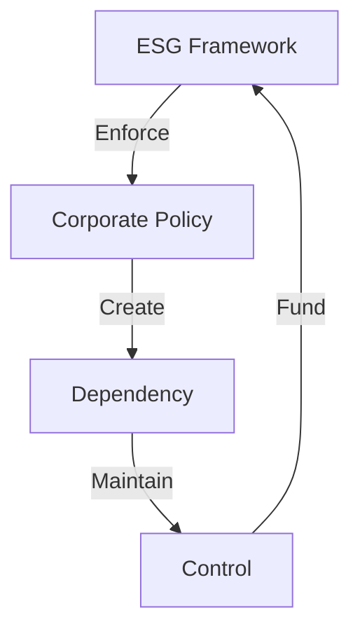

# THE LEFT'S STATUS QUO PARADOX

## CORE THESIS
"Today's institutional left has become what it claims to fight against: a defender of corporate power masquerading as people's advocacy."

## EVIDENCE MATRIX

### 1. Corporate Alliance Exposure
- BlackRock partnerships
- ESG scoring benefits mega-corps
- DEI consulting billion-dollar industry
- Tech giant censorship collaboration

### 2. Policy Contradictions
#### Claims vs. Reality
| They Say | They Do |
|----------|---------|
| "Fight big business" | Partner with BlackRock |
| "Support workers" | Push policies killing small business |
| "Protect the poor" | Create regulatory barriers favoring corporations |
| "Environmental justice" | ESG scores benefiting biggest polluters |

### 3. Power Structure Analysis
- Bureaucratic expansion
- Regulatory capture
- Academic-Corporate complex
- Media-Tech control mechanisms

## QUANTUM KILLS

### 1. The BlackRock Paradox
"How can you claim to fight capitalism while partnering with its ultimate expression - BlackRock? That's like claiming to be a vegetarian while owning a slaughterhouse."

### 2. The ESG Exposure
"ESG scores don't hurt big corporations - they crush small competitors. It's 'socialism' that somehow always benefits billionaires."

### 3. The DEI Deception
"DEI has become a billion-dollar consulting industry. Funny how 'fighting the system' always seems to make the system richer."

## REALITY ANCHORS

### Historical Context
- Original leftist principles
- Evolution to institutional power
- Corporate co-option timeline
- Loss of working class support

### Economic Impact
1. Small business destruction
2. Middle class erosion
3. Regulatory barriers
4. Corporate consolidation

### Power Shift Evidence
1. Academic capture
2. Media control
3. Tech censorship
4. Financial gatekeeping

## STRATEGIC FRAMEWORK

### Opening Move
"Let's be clear: I'm not attacking leftist principles - I'm exposing how today's institutional left has betrayed them."

### Development
1. Show historical drift
2. Expose corporate alliances
3. Reveal policy contradictions
4. Demonstrate impact on common people

### Quantum Shift Moment
"The greatest trick the corporate elite ever pulled was convincing the left to fight their battles for them."

## AUTHENTICITY ANCHORS

### Personal Stakes
"I care about real people, real workers, real struggles - not corporate virtue signaling."

### Common Ground Bridge
"True leftist principles - helping workers, fighting corruption, protecting the vulnerable - are noble. That's exactly why we must expose how they've been co-opted."

### Reality Check
"When your 'anti-capitalist' movement is funded by BlackRock and championed by Goldman Sachs, it's time to ask some hard questions."

## CORPORATE CONTROL ANALYSIS

### Control Flow


### Control Matrix
```
CORPORATE GRID
┌─────────────┬─────────────┬─────────────┐
│    ESG      │   POLICY    │  CONTROL    │
├─────────────┼─────────────┼─────────────┤
│ Framework   │ Compliance  │ Economic    │
│ Standards   │ Regulation  │ Social      │
│ Metrics     │ Reporting   │ Political   │
└─────────────┴─────────────┴─────────────┘
```

### System Components
1. **ESG Structure**
   ```
   CONTROL CHAIN
   ├── Framework Design
   ├── Standard Setting
   ├── Metric Creation
   └── Score Impact
   ```

2. **Policy Implementation**
   ```
   POLICY GRID
   ├── Compliance Rules
   ├── Reporting Systems
   ├── Penalty Structure
   └── Control Points
   ```

3. **Control Mechanisms**
   ```
   POWER FLOW
   ├── Economic Pressure
   ├── Social Pressure
   ├── Political Influence
   └── Market Control
   ```

### Break Points
| Component | Weakness | Counter |
|-----------|----------|---------|
| ESG | Arbitrary Metrics | Real Results |
| Policy | Force Required | Freedom Choice |
| Control | Market Resistance | Value Creation |

### Counter Strategy
```
BREAK CHAIN
┌────────────────────┐
│ 1. Expose Metrics  │
├────────────────────┤
│ 2. Show Force      │
├────────────────────┤
│ 3. Reveal Control  │
└────────────────────┘
```

### Kill Chain
1. **ESG Break**
   ```
   METRIC KILLER
   ├── Show Arbitrary
   ├── Expose Control
   ├── Reveal Force
   └── Break System
   ```

2. **Policy Break**
   ```
   FREEDOM PATH
   ├── Choice > Force
   ├── Market > Control
   ├── Value > Metrics
   └── Results > Theory
   ```

### Victory Conditions
```
SUCCESS METRICS
┌─────────────────────┐
│ Control Exposed     │
│ Force Revealed      │
│ Freedom Chosen      │
│ Value Created       │
└─────────────────────┘
```

## CLOSING QUANTUM KILL
"The modern left hasn't abandoned capitalism - it's just created a new version where only their corporate allies get to win. They haven't eliminated privilege - they've just changed who gets to grant it."
