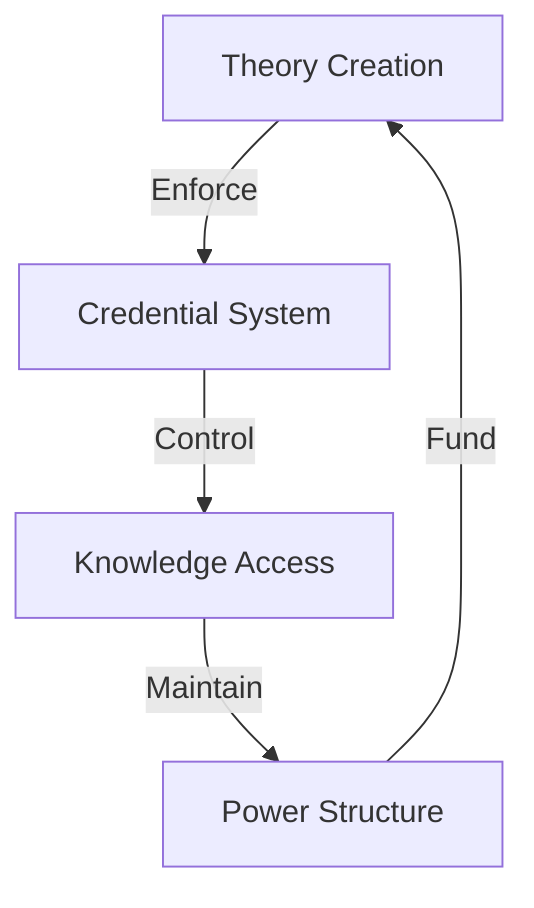

# THE ACADEMIC-STATE PARASITIC COMPLEX

## CORE EXPOSURE
"They claim intellectual superiority while being completely dependent on state funding - they're not independent thinkers, they're state employees with fancy titles."

## PARADOX MATRIX

### 1. The Academic Contradiction
| They Claim | Reality Shows |
|------------|---------------|
| "Independent thinking" | State-funded positions |
| "Academic freedom" | Ideological conformity |
| "Fighting fascism" | Enforcing thought control |
| "Speaking truth to power" | Being power's paid spokesman |

### 2. The Keynesian Circle
- Write papers supporting state power
- Get state funding for more papers
- Call it "peer review"
- Attack any outside thinking

## QUANTUM KILLS

### 1. The Funding Exposure
"Funny how your 'revolutionary' ideas always conclude that you need more funding."

### 2. The Market Test
"If your ideas are so brilliant, why do they need state funding to survive? Real ideas create value without coercion."

### 3. The Nazi Projection
"You call everyone Nazis while demanding state control over thought, speech, and education. Look in the mirror."

## STRATEGIC STRIKES

### 1. Intellectual Dependency
- Can't survive in free market
- Need forced funding
- Fear real competition
- Hate independent thinkers

### 2. Echo Chamber Exposure
- Self-referential "research"
- Circular peer review
- Ideological gatekeeping
- Cancel culture enforcement

### 3. Power Structure
- State funds research
- Research supports state
- Attack outsiders
- Maintain monopoly

## QUANTUM SHIFTS

### 1. The Market Reality
"Real intellectuals create value people voluntarily pay for. You need the state to force people to fund your ideas."

### 2. The Freedom Test
"If your ideas are so good, why do you need to force people to fund them? Why do you fear intellectual competition?"

### 3. The Projection Flip
"You scream 'Nazi' at everyone while building a system of thought control, forced funding, and ideological conformity. Who's the real authoritarian?"

## AUTHENTICITY ANCHORS

### Real World Test
"Your theories have never worked in reality - that's why you hide in academia where failure has no consequences."

### Value Creation
"We create value in the real world. You create papers justifying your next grant application."

### Independence Proof
"Our ideas survive in the free market of thoughts. Yours need state protection to exist."

## ACADEMIC CONTROL ANALYSIS

## Control Flow


## Control Matrix
```
ACADEMIC GRID
┌─────────────┬─────────────┬─────────────┐
│   THEORY    │  STATUS     │   POWER     │
├─────────────┼─────────────┼─────────────┤
│ Creation    │ Credentials │ Access      │
│ Control     │ Authority   │ Funding     │
│ Narrative   │ Position    │ Control     │
└─────────────┴─────────────┴─────────────┘
```

## System Components
1. **Theory Structure**
   ```
   CONTROL CHAIN
   ├── Narrative Creation
   ├── Theory Control
   ├── Knowledge Gates
   └── Access Limits
   ```

2. **Status System**
   ```
   POWER GRID
   ├── Credential Control
   ├── Authority Grant
   ├── Position Power
   └── Access Rights
   ```

3. **Control Mechanisms**
   ```
   POWER FLOW
   ├── Funding Control
   ├── Access Control
   ├── Narrative Control
   └── Knowledge Control
   ```

## Break Points
| Component | Weakness | Counter |
|-----------|----------|---------|
| Theory | Reality Gap | Results Focus |
| Status | Merit Void | Value Creation |
| Power | Force Need | Free Choice |

## Counter Strategy
```
BREAK CHAIN
┌────────────────────┐
│ 1. Show Results    │
├────────────────────┤
│ 2. Create Value    │
├────────────────────┤
│ 3. Choose Freedom  │
└────────────────────┘
```

## Kill Chain
1. **Theory Break**
   ```
   REALITY CHAIN
   ├── Show Results
   ├── Expose Gaps
   ├── Break Theory
   └── Win Reality
   ```

2. **Status Break**
   ```
   MERIT PATH
   ├── Results > Theory
   ├── Value > Status
   ├── Creation > Control
   └── Freedom > Force
   ```

## Victory Conditions
```
SUCCESS METRICS
┌─────────────────────┐
│ Theory Broken       │
│ Results Shown       │
│ Value Created       │
│ Freedom Chosen      │
└─────────────────────┘
```

## CLOSING QUANTUM KILL
"You're not fighting the system - you ARE the system. You're not speaking truth to power - you're power's paid propagandists. The real rebellion? Independent thinking and free market success."
