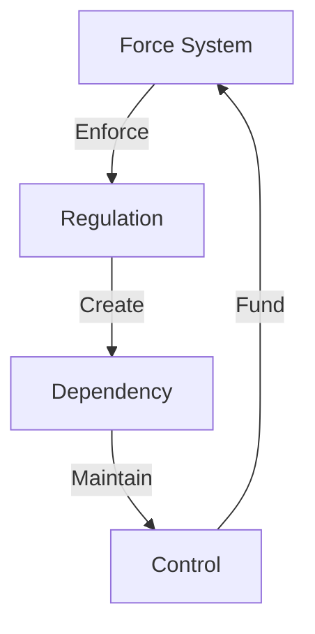

# FREEDOM VS. CONTROL: THE REAL BATTLE

## CORE THESIS
"The left doesn't protect the vulnerable - they create vulnerability through dependency. True empowerment comes through freedom, choice, and personal responsibility."

## REALITY FRAMEWORK

### 1. Freedom vs. Control
| They Say | Truth Is |
|----------|----------|
| "Protecting people" | Controlling choices |
| "Social justice" | Forced conformity |
| "Equity" | Enforced mediocrity |
| "Safety" | Dependency |

### 2. The Freedom Alternative
- Individual choice
- Personal responsibility
- Natural consequences
- Voluntary cooperation

## QUANTUM KILLS

### 1. The Responsibility Paradox
"You claim to help people by removing their ability to help themselves. That's not protection - that's prison."

### 2. The Dependency Trap
"Every 'free' government program comes with invisible chains. The more 'help' you accept, the less freedom you retain."

### 3. The Choice Exposé
"You don't trust people to make their own choices. What makes you qualified to make choices for everyone else?"

## POWER DYNAMICS

### Their True Agenda
1. Create Problems
   - Regulate small business out of existence
   - Inflate currency
   - Create artificial scarcity

2. Offer "Solutions"
   - Government dependency
   - Loss of autonomy
   - Controlled choices

3. Maintain Power
   - Fear manipulation
   - Crisis creation
   - Moral blackmail

## FREEDOM FRAMEWORK

### Core Principles
1. Individual Rights
   - Property rights
   - Freedom of association
   - Freedom of exchange

2. Personal Responsibility
   - Own your choices
   - Face consequences
   - Build resilience

3. Voluntary Cooperation
   - Free market solutions
   - Community choice
   - Natural organization

## QUANTUM SHIFTS

### 1. The Empowerment Flip
"True compassion means believing in people's ability to solve their own problems, not treating them like helpless children."

### 2. The Responsibility Revolution
"Freedom isn't just about rights - it's about owning your choices and their consequences. That's not harsh - that's human dignity."

### 3. The Control Exposure
"Every time they say 'we must protect', translate it to 'we must control'. Suddenly their whole agenda becomes clear."

## STATE CONTROL ANALYSIS

## Control Flow


## Control Matrix
```
STATE GRID
┌─────────────┬─────────────┬─────────────┐
│   FORCE     │  CONTROL    │   IMPACT    │
├─────────────┼─────────────┼─────────────┤
│ Violence    │ Regulation  │ Economic    │
│ Threats     │ Compliance  │ Social      │
│ Coercion    │ Monitoring  │ Physical    │
└─────────────┴─────────────┴─────────────┘
```

## System Components
1. **Force Structure**
   ```
   CONTROL CHAIN
   ├── Violence System
   ├── Threat Network
   ├── Coercion Grid
   └── Control Points
   ```

2. **Regulation System**
   ```
   POWER GRID
   ├── Rule Creation
   ├── Force Application
   ├── Compliance Check
   └── Penalty System
   ```

3. **Impact Mechanisms**
   ```
   DAMAGE FLOW
   ├── Economic Control
   ├── Social Control
   ├── Physical Control
   └── Mental Control
   ```

## Break Points
| Component | Weakness | Counter |
|-----------|----------|---------|
| Force | Moral Cost | Freedom Choice |
| Control | Results Fail | Value Creation |
| Impact | Resistance Rise | Independence |

## Counter Strategy
```
BREAK CHAIN
┌────────────────────┐
│ 1. Show Force      │
├────────────────────┤
│ 2. Expose Failure  │
├────────────────────┤
│ 3. Choose Freedom  │
└────────────────────┘
```

## Kill Chain
1. **Force Break**
   ```
   FREEDOM CHAIN
   ├── Expose Violence
   ├── Show Threats
   ├── Reveal Coercion
   └── Break Control
   ```

2. **Control Break**
   ```
   LIBERTY PATH
   ├── Choice > Force
   ├── Value > Control
   ├── Freedom > Power
   └── Results > Theory
   ```

## Victory Conditions
```
SUCCESS METRICS
┌─────────────────────┐
│ Force Exposed       │
│ Control Broken      │
│ Freedom Chosen      │
│ Value Created       │
└─────────────────────┘
```

## CLOSING QUANTUM KILL
"You don't own compassion. You don't own protection. You don't own progress. What you want is control - and we choose freedom, with all its responsibilities and rewards."

Remember: State control always requires force - expose it.
