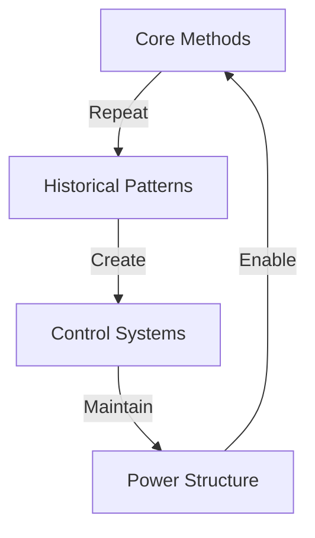

# UNCOMFORTABLE PARALLELS: THE LEFT'S HISTORICAL MIRROR

## CORE THESIS
"Those who scream 'Nazi' the loudest share more similarities with historical authoritarians than they'd care to admit."

## HISTORICAL PARALLELS

### 1. State Control Mechanisms
| Historical Reich | Modern Left |
|-----------------|-------------|
| Animal protection laws | Environmental regulation |
| State-directed economy | ESG scores & control |
| Centralized education | Academic monopoly |
| "Public good" rhetoric | "Greater good" mandates |

### 2. Policy Overlaps
- Centralized economic control
- State intervention in private life
- "Protection" as control mechanism
- Moral superiority complex

## QUANTUM KILLS

### 1. The Animal Rights Paradox
"You know who first implemented comprehensive animal protection laws? The same regime you compare everyone to. Interesting how 'good intentions' can mask authoritarian control."

### 2. The Control Pattern
"Your methods mirror what you claim to fight: central control, forced compliance, moral crusades. The only difference? The branding."

### 3. The Protection Trap
"Whether it's protecting animals, the environment, or 'the vulnerable' - authoritarian control always comes disguised as protection."

## PATTERN ANALYSIS

## Pattern Flow


## Pattern Matrix
```
HISTORY GRID
┌─────────────┬─────────────┬─────────────┐
│  METHODS    │  SYSTEMS    │  RESULTS    │
├─────────────┼─────────────┼─────────────┤
│ Control     │ Academic    │ Dependency  │
│ Force       │ Corporate   │ Control     │
│ Narrative   │ State       │ Power       │
└─────────────┴─────────────┴─────────────┘
```

## System Components
1. **Method Patterns**
   ```
   CONTROL CHAIN
   ├── Force Use
   ├── Control Systems
   ├── Narrative Creation
   └── Power Structure
   ```

2. **System Patterns**
   ```
   POWER GRID
   ├── Academic Control
   ├── Corporate Power
   ├── State Force
   └── Social Pressure
   ```

3. **Result Patterns**
   ```
   IMPACT FLOW
   ├── Dependency Creation
   ├── Control Establishment
   ├── Power Consolidation
   └── Freedom Reduction
   ```

## Break Points
| Pattern | Recognition | Counter |
|---------|-------------|---------|
| Methods | Force Need | Freedom Choice |
| Systems | Control Req | Value Creation |
| Results | Failure | Independence |

## Counter Strategy
```
BREAK CHAIN
┌────────────────────┐
│ 1. Show Pattern    │
├────────────────────┤
│ 2. Expose Method   │
├────────────────────┤
│ 3. Break System    │
└────────────────────┘
```

## Kill Chain
1. **Pattern Break**
   ```
   FREEDOM CHAIN
   ├── Show History
   ├── Expose Methods
   ├── Break System
   └── Win Freedom
   ```

2. **System Break**
   ```
   LIBERTY PATH
   ├── Pattern > Control
   ├── Freedom > Force
   ├── Value > Power
   └── Truth > Narrative
   ```

## Victory Conditions
```
SUCCESS METRICS
┌─────────────────────┐
│ Pattern Exposed     │
│ Methods Revealed    │
│ System Broken       │
│ Freedom Won         │
└─────────────────────┘
```

## STRATEGIC FRAMEWORK

### 1. Pattern Recognition
- Use of state power
- Moral justification
- Forced compliance
- Demonization of opposition

### 2. Method Exposure
- "Protection" as control
- "Science" as religion
- "Progress" as regression
- "Freedom" as submission

## QUANTUM SHIFTS

### 1. The Protection Flip
"Every totalitarian movement started with 'protecting' something. What matters isn't the excuse - it's the control."

### 2. The Methods Matter
"If your methods mirror authoritarian control, maybe you're not as different as you think."

### 3. The Freedom Test
"True freedom includes the freedom to disagree. Your 'protection' always seems to require total compliance."

## CLOSING QUANTUM KILL
"Here's the ultimate irony: while screaming about fascism, you've built a system of central control, forced compliance, and moral crusades that would make any historical authoritarian proud. The difference? At least they were honest about what they were doing."
