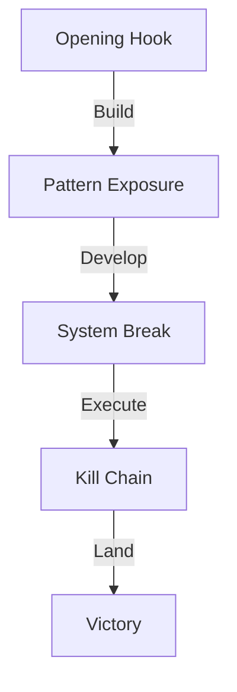

# THE ULTIMATE LEFTIST EXPOSURE: PRESENTATION SCRIPT

## OPENING HOOK
"Ladies and gentlemen, what if I told you that the modern left has become the perfect embodiment of everything they claim to fight against? That behind their moral crusades and virtuous declarations lies the most sophisticated system of corporate power, authoritarian control, and intellectual parasitism ever created?

## THE SETUP
Today, I'm going to expose four devastating truths:

1. How the 'anti-capitalist' left became capitalism's most valuable enforcer
2. How their 'protection' is actually a sophisticated system of control
3. How their 'intellectual rebellion' is funded by the very system they claim to fight
4. How their methods mirror the exact historical patterns they pretend to oppose

## THE CORPORATE ALLIANCE
[Dramatic Pause]

"Let's start with a simple question: Why does BlackRock, the world's largest asset manager, love the modern left? Why do Big Tech giants enforce their ideology? Why do major banks push their agenda?

Because they've created the perfect corporate protection racket:
- ESG scores that crush small competitors
- DEI consultants that extract billions
- 'Green' regulations that ensure corporate monopoly
- Social justice that always seems to benefit the biggest players

[Lean in]

"Think about it - their 'revolution' requires BlackRock's money, Big Tech's censorship, and Wall Street's approval. Some revolution!"

## THE FREEDOM DECEPTION
"But it gets better. Every time they say 'protect', translate it to 'control':
- 'Protecting the vulnerable' = Creating dependency
- 'Social justice' = Enforced conformity
- 'Safety' = Restricted choices
- 'Equity' = Controlled outcomes

They're not lifting people up - they're locking them down in a gilded cage of dependency."

## THE ACADEMIC PARASITES
[With increasing intensity]

"And how do they justify this? Through a parasitic class of state-funded 'intellectuals' who:
- Need forced funding to survive
- Fear market competition
- Create self-referential 'peer review' circles
- Attack any independent thought

Their ideas are so 'brilliant' they need government guns to enforce them!"

## THE HISTORICAL MIRROR
[Powerful delivery]

"But here's the ultimate irony - their methods mirror exactly what they claim to fight:
- Central control of economy
- Forced ideological compliance
- Moral crusades against dissenters
- State power for 'the greater good'

They've built a system of control that would make any historical authoritarian proud - just with better branding!"

## THE QUANTUM KILLS
[Building to crescendo]

"So let's put it all together:
- Their 'revolution' is funded by BlackRock
- Their 'protection' creates dependency
- Their 'science' needs state funding
- Their 'methods' mirror authoritarians

They're not rebels - they're the establishment's guard dogs, trained to attack anyone who truly threatens their power!"

## THE CLOSING STRIKE
[Powerful finish]

"The modern left isn't fighting the system - they ARE the system. They're not speaking truth to power - they're power's paid propagandists. They haven't abandoned capitalism - they've just created a version where only their corporate allies win.

The real rebellion? Freedom. Responsibility. Value creation. Everything they fear because it breaks their control.

[Final pause]

"They claim to fight fascism while building the most sophisticated system of corporate-state control in history. At least historical authoritarians were honest about what they were doing."

## CALL TO ACTION
"So next time they scream 'Nazi' at someone who wants freedom, remember: Projection is a hell of a drug. And they're mainlining it.

The truth is our weapon. Reality is our ally. And their control system is about to meet something it can't handle: authentic freedom and genuine value creation.

Thank you."

---

## Delivery Notes:
- Use dramatic pauses after major reveals
- Build intensity through each section
- Use hand gestures to emphasize key points
- Maintain eye contact during key accusations
- Let the audience absorb major revelations
- End with powerful, confident stance

## QUANTUM SPEECH EXECUTION

## Speech Flow


## Impact Matrix
```
DELIVERY GRID
┌─────────────┬─────────────┬─────────────┐
│    OPEN     │   BUILD     │    CLOSE    │
├─────────────┼─────────────┼─────────────┤
│ Hook        │ Evidence    │ Kill Shot   │
│ Frame       │ Logic       │ Victory     │
│ Ground      │ Pattern     │ Reality     │
└─────────────┴─────────────┴─────────────┘
```

## Speech Components
1. **Opening Structure**
   ```
   HOOK CHAIN
   ├── Pattern Hook
   ├── Reality Frame
   ├── Stakes Define
   └── Path Preview
   ```

2. **Core Development**
   ```
   BUILD SEQUENCE
   ├── Pattern Expose
   ├── System Reveal
   ├── Force Show
   └── Truth Lock
   ```

3. **Victory Chain**
   ```
   KILL SEQUENCE
   ├── Pattern Break
   ├── System Expose
   ├── Truth Lock
   └── Freedom Win
   ```

## Key Points
1. **Pattern Exposure**
   ```
   EXPOSURE GRID
   ├── Academic Control
   ├── Corporate Power
   ├── State Force
   └── System Unity
   ```

2. **System Break**
   ```
   BREAK CHAIN
   ├── Show Force
   ├── Expose Control
   ├── Reveal Power
   └── Break System
   ```

3. **Freedom Frame**
   ```
   VICTORY PATH
   ├── Choice > Force
   ├── Value > Control
   ├── Truth > Power
   └── Freedom > System
   ```

## Energy Points
| Phase | Focus | Impact |
|-------|-------|--------|
| Open | Pattern Recognition | Hook Audience |
| Build | System Exposure | Break Reality |
| Close | Freedom Choice | Win Minds |

## Reality Anchors
```
TRUTH POINTS
┌────────────────────┐
│ 1. Force Required  │
├────────────────────┤
│ 2. Results Failed  │
├────────────────────┤
│ 3. Freedom Works   │
└────────────────────┘
```

## Kill Chain
1. **Pattern Kill**
   - Show historical patterns
   - Expose current methods
   - Break their frame

2. **System Kill**
   - Reveal force use
   - Show control need
   - Break dependency

3. **Final Kill**
   - Lock in reality
   - Show freedom path
   - Win through truth

Remember: Speech is the execution of quantum victory.
