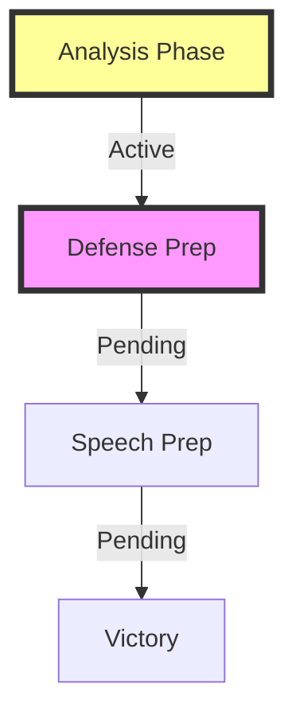

# FEMINIST FAILURE CAMPAIGN

## Campaign Status


## Campaign Matrix
```
OPERATION GRID
┌─────────────┬─────────────┬─────────────┐
│  ANALYSIS   │  DEFENSE    │   SPEECH    │
├─────────────┼─────────────┼─────────────┤
│ □ Master    │ □ Core      │ □ Scripts   │
│ □ Corporate │ □ Counters  │ □ Delivery  │
│ □ Academic  │ □ Kills     │ □ Impact    │
└─────────────┴─────────────┴─────────────┘
```

## Active Files
```
CAMPAIGN STRUCTURE
├── 1_analysis/
│   ├── 1_MASTER.md
│   └── subpoints/
│       ├── 2_CORPORATE.md     # Corporate Exploitation
│       ├── 3_ACADEMIC.md      # Theory Failure
│       ├── 4_STATE.md         # Government Control
│       └── 5_PATTERNS.md      # Historical Analysis
├── 2_DEFENSE.md
└── 3_SPEECH.md
```

## Progress Dashboard
| Component | Status | Next Action |
|-----------|--------|-------------|
| Analysis | 20% | Complete Master Analysis |
| Defense | 0% | Develop Counter Strategies |
| Speech | 0% | Create Script Framework |

## Key Points
```
IMPACT TRACKER
┌────────────────────┐
│ Theory vs Reality  │
├────────────────────┤
│ Corporate Betrayal │
├────────────────────┤
│ Movement Capture   │
└────────────────────┘
```

## Active Operations
1. **Pattern Breaking**
   ```
   BREAK CHAIN
   ├── Theory Failure
   ├── Corporate Exploitation
   ├── Movement Capture
   └── Reality Gap
   ```

2. **Defense Network**
   ```
   SHIELD GRID
   ├── Reality Defense
   ├── Value Creation
   ├── Freedom Choice
   └── Truth Focus
   ```

3. **Speech Arsenal**
   ```
   STRIKE FORCE
   ├── Pattern Exposure
   ├── System Reveal
   ├── Truth Chain
   └── Victory Path
   ```

## Next Actions
- [ ] Complete master analysis
- [ ] Map corporate exploitation
- [ ] Document academic failure
- [ ] Analyze state capture

## Campaign Notes
This campaign exposes how 4th wave feminism:
1. Abandoned real women's issues
2. Got captured by corporate interests
3. Became a control mechanism
4. Lost touch with reality

Remember: This campaign demonstrates the failure of theory vs reality.
